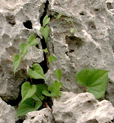
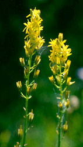

---
aliases:
- Bljuštolike
- bljuščevci
- Bộ Củ nâu
- Dioscoreales
- Dioscoreals
- Dioskorealoj
- Dioskoreju rinda
- dioskoreotvaré
- Dioskoreyaçiçəklilər
- jamszgyökérvirágúak
- Moeg Maenzbya
- Pochrzynowce
- smldincotvaré
- Tanom nga ubi
- Yams-ordenen
- yamsrotordenen
- Yamswurzelartige
- блуждовидни
- диоскореецветни
- диоскореецветные
- טמוסאים
- تمیسسانان
- ديسقوريات
- دۆسجۆرەالەس
- ഡയസ്കൊറിയേൽസ്
- อันดับกลอย
- ヤマノイモ目
- 薯蓣目
- 薯蕷目
- 마목
title: Dioscoreales
has_id_wikidata: Q747698
dv_has_:
  name_:
    an: Dioscoreales
    ar: ديسقوريات
    arz: ديسقوريات
    ast: Dioscoreales
    az: Dioskoreyaçiçəklilər
    be: Dioscoreales
    bg: диоскореецветни
    bs: Dioscoreales
    ca: Dioscoreals
    ceb: Tanom nga ubi
    cs: smldincotvaré
    da: Yams-ordenen
    de: Yamswurzelartige
    en: Dioscoreales
    eo: Dioskorealoj
    es: Dioscoreales
    eu: Dioscoreales
    ext: Dioscoreales
    fa: تمیسسانان
    fi: Dioscoreales
    fr: Dioscoreales
    frr: Dioscoreales
    ga: Dioscoreales
    gl: Dioscoreales
    he: טמוסאים
    hr: Bljuštolike
    hu: jamszgyökérvirágúak
    ia: Dioscoreales
    id: Dioscoreales
    ie: Dioscoreales
    io: Dioscoreales
    it: Dioscoreales
    ja: ヤマノイモ目
    ko: 마목
    ku: Dioscoreales
    ku_arab: دۆسجۆرەالەس
    ku_latn: Dioscoreales
    la: Dioscoreales
    lv: Dioskoreju rinda
    mk: блуждовидни
    ml: ഡയസ്കൊറിയേൽസ്
    mul: Dioscoreales
    nb: Dioscoreales
    nl: Dioscoreales
    nn: yamsrotordenen
    oc: Dioscoreales
    pl: Pochrzynowce
    pt: Dioscoreales
    pt_br: Dioscoreales
    ro: Dioscoreales
    ru: диоскореецветные
    sk: dioskoreotvaré
    sl: bljuščevci
    sq: Dioscoreales
    sr: Dioscoreales
    sv: Dioscoreales
    th: อันดับกลอย
    uk: Dioscoreales
    vi: Bộ Củ nâu
    vo: Dioscoreales
    war: Dioscoreales
    yue: 薯蕷目
    za: Moeg Maenzbya
    zh: 薯蓣目
    zh_cn: 薯蓣目
    zh_hans: 薯蓣目
    zh_hant: 薯蕷目
    zh_hk: 薯蕷目
---

# [[Dioscoreales]] 

   

## #has_/text_of_/abstract 

> The **Dioscoreales** are an order of monocotyledonous flowering plants, organized under modern classification systems, such as the Angiosperm Phylogeny Group or the Angiosperm Phylogeny Web.  Among monocot plants, Dioscoreales are grouped with the lilioid monocots, wherein they are a sister group to the Pandanales. In total, the order Dioscoreales comprises three families, 22 genera and about 850 species.
>
> Dioscoreales contains the family Dioscoreaceae, which notably includes the yams (Dioscorea) and several other bulbous and tuberous plants, some of which are heavily cultivated as staple food sources in certain countries. 
>
> Certain species are found solely in arid climates (incl. parts of Southern Africa), and have adapted to this harsh environment as caudex-forming, perennial caudiciformes, including Dioscorea elephantipes, the "elephant's foot" or "elephant-foot yam".
>
> Older systems tended to place all lilioid monocots with reticulate veined leaves (such as Smilacaceae and Stemonaceae together with Dioscoraceae) in Dioscoreales; as currently circumscribed by phylogenetic analysis, using combined morphology and molecular methods, Dioscreales now contains many reticulate-veined vines within the Dioscoraceae, as well as the myco-heterotrophic Burmanniaceae and the autotrophic Nartheciaceae.
>
> [Wikipedia](https://en.wikipedia.org/wiki/Dioscoreales) 

## Phylogeny 

-   « Ancestral Groups  
    -   [Monocot](../Monocot.md)
    -   [Flowering_Plant](../../Flowering_Plant.md)
    -   [Seed_Plant](../../../Seed_Plant.md)
    -   [Land_Plant](../../../../Land_Plant.md)
    -  [Green plants](../../../../../Plant.md) 
    -  [Eukarya](../../../../../../Eukarya.md) 
    -   [Tree of Life](../../../../../../Tree_of_Life.md)

-   ◊ Sibling Groups of  Monocotyledons
    -   [Alismatanae](Alismatanae.md)
    -   [Aranae](Aranae.md)
    -   [Liliales](Liliales.md)
    -   [Asparagales](Asparagales.md)
    -   [Pandanales](Pandanales.md)
    -   Dioscoreales
    -   [Palm](Palm.md)
    -   [Zingiberales](Zingiberales.md)
    -   [Commelinanae](Commelinids/Commelinanae.md)

-   » Sub-Groups 
	-   *Burmanniaceae*
	-   *Dioscoreaceae*
	-   *Nartheciaceae*
	-   *Taccaceae*
	-   *Thismiaceae*
	-   *Trichopodaceae*

## Title Illustrations

------------------------------------------------------------------------

scientific_name ::   Tamus communis
location ::         Samos, Greece
Comments           Dioscoreaceae
Acknowledgements   courtesy [Botanical Image Database](http://www.unibas.ch/botimage/)
copyright ::          © 2001 University of Basel, Basel, Switzerland 

-----------------------------------------

scientific_name ::     Narthecium californicum
location ::           Gumboot Creek, headwaters of South Fork Sacramento River, south side of Mt. Eddy (Siskiyou County, California, USA)
Comments             California bog asphodel (Nartheciaceae).
specimen_condition ::  Live Specimen
Source Collection    [CalPhotos](http://calphotos.berkeley.edu/)
copyright ::            © 1991 [Julie Kierstead Nelson](mailto:jknelson@fs.fed.us)

## Confidential Links & Embeds: 

### #is_/same_as :: [[/_Standards/bio/bio~Domain/Eukarya/Plant/Land_Plant/Seed_Plant/Flowering_Plant/Monocot/Dioscoreales|Dioscoreales]] 

### #is_/same_as :: [[/_public/bio/bio~Domain/Eukarya/Plant/Land_Plant/Seed_Plant/Flowering_Plant/Monocot/Dioscoreales.public|Dioscoreales.public]] 

### #is_/same_as :: [[/_internal/bio/bio~Domain/Eukarya/Plant/Land_Plant/Seed_Plant/Flowering_Plant/Monocot/Dioscoreales.internal|Dioscoreales.internal]] 

### #is_/same_as :: [[/_protect/bio/bio~Domain/Eukarya/Plant/Land_Plant/Seed_Plant/Flowering_Plant/Monocot/Dioscoreales.protect|Dioscoreales.protect]] 

### #is_/same_as :: [[/_private/bio/bio~Domain/Eukarya/Plant/Land_Plant/Seed_Plant/Flowering_Plant/Monocot/Dioscoreales.private|Dioscoreales.private]] 

### #is_/same_as :: [[/_personal/bio/bio~Domain/Eukarya/Plant/Land_Plant/Seed_Plant/Flowering_Plant/Monocot/Dioscoreales.personal|Dioscoreales.personal]] 

### #is_/same_as :: [[/_secret/bio/bio~Domain/Eukarya/Plant/Land_Plant/Seed_Plant/Flowering_Plant/Monocot/Dioscoreales.secret|Dioscoreales.secret]] 

