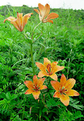
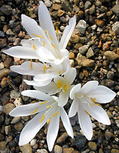
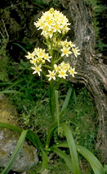

---
aliases:
  - Liliales
title: Liliales
---

## Phylogeny 

-   « Ancestral Groups  
    -   [Monocot](../Monocot.md)
    -   [Flowering_Plant](../../Flowering_Plant.md)
    -   [Seed_Plant](../../../Seed_Plant.md)
    -   [Land_Plant](../../../../Land_Plant.md)
    -  [Green plants](../../../../../Plant.md))
    -  [Eukarya](../../../../../../Eukarya.md))
    -   [Tree of Life](../../../../../../Tree_of_Life.md)

-   ◊ Sibling Groups of  Monocotyledons
    -   [Alismatanae](Alismatanae.md)
    -   [Aranae](Aranae.md)
    -   Liliales
    -   [Asparagales](Asparagales.md)
    -   [Pandanales](Pandanales.md)
    -   [Dioscoreales](Dioscoreales.md)
    -   [Palm](Palm.md)
    -   [Zingiberales](Zingiberales.md)
    -   [Commelinanae](Commelinids/Commelinanae.md)

-   » Sub-Groups 
	-   *Alstroemeriaceae*
	-   *Campynemataceae*
	-   *Colchicaceae*
	-   *Liliaceae*
	-   *Luzuriagaceae*
	-   *Melanthiaceae*
	-   *Philesiaceae*
	-   *Ripogonaceae*
	-   *Smilacaceae*

# [[Liliales]] 

     

## #has_/text_of_/abstract 

> **Liliales** is an order of monocotyledonous flowering plants in the Angiosperm Phylogeny Group 
> and Angiosperm Phylogeny Web system, within the lilioid monocots. 
> 
> This order of necessity includes the family Liliaceae. 
> The APG III system (2009) places this order in the monocot clade. 
> In APG III, the family Luzuriagaceae is combined with the family Alstroemeriaceae 
> and the family Petermanniaceae is recognized. 
> 
> Both the order Lililiales and the family Liliaceae have had a widely disputed history, 
> with the circumscription varying greatly from one taxonomist to another. 
> 
> Previous members of this order, 
> which at one stage included most monocots with conspicuous tepals 
> and lacking starch in the endosperm are now distributed over three orders, 
> - Liliales, 
> - Dioscoreales and 
> - Asparagales, 
> using predominantly molecular phylogenetics. 
> 
> The newly delimited Liliales is monophyletic, with ten families. 
> Well known plants from the order include 
> Lilium (lily), tulip, the North American wildflower Trillium, and greenbrier.
>
> Thus circumscribed, this order consists mostly of herbaceous plants, 
> but lianas and shrubs also occur. 
> 
> They are mostly perennial plants, with food storage organs such as corms or rhizomes. 
> The family Corsiaceae is notable for being heterotrophic.
>
> The order has worldwide distribution. The larger families (with more than 100 species) are roughly confined to the Northern Hemisphere, or are distributed worldwide, centering on the north. On the other hand, the smaller families (with up to 10 species) are confined to the Southern Hemisphere, or sometimes just to Australia or South America. The total number of species in the order is now about 1768.
>
> As with any herbaceous group, the fossil record of the Liliales is rather scarce. There are several species from the Eocene, such as Petermanniopsis anglesaensis or Smilax, but their identification is not definite. Another known fossil is Ripogonum scandens from the Miocene. Due to the scarcity of data, it seems impossible to determine precisely the age and the initial distribution of the order. It is assumed that the Liliales originate from the Lower Cretaceous, over 100 million years ago. Fossil aquatic plants from the Cretaceous of northeastern Brazil and a new terrestrial species placed in the new genus Cratosmilax suggest that the first species have appeared around 120 million years ago when the continents formed Pangea, before dispersing as Asia, Africa and America. The initial diversification to the current families took place between 82 and 48 million years ago. The order consists of 10 families, 67 genera and about 1,768 species.
>
> [Wikipedia](https://en.wikipedia.org/wiki/Liliales) 

## Title Illustrations

-------------------------------------------------------------------------
 
Scientific Name ::    Lilium pensylvanicum
Location ::          Near Shari, Hokkaido (Japan)
Comments            Liliaceae
Source Collection   [CalPhotos](http://calphotos.berkeley.edu/)
Copyright ::           © 1998 [Nick Kurzenko](mailto:kurzenko@ibss.dvo.ru) 

------------------------------------------------------------------------
 
Scientific Name ::   Colchicum troodii
Location ::         Cultivated at the Botanical Garden, Basel, Switzerland
Comments           Colchicaceae
Acknowledgements   courtesy [Botanical Image Database](http://www.unibas.ch/botimage/)
Copyright ::          © 2001 University of Basel, Basel, Switzerland 

------------------------------------------------------------------------------

Scientific Name ::    Zigadenus venenosus
Location ::          Point Lobos State Reserve (Monterey County, California, USA)
Comments            Melanthiaceae
Creator             Photograph by Robert Potts
Source Collection   [CalPhotos](http://calphotos.berkeley.edu/)
Copyright ::           © 2001 [California Academy of Sciences](http://www.calacademy.org/) 

## Confidential Links & Embeds: 

### #is_/same_as :: [Liliales](/_Standards/bio/bio~Domain/Eukarya/Plant/Land_Plant/Seed_Plant/Flowering_Plant/Monocot/Liliales.md) 

### #is_/same_as :: [Liliales.public](/_public/bio/bio~Domain/Eukarya/Plant/Land_Plant/Seed_Plant/Flowering_Plant/Monocot/Liliales.public.md) 

### #is_/same_as :: [Liliales.internal](/_internal/bio/bio~Domain/Eukarya/Plant/Land_Plant/Seed_Plant/Flowering_Plant/Monocot/Liliales.internal.md) 

### #is_/same_as :: [Liliales.protect](/_protect/bio/bio~Domain/Eukarya/Plant/Land_Plant/Seed_Plant/Flowering_Plant/Monocot/Liliales.protect.md) 

### #is_/same_as :: [Liliales.private](/_private/bio/bio~Domain/Eukarya/Plant/Land_Plant/Seed_Plant/Flowering_Plant/Monocot/Liliales.private.md) 

### #is_/same_as :: [Liliales.personal](/_personal/bio/bio~Domain/Eukarya/Plant/Land_Plant/Seed_Plant/Flowering_Plant/Monocot/Liliales.personal.md) 

### #is_/same_as :: [Liliales.secret](/_secret/bio/bio~Domain/Eukarya/Plant/Land_Plant/Seed_Plant/Flowering_Plant/Monocot/Liliales.secret.md)

