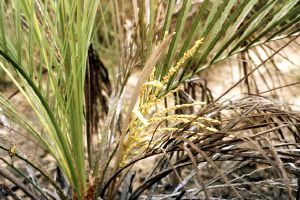

---
aliases:
  - Arecanae
  - Principes
  - Palms
  - Palme
  - Palmen
title: Arecanae
has_id_wikidata: Q14080
---

# [[Palm]]

The palms 

 

#is_/same_as :: [[../../../../../../../../WikiData/WD~Palms,14080|WD~Palms,14080]] 
## #has_/text_of_/abstract 

> Arecales is an order of flowering plants. 
> The order has been widely named as such only for the past few decades; until then, 
> the accepted name for the order including these plants was Principes. 
> The order includes palms and relatives.
>
> [Wikipedia](https://en.wikipedia.org/wiki/Arecales) 

## Introduction

[William J. Hahn]()

The palms are one of the most distinctive groups of land plants 
and show some of the greatest morphological diversity among all monocots. 

They are characteristic elements of the tropics and subtropics of the world
where they are of considerable economic and ecological importance.

Well-known members include the coconut (Cocos nucifera), the date palm (Phoenix dactylifera), 
the oil palm (Elaeis guineensis), and many ornamental species. 

The superorder includes 1 family, 200 genera, and approximately 2000 species.

### Characteristics

The palms are a readily identifiable group although no consistent
morphological synapomorphies are known for the family. Uhl and
Dransfield (1987) and Uhl, et al. (1995) have identified two principal
diagnostic characters: 1) \"woody\" stems (due to fibrous sclerenchya,
not secondary-growth), and 2) the leaves plicate in bud and later split
in most groups.

## Phylogeny 

-   « Ancestral Groups  
    -   [Monocot](../Monocot.md)
    -   [Flowering_Plant](../../Flowering_Plant.md)
    -   [Seed_Plant](../../../Seed_Plant.md)
    -   [Land_Plant](../../../../Land_Plant.md)
    -  [Green plants](../../../../../Plant.md))
    -  [Eukarya](../../../../../../Eukarya.md))
    -   [Tree of Life](../../../../../../Tree_of_Life.md)

-   ◊ Sibling Groups of  Monocotyledons
    -   [Alismatanae](Alismatanae.md)
    -   [Aranae](Aranae.md)
    -   [Liliales](Liliales.md)
    -   [Asparagales](Asparagales.md)
    -   [Pandanales](Pandanales.md)
    -   [Dioscoreales](Dioscoreales.md)
    -   Arecanae
    -   [Zingiberales](Zingiberales.md)
    -   [Commelinanae](Commelinids/Commelinanae.md)

-   » Sub-Groups 

## Confidential Links & Embeds: 

### #is_/same_as :: [Palms](/_Standards/bio/bio~Domain/Eukarya/Plant/Land_Plant/Seed_Plant/Flowering_Plant/Monocot/Palms.md) 

### #is_/same_as :: [Palms.public](/_public/bio/bio~Domain/Eukarya/Plant/Land_Plant/Seed_Plant/Flowering_Plant/Monocot/Palms.public.md) 

### #is_/same_as :: [Palms.internal](/_internal/bio/bio~Domain/Eukarya/Plant/Land_Plant/Seed_Plant/Flowering_Plant/Monocot/Palms.internal.md) 

### #is_/same_as :: [Palms.protect](/_protect/bio/bio~Domain/Eukarya/Plant/Land_Plant/Seed_Plant/Flowering_Plant/Monocot/Palms.protect.md) 

### #is_/same_as :: [Palms.private](/_private/bio/bio~Domain/Eukarya/Plant/Land_Plant/Seed_Plant/Flowering_Plant/Monocot/Palms.private.md) 

### #is_/same_as :: [Palms.personal](/_personal/bio/bio~Domain/Eukarya/Plant/Land_Plant/Seed_Plant/Flowering_Plant/Monocot/Palms.personal.md) 

### #is_/same_as :: [Palms.secret](/_secret/bio/bio~Domain/Eukarya/Plant/Land_Plant/Seed_Plant/Flowering_Plant/Monocot/Palms.secret.md)

