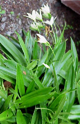

---
aliases:
- Bộ Dứa dại
- csavarpálma-virágúak
- Koma ceredaran
- Pandanales
- Pandanaloj
- Pandanals
- Pandanaçiçəklilər
- Pandaniečiai
- Pandanilaadsed
- Pandanolike
- pandanovci
- pandanowce
- pandans
- pandánotvaré
- Pandānu rinda
- Schraubenbaumartige
- screw-pines
- Skruepalme-ordenen
- панданоцветни
- панданоцветные
- كاذيات
- پیچکاجیسانان
- อันดับเตยทะเล
- タコノキ目
- 露兜树目
- 露兜樹目
- 부들목
title: Pandanales
has_id_wikidata: Q269303
dv_has_:
  name_:
    an: Pandanales
    ar: كاذيات
    arz: كاذيات
    ast: Pandanales
    az: Pandanaçiçəklilər
    bg: панданоцветни
    bs: Pandanales
    ca: Pandanals
    ceb: Pandanales
    cs: pandánotvaré
    da: Skruepalme-ordenen
    de: Schraubenbaumartige
    en: Pandanales
    eo: Pandanaloj
    es: Pandanales
    et: Pandanilaadsed
    eu: Pandanales
    ext: Pandanales
    fa: پیچکاجیسانان
    fi: Pandanales
    fr: Pandanales
    frr: Pandanales
    ga: Pandanales
    gl: Pandanales
    hr: Pandanolike
    hu: csavarpálma-virágúak
    ia: Pandanales
    id: Pandanales
    ie: Pandanales
    io: Pandanales
    it: Pandanales
    ja: タコノキ目
    ko: 부들목
    ku: Koma ceredaran
    la: Pandanales
    lt: Pandaniečiai
    lv: Pandānu rinda
    mul: Pandanales
    nb: Pandanales
    nl: Pandanales
    oc: Pandanales
    pl: pandanowce
    pt: Pandanales
    pt_br: Pandanales
    ro: Pandanales
    ru: панданоцветные
    sl: pandanovci
    sq: Pandanales
    sv: Pandanales
    th: อันดับเตยทะเล
    uk: Pandanales
    vi: Bộ Dứa dại
    vo: Pandanales
    war: Pandanales
    yue: 露兜樹目
    zh: 露兜树目
    zh_cn: 露兜树目
    zh_tw: 露兜樹目
---

# [[Pandanales]] 

 

## #has_/text_of_/abstract 

> **Pandanales**, the pandans or screw-pines, is an order of flowering plants 
> placed in the monocot clade in the Angiosperm Phylogeny Group 
> and Angiosperm Phylogeny Web systems. 
> 
> Within the monocots Pandanales are grouped in the lilioid monocots 
> where they are in a sister group relationship with the Dioscoreales. 
> 
> Historically the order has consisted of a number of different families in different systems 
> but modern classification of the order is based primarily on molecular phylogenetics 
> despite diverse morphology which previously placed many of the families in other groupings 
> based on apparent similarity. 
> 
> Members of the order have a subtropical distribution 
> and includes trees, shrubs, and vines as well as herbaceous plants. 
> The order consists of 5 families, 36 genera and about 1,610 species.
>
> [Wikipedia](https://en.wikipedia.org/wiki/Pandanales) 

## Phylogeny 

-   « Ancestral Groups  
    -   [Monocot](../Monocot.md)
    -   [Flowering_Plant](../../Flowering_Plant.md)
    -   [Seed_Plant](../../../Seed_Plant.md)
    -   [Land_Plant](../../../../Land_Plant.md)
    -  [Green plants](../../../../../Plant.md) 
    -  [Eukarya](../../../../../../Eukarya.md) 
    -   [Tree of Life](../../../../../../Tree_of_Life.md)

-   ◊ Sibling Groups of  Monocotyledons
    -   [Alismatanae](Alismatanae.md)
    -   [Aranae](Aranae.md)
    -   [Liliales](Liliales.md)
    -   [Asparagales](Asparagales.md)
    -   Pandanales
    -   [Dioscoreales](Dioscoreales.md)
    -   [Palm](Palm.md)
    -   [Zingiberales](Zingiberales.md)
    -   [Commelinanae](Commelinids/Commelinanae.md)

-   » Sub-Groups 
	-   *Cyclanthaceae*
	-   *Pandanaceae*
	-   *Stemonaceae*
	-   *Triuridaceae*
	-   *Velloziaceae*

## Title Illustrations

---------------------------------------------------------------------
 
scientific_name ::  Barbacenia elegans
Comments          Velloziaceae
copyright ::         © [Kurt Stüber](http://www.biolib.de/) 

## Confidential Links & Embeds: 

### #is_/same_as :: [[/_Standards/bio/bio~Domain/Eukarya/Plant/Land_Plant/Seed_Plant/Flowering_Plant/Monocot/Pandanales|Pandanales]] 

### #is_/same_as :: [[/_public/bio/bio~Domain/Eukarya/Plant/Land_Plant/Seed_Plant/Flowering_Plant/Monocot/Pandanales.public|Pandanales.public]] 

### #is_/same_as :: [[/_internal/bio/bio~Domain/Eukarya/Plant/Land_Plant/Seed_Plant/Flowering_Plant/Monocot/Pandanales.internal|Pandanales.internal]] 

### #is_/same_as :: [[/_protect/bio/bio~Domain/Eukarya/Plant/Land_Plant/Seed_Plant/Flowering_Plant/Monocot/Pandanales.protect|Pandanales.protect]] 

### #is_/same_as :: [[/_private/bio/bio~Domain/Eukarya/Plant/Land_Plant/Seed_Plant/Flowering_Plant/Monocot/Pandanales.private|Pandanales.private]] 

### #is_/same_as :: [[/_personal/bio/bio~Domain/Eukarya/Plant/Land_Plant/Seed_Plant/Flowering_Plant/Monocot/Pandanales.personal|Pandanales.personal]] 

### #is_/same_as :: [[/_secret/bio/bio~Domain/Eukarya/Plant/Land_Plant/Seed_Plant/Flowering_Plant/Monocot/Pandanales.secret|Pandanales.secret]] 

