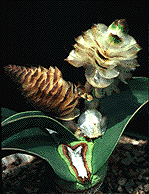
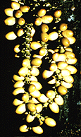
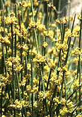
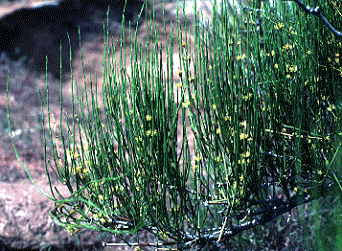

---
aliases:
- Gnetales
- Gnetatae
- Gnethophyta
- Gnetidae
- Gnetofitoj
- Gnetophyta
- Gnetophytina
- Gnetopsida
- Gnetòfits
- Gnetófitas
- Gnetūnai
- Gniotowce
- leplesmagvúak
- Lianovcorasty
- Ngành Dây gắm
- obalosemenné
- Qnetumlar
- ʻakau sukau
- Γνητόφυτα
- гнетавидныя
- Гнетавыя (кляса)
- гнетови
- гнетовидные
- гнетоподібні
- Գնետայիններ
- גנטאים
- شعبة الجنتويات
- نيٽوفائٽا
- گنتومتباران
- საფართესლოვანები
- グネツム類
- 买麻藤门
- 買麻藤門
- 마황문
title: Gnetales
has_id_wikidata: Q309147
dv_has_:
  name_:
    an: Gnetophyta
    ar: شعبة الجنتويات
    arz: شعبة الجنتويات
    ast: Gnetophyta
    az: Qnetumlar
    be: гнетавидныя
    be-tarask: Гнетавыя (кляса)
    bg: гнетови
    bs: Gnethophyta
    ca: Gnetòfits
    ceb: Gnetopsida
    cs: obalosemenné
    da: Gnetophyta
    de: Gnetophyta
    el: Γνητόφυτα
    en: Gnetophyta
    eo: Gnetofitoj
    es: Gnetidae
    eu: Gnetophyta
    ext: Gnetophyta
    fa: گنتومتباران
    fi: Gnetophytina
    fr: Gnetophyta
    ga: Gnetophyta
    gl: Gnetophyta
    he: גנטאים
    hr: Gnetophyta
    hu: leplesmagvúak
    hy: Գնետայիններ
    ia: Gnetophyta
    id: Gnetophyta
    ie: Gnetophyta
    io: Gnetophyta
    is: Gnetophyta
    it: Gnetophyta
    ja: グネツム類
    ka: საფართესლოვანები
    ko: 마황문
    la: Gnetophyta
    lt: Gnetūnai
    mul: Gnetophyta
    nb: Gnetophyta
    nl: Gnetophyta
    oc: Gnetophyta
    pl: Gniotowce
    pt: Gnetófitas
    pt-br: Gnetophyta
    ro: Gnetatae
    ru: гнетовидные
    sd: نيٽوفائٽا
    sk: Lianovcorasty
    sl: Gnetophyta
    sq: Gnetophyta
    sv: Gnetophyta
    th: Gnetophyta
    tl: Gnetophyta
    to: ʻakau sukau
    uk: гнетоподібні
    vi: Ngành Dây gắm
    vo: Gnetophyta
    war: Gnetopsida
    yue: 買麻藤門
    zh: 買麻藤門
    zh-cn: 买麻藤门
    zh-hans: 买麻藤门
    zh-hant: 買麻藤門
    zh-hk: 買麻藤門
    zh-my: 买麻藤门
    zh-sg: 买麻藤门
    zh-tw: 買麻藤門
---
# Gnetales 

        
© 1996 [Michael Donoghue](mailto:michael.donoghue@yale.edu) 

## #has_/text_of_/abstract 

> Gnetophyta is a division of plants (alternatively considered the subclass Gnetidae or order **Gnetales**), 
> grouped within the gymnosperms (which also includes conifers, cycads, and ginkgos), 
> that consists of some 70 species across the three relict genera: 
> - Gnetum (family Gnetaceae), 
> - Welwitschia (family Welwitschiaceae), and 
> - Ephedra (family Ephedraceae). 
> 
> The earliest unambiguous records of the group date to the Jurassic, 
> and they achieved their highest diversity during the Early Cretaceous. 
> 
> The primary difference between gnetophytes and other gymnosperms 
> is the presence of vessel elements, a system of small tubes (xylem) 
> that transport water within the plant, similar to those found in flowering plants. 
> 
> Because of this, gnetophytes were once 
> thought to be the closest gymnosperm relatives to flowering plants, 
> but more recent molecular studies have brought this hypothesis into question, 
> with many recent phylogenies finding them to be nested within the conifers.
>
> Though it is clear they are all related, 
> the exact evolutionary inter-relationships between gnetophytes are unclear. 
> 
> Some classifications hold that all three genera should be placed in a single order(Gnetales), 
> while other classifications say they should be distributed among three separate orders, 
> each containing a single family and genus. 
> 
> Most morphological and molecular studies confirm that the genera 
> Gnetum and Welwitschia diverged from each other more recently than they did from Ephedra.
>
> [Wikipedia](https://en.wikipedia.org/wiki/Gnetophyta) 

## Phylogeny 

-   « Ancestral Groups  
    -   [Seed_Plant](../Seed_Plant.md)
    -   [Land_Plant](../../Land_Plant.md)
    -  [Green plants](../../../Plant.md) 
    -  [Eukarya](../../../../Eukarya.md) 
    -   [Tree of Life](../../../../Tree_of_Life.md)

-   ◊ Sibling Groups of  Spermatopsida
    -   [Conifers](Conifers.md)
    -   Gnetales
    -   [Flowering_Plant](Flowering_Plant.md)

-   » Sub-Groups
    -   [Ephedra](Gnetales/Ephedra.md)
    -   [Gnetum](Gnetales/Gnetum.md)

## Confidential Links & Embeds: 

### #is_/same_as :: [[/_Standards/bio/bio~Domain/Eukarya/Plant/Land_Plant/Seed_Plant/Gnetales|Gnetales]] 

### #is_/same_as :: [[/_public/bio/bio~Domain/Eukarya/Plant/Land_Plant/Seed_Plant/Gnetales.public|Gnetales.public]] 

### #is_/same_as :: [[/_internal/bio/bio~Domain/Eukarya/Plant/Land_Plant/Seed_Plant/Gnetales.internal|Gnetales.internal]] 

### #is_/same_as :: [[/_protect/bio/bio~Domain/Eukarya/Plant/Land_Plant/Seed_Plant/Gnetales.protect|Gnetales.protect]] 

### #is_/same_as :: [[/_private/bio/bio~Domain/Eukarya/Plant/Land_Plant/Seed_Plant/Gnetales.private|Gnetales.private]] 

### #is_/same_as :: [[/_personal/bio/bio~Domain/Eukarya/Plant/Land_Plant/Seed_Plant/Gnetales.personal|Gnetales.personal]] 

### #is_/same_as :: [[/_secret/bio/bio~Domain/Eukarya/Plant/Land_Plant/Seed_Plant/Gnetales.secret|Gnetales.secret]] 

