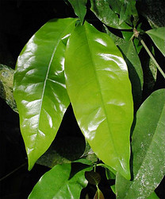

---
aliases:
  - Gnetum
title: Gnetum
---

## Phylogeny 

-   « Ancestral Groups  
    -   [Gnetales](../Gnetales.md)
    -   [Seed_Plant](../../Seed_Plant.md)
    -   [Land_Plant](../../../Land_Plant.md)
    -  [Green plants](../../../../Plant.md) 
    -  [Eukarya](../../../../../Eukarya.md) 
    -   [Tree of Life](../../../../../Tree_of_Life.md)

-   ◊ Sibling Groups of  Gnetales
    -   [Ephedra](Ephedra.md)
    -   Gnetum

-   » Sub-Groups 

# Gnetum 

-   *Gnetum acutum*
-   *Gnetum africanum*
-   *Gnetum arobreum*
-   *Gnetum bosavicum*
-   *Gnetum buchholzianum*
-   *Gnetum camporum*
-   *Gnetum cleistostachyum*
-   *Gnetum contractum*
-   *Gnetum costatum*
-   *Gnetum cuspidatum*
-   *Gnetum diminutum*
-   *Gnetum globosum*
-   *Gnetum gnemon*
-   *Gnetum gnemonoides*
-   *Gnetum gracilipes*
-   *Gnetum hainanense*
-   *Gnetum klossii*
-   *Gnetum latifolium*
-   *Gnetum leptostachyum*
-   *Gnetum leyboldii*
-   *Gnetum lofuense*
-   *Gnetum loerzingii*
-   *Gnetum macrostachyum*
-   *Gnetum microcarpum*
-   *Gnetum montanum*
-   *Gnetum neglectum*
-   *Gnetum nodiflorum*
-   *Gnetum oblongum*
-   *Gnetum oxycarpum*
-   *Gnetum paniculatum*
-   *Gnetum parvifolium*
-   *Gnetum pendulum*
-   *Gnetum raya*
-   *Gnetum ridleyi*
-   *Gnetum schwackeanum*
-   *Gnetum tenuifolium*
-   *Gnetum ula*
-   *Gnetum urens*
-   *Gnetum venosum*

Containing group: [Gnetales](../Gnetales.md)

### References

Friedman, W. E. and J. S. Carmichael. 1998. Heterochrony and
developmental innovation: Evolution of female gametophyte ontogeny in
Gnetum, a highly apomorphic seed plant. Evolution 52 (4):1016-1030.

Hansen, A., S. Hansmann, T. Samigullin, A. Antonov, and W. Martin. 1999.
Gnetum and the angiosperms: molecular evidence that their shared
morphological characters are convergent, rather than homologous.
Molecular Biology and Evolution 16:1006-1009.

Markgraf F. 1930. Monographie der Gattung Gnetum. Bulletin du Jardin
Botanique Buitenzorg 10: 407-511.

Price, R. A. 1996. Systematics of the Gnetales: a review of
morphological and molecular evidence. International Journal of Plant
Sciences157(6, Suppl.): S40-S49.

## Title Illustrations



  ----------------------------------------------------------------------
  scientific_name ::     Gnetum gnemon
  location ::           cultivated at the Botanical Garden Basel, Switzerland
  Acknowledgements     courtesy [Botanical Image Database](http://www.unibas.ch/botimage/)
  specimen_condition ::  Live Specimen
  Body Part            new and old leaves
  copyright ::            © University of Basel, Basel, Switzerland 
  ----------------------------------------------------------------------

## Confidential Links & Embeds: 

### #is_/same_as :: [[/_Standards/bio/bio~Domain/Eukarya/Plant/Land_Plant/Seed_Plant/Gnetales/Gnetum|Gnetum]] 

### #is_/same_as :: [[/_public/bio/bio~Domain/Eukarya/Plant/Land_Plant/Seed_Plant/Gnetales/Gnetum.public|Gnetum.public]] 

### #is_/same_as :: [[/_internal/bio/bio~Domain/Eukarya/Plant/Land_Plant/Seed_Plant/Gnetales/Gnetum.internal|Gnetum.internal]] 

### #is_/same_as :: [[/_protect/bio/bio~Domain/Eukarya/Plant/Land_Plant/Seed_Plant/Gnetales/Gnetum.protect|Gnetum.protect]] 

### #is_/same_as :: [[/_private/bio/bio~Domain/Eukarya/Plant/Land_Plant/Seed_Plant/Gnetales/Gnetum.private|Gnetum.private]] 

### #is_/same_as :: [[/_personal/bio/bio~Domain/Eukarya/Plant/Land_Plant/Seed_Plant/Gnetales/Gnetum.personal|Gnetum.personal]] 

### #is_/same_as :: [[/_secret/bio/bio~Domain/Eukarya/Plant/Land_Plant/Seed_Plant/Gnetales/Gnetum.secret|Gnetum.secret]] 

