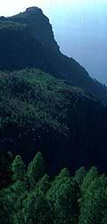
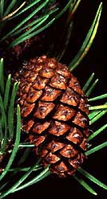

---
aliases:
- "Pine Tree"
- Pinus
title: Pinus
---

#is_/instance_of :: [[../../../../../Animals/Bilateria/bio~Class/bio~Order/bio~Family/bio~Genus|bio~Genus]] 

## Phylogeny 

-   « Ancestral Groups  
    -   [Pine](../Pine.md)
    -   [Conifers](../../Conifers.md)
    -   [Seed_Plant](../../../Seed_Plant.md)
    -   [Land_Plant](../../../../Land_Plant.md)
    -   [Green plants](../../../../../Plants.md)
    -  [Eukarya](../../../../../../Eukarya.md))
    -   [Tree of Life](../../../../../../Tree_of_Life.md)

-   ◊ Sibling Groups of  Pinaceae
    -   Pinus
    -   [Pseudotsuga](Pseudotsuga.md)
    -   [Larch](Larch.md)

-   » Sub-Groups
    -   [subgenus Pinus](subgenus_Pinus)
    -   [subgenus Strobus](subgenus_Strobus)

# Pinus [L.]

Pine Trees 

  .jpg)    .jpg) 

## Introduction

[David S. Gernandt, Aaron Liston, and Robert A. Price]()

*Pinus*, with over 100 species, is the largest genus of conifers 
and the most widespread genus of trees in the Northern Hemisphere. 

The natural distribution of pines ranges from arctic and subarctic regions of Eurasia and North America 
south to subtropical and tropical (usually montane) regions of Central America and Asia. 

Pines are also extensively planted in temperate regions of the Southern Hemisphere. 
Many pines are fast growing species tolerant of poor soils and relatively arid conditions, 
making them popular in reforestation. 

Important pine products include wood, turpentine, and edible seeds.

Pines have a relatively rich fossil record dating back to the Early Cretaceous, 130 million years ago. 

### Discussion of Phylogenetic Relationships

Most classifications of *Pinus* recognize two major lineages: 
- subgenus *Strobus* (haploxylon or soft pines, with one fibrovascular bundle in the needle) and 
- subgenus *Pinus* (diploxylon or hard pines, with two fibrovascular bundles in the needles). 

This division is consistent with data from wood anatomy and secondary chemistry, 
and is supported in recent molecular phylogenetic studies 
(Strauss & Doerksen 1990; Wang & Szmidt 1993; reviewed in Price et al., 1998). 

The Vietnamese species, *P. krempfii* possesses unusual flattened needles and a unique wood anatomy. 
Based on these distinctive features, the species was considered a third subgenus 
in the influential classification of Little & Critchfield (1969). 
On the other hand, secondary product chemistry (Erdtman et al. 1966), nuclear ribosomal DNA 
(Liston et al. 2003) and chloroplast DNA sequences (Wang et al. 1999; Gernandt et al. in press) 
indicate that *P. krempfii* should be considered a member of subgenus *Strobus*.

## Title Illustrations

---------------------------------------------------------------------------

Scientific Name ::  Pinus canariensis
Location ::        Tenerife, Spain
Copyright ::         © [Aaron Liston](http://www.bcc.orst.edu/bpp/faculty/liston/) 

---------------------------------------------------------------------------
 
Scientific Name ::  Pinus monticola
Body Part         ovulate cone
Copyright ::         © [Aaron Liston](http://www.bcc.orst.edu/bpp/faculty/liston/) 

---------------------------------------------------------------------------

Scientific Name ::  Pinus contorta
Body Part         ovulate cone
Copyright ::         © [Aaron Liston](http://www.bcc.orst.edu/bpp/faculty/liston/) 

---------------------------------------------------------------------------
.jpg) 
Scientific Name ::  Pinus krempfii
Body Part         flattened leaves
Copyright ::         © [Aaron Liston](http://www.bcc.orst.edu/bpp/faculty/liston/) 

## Confidential Links & Embeds: 

### #is_/same_as ::[Pinus](Pinus.md)) 

### #is_/same_as :: [Pinus.public](/_public/bio/bio~Domain/Eukarya/Plants/Land_Plant/Seed_Plant/Conifers/Pine/Pinus.public.md) 

### #is_/same_as :: [Pinus.internal](/_internal/bio/bio~Domain/Eukarya/Plants/Land_Plant/Seed_Plant/Conifers/Pine/Pinus.internal.md) 

### #is_/same_as :: [Pinus.protect](/_protect/bio/bio~Domain/Eukarya/Plants/Land_Plant/Seed_Plant/Conifers/Pine/Pinus.protect.md) 

### #is_/same_as :: [Pinus.private](/_private/bio/bio~Domain/Eukarya/Plants/Land_Plant/Seed_Plant/Conifers/Pine/Pinus.private.md) 

### #is_/same_as :: [Pinus.personal](/_personal/bio/bio~Domain/Eukarya/Plants/Land_Plant/Seed_Plant/Conifers/Pine/Pinus.personal.md) 

### #is_/same_as :: [Pinus.secret](/_secret/bio/bio~Domain/Eukarya/Plants/Land_Plant/Seed_Plant/Conifers/Pine/Pinus.secret.md)

