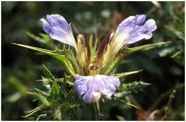

# [[Blepharis]] 

     
  

## #has_/text_of_/abstract 

> **Blepharis** is a genus of plant in family Acanthaceae. It contains around 128 species found in seasonally dry to arid habitats from Africa through Arabia to Southeast Asia. In section Acanthodium, there are 13–15 species that use the C4 carbon fixation pathway. Phylogenetic analysis suggests that this pathway evolved up to three times independently in the genus over the last five million years.
>
> The genus is named after the Greek word βλεφαριϛ, which means eyelash. Missouri Botanical Garden
>
> [Wikipedia](https://en.wikipedia.org/wiki/Blepharis) 

## Phylogeny 

-   « Ancestral Groups  
    -   [Acantheae](../Acantheae.md)
    -   [Acanthaceae](../../Acanthaceae.md)
    -   [Lamiales](../../../Lamiales.md)
    -   [Asterids](../../../../Asterids.md)
    -  [Core Eudicots](../../../../../Core_Eudicots.md))
    -   [Eudicots](../../../../../../Eudicots.md)
    -   [Flowering_Plant](../../../../../../../Flowering_Plant.md)
    -   [Seed_Plant](../../../../../../../../Seed_Plant.md)
    -   [Land_Plant](../../../../../../../../../Land_Plant.md)
    -   [Green plants](../../../../../../../../../../Plants.md)
    -  [Eukarya](../../../../../../../../../../../Eukarya.md))
    -   [Tree of Life](../../../../../../../../../../../Tree_of_Life.md)

-   ◊ Sibling Groups of  Acantheae
    -   [Acanthus Clade](Acanthus_Clade)
    -   [Acanthopsis](Acanthopsis.md)
    -   Blepharis
    -   [Cynarospermum         asperrimum](Cynarospermum_asperrimum)
    -   [Crossandrella dusenii](Crossandrella_dusenii)
    -   [Streptosiphon hirsutus](Streptosiphon_hirsutus)
    -   [Sclerochiton](Sclerochiton.md)
    -   [Crossandra](Crossandra.md)
    -   [Stenandriopsis Clade](Stenandriopsis_Clade)
    -   [Stenandrium Clade](Stenandrium_Clade)
    -   [Other New World         Acantheae](Other_New_World_Acantheae)

-   » Sub-Groups 
	-   *Blepharis acuminata* [ Oberm.]
	-   *Blepharis asteracanthus* [ C. B. Clarke]
	-   *Blepharis buchneri* [ Lindau]
	-   *Blepharis calcitrapa* [ Benoist]
	-   *Blepharis diversipina*[ (Nees) C. B. Clarke]
	-   *Blepharis edulis*[ (Forssk.) Pers.]
	-   *Blepharis integrifolia*[ (L.f.) E. Mey. ex Schinz]
	-   *Blepharis katangensis* [ De Wild.]
	-   *Blepharis maderaspatensis* [ (L.) Roth.]
	-   *Blepharis natalensis* [ Oberm.]
	-   *Blepharis sinuata*[ (Nees) C. B. Clarke]
	-   *Blepharis subvolubilis* [ C. B. Clarke]
	-   *Blepharis tenuiramea* [ S. Moore]
	-   *Blepharis trispina* [ Napper]

## Introduction

[Lucinda A. McDade and Carrie Kiel]() 

*Blepharis* is the largest genus of Acantheae in the Old World; it was
recently monographed by Vollesen (2000) as containing 129 species. 
Phylogenetic analyses using molecular data indicate that the genus is
monophyletic with the somewhat enigmatic exception of *B. dhofarensis*
which is placed with species of *Acanthus*, with strong support. Our
results also clearly point to two very well supported subclades within
*Blepharis*;  these correspond  to Vollesen\'s (2000) subgenera
*Acanthodium* and *Blepharis*.

### Characteristics

Plants belonging to this genus have leaves in pseudowhorls and extremely
odd dimorphic filaments:  the anterior pair is laterally flattened and
bears a remarkable appendage distally (i. e., near the anther).  This
appendage is usually tooth- or finger-like but is sometimes rounded. 
The posterior pair is \'normal\':  narrower and unappendaged.  These
plants also have seeds with hygroscopic (i. e., water absorbing)
trichomes.

The two subclades of *Blepharis* are both very strongly supported by
molecular data and one, subgenus *Blepharis*, is also extremely well
marked by morphological synapomorphies:  inflorescences are reduced, the
corolla limb has three (rather than five) lobes, and the fertile portion
of each anther locule is reduced to 1/2 - 2/3 of the total anther
length.  In contrast,  subgenus *Acanthodium* is not marked by
synapomorphies that we have been able to identify.  It is interesting in
this context that Vollesen suggested that *Acanthodium* is the least
advanced of the two subgenera.\

## Title Illustrations

---------------------------------------------------------------------------)
Scientific Name ::     Blepharis sinuata (Nees) C.B Clarke, McDade & Dold
Location ::           South Africa
Specimen Condition   Live Specimen
Copyright ::            © 2006 [Lucinda A. McDade](mailto:lucinda.mcdade@cgu.edu) 

---------------------------------------------------------------------------)
Scientific Name ::     Blepharis natalensis Oberm.
Location ::           Kwazulu-Natal, near Weenen, South Africa
Specimen Condition   Live Specimen
Identified By        K. Balkwill
Collection           J
Collector            K. Balkwill et al.
Copyright ::            © 2006 [Lucinda A. McDade](mailto:lucinda.mcdade@cgu.edu) 

---------------------------------------------------------------------------
 
Scientific Name ::     Blepharis Juss.
Location ::           Davenham, South Africa
Specimen Condition   Live Specimen
Collection           J
Copyright ::            © 2006 [Lucinda A. McDade](mailto:lucinda.mcdade@cgu.edu) 

---------------------------------------------------------------------------
 
Scientific Name ::     Blepharis longispica C.B. Clarke
Location ::           Kwazulu-Natal, Green Fram, South Africa
Specimen Condition   Live Specimen
Collection           J
Collector            K. Balkwill et al
Copyright ::            © 2006 [Lucinda A. McDade](mailto:lucinda.mcdade@cgu.edu) 

## Confidential Links & Embeds: 

### #is_/same_as ::[Blepharis](Blepharis.md)) 

### #is_/same_as :: [Blepharis.public](/_public/bio/bio~Domain/Eukarya/Plants/Land_Plant/Seed_Plant/Flowering_Plant/Eudicots/Core_Eudicots/Asterids/Lamiales/Acanthaceae/Acantheae/Blepharis.public.md) 

### #is_/same_as :: [Blepharis.internal](/_internal/bio/bio~Domain/Eukarya/Plants/Land_Plant/Seed_Plant/Flowering_Plant/Eudicots/Core_Eudicots/Asterids/Lamiales/Acanthaceae/Acantheae/Blepharis.internal.md) 

### #is_/same_as :: [Blepharis.protect](/_protect/bio/bio~Domain/Eukarya/Plants/Land_Plant/Seed_Plant/Flowering_Plant/Eudicots/Core_Eudicots/Asterids/Lamiales/Acanthaceae/Acantheae/Blepharis.protect.md) 

### #is_/same_as :: [Blepharis.private](/_private/bio/bio~Domain/Eukarya/Plants/Land_Plant/Seed_Plant/Flowering_Plant/Eudicots/Core_Eudicots/Asterids/Lamiales/Acanthaceae/Acantheae/Blepharis.private.md) 

### #is_/same_as :: [Blepharis.personal](/_personal/bio/bio~Domain/Eukarya/Plants/Land_Plant/Seed_Plant/Flowering_Plant/Eudicots/Core_Eudicots/Asterids/Lamiales/Acanthaceae/Acantheae/Blepharis.personal.md) 

### #is_/same_as :: [Blepharis.secret](/_secret/bio/bio~Domain/Eukarya/Plants/Land_Plant/Seed_Plant/Flowering_Plant/Eudicots/Core_Eudicots/Asterids/Lamiales/Acanthaceae/Acantheae/Blepharis.secret.md)

