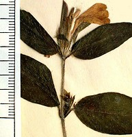
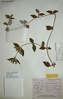
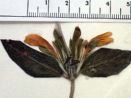

---
title: "Cynarospermum asperrimum"
---

## [[Cynarospermum]] 

## #has_/text_of_/abstract 

> **Cynarospermum** asperrimum is a species of flowering plant belonging to the family Acanthaceae. It is a subshrub endemic to the Western Ghats of western India. It is the sole species in genus Cynarospermum.
>
> Cynarospermum asperrimum is a scrambling or trailing perennial herb, with multiple branches and stems up to 1 meter long. Stems can root in contact with soil. It flowers during the monsoon and post-monsoon season, and attracts several species of butterflies for pollination.
>
> It is locally common in the foothills and hill ranges of the Western Ghats in southern Gujarat, Maharashtra, Goa, and Karnataka states. It grows abundantly in partly-shaded and moist areas, including shrub savannas, forest edges, partly-shaded roadsides, and bunds between fields. It is easily cultivated in pots and gardens.
>
> [Wikipedia](https://en.wikipedia.org/wiki/Cynarospermum) 

## Phylogeny 

-   « Ancestral Groups  
    -   [Acantheae](../Acantheae.md)
    -   [Acanthaceae](../../Acanthaceae.md)
    -   [Lamiales](../../../Lamiales.md)
    -   [Asterids](../../../../Asterids.md)
    -  [Core Eudicots](../../../../../Core_Eudicots.md))
    -   [Eudicots](../../../../../../Eudicots.md)
    -   [Flowering_Plant](../../../../../../../Flowering_Plant.md)
    -   [Seed_Plant](../../../../../../../../Seed_Plant.md)
    -   [Land_Plant](../../../../../../../../../Land_Plant.md)
    -   [Green plants](../../../../../../../../../../Plants.md)
    -  [Eukarya](../../../../../../../../../../../Eukarya.md))
    -   [Tree of Life](../../../../../../../../../../../Tree_of_Life.md)

-   ◊ Sibling Groups of  Acantheae
    -   [Acanthus Clade](Acanthus_Clade)
    -   [Acanthopsis](Acanthopsis.md)
    -   [Blepharis](Blepharis.md)
    -   Cynarospermum asperrimum
    -   [Crossandrella dusenii](Crossandrella_dusenii)
    -   [Streptosiphon hirsutus](Streptosiphon_hirsutus)
    -   [Sclerochiton](Sclerochiton.md)
    -   [Crossandra](Crossandra.md)
    -   [Stenandriopsis Clade](Stenandriopsis_Clade)
    -   [Stenandrium Clade](Stenandrium_Clade)
    -   [Other New World         Acantheae](Other_New_World_Acantheae)

-   » Sub-Groups 
	- *Cynarospermum asperrimum* [(Nees) Vollesen] 

## Introduction

[Lucinda A. McDade and Carrie Kiel]() 

*Cynarospermum* is an Indian genus with a single species.  This species
was treated as a member of *Blepharis* until Vollesen (1999) pointed out
that it lacks the synapomorphies of that genus (i.e., leaves are
opposite rather than in pseudowhorls, and the anterior pair of filaments
is normal rather than appendaged).  Plants of this species also have a
number of apomorphies that further distinguish them from *Blepharis*. 
Inflorescences are reduced to solitary or paired flowers in the axils of
vegetatives leaves, the bracteoles are three parted at the apex, and the
seeds have conical tubercles.

## Title Illustrations

--------------------------------------------------------------------------)
Scientific Name ::     Cynarospermum asperrimum (Ness) Vollesen
Location ::           Mysore, India
Specimen Condition   Dead Specimen
Copyright ::            © [Lucinda A. McDade](mailto:lucinda.mcdade@cgu.edu) 

---------------------------------------------------------------------------)
Scientific Name ::     Cynarospermum asperrimum (Ness) Vollesen
Location ::           Mysore, India
Reference            KEW
Specimen Condition   Dead Specimen
Collection           KEW
Collector            Saldanha 1193
Copyright ::            © 2006 [Lucinda A. McDade](mailto:lucinda.mcdade@cgu.edu) 

## Confidential Links & Embeds: 

### #is_/same_as ::[Cynarospermum](Cynarospermum.md)) 

### #is_/same_as :: [Cynarospermum.public](/_public/bio/bio~Domain/Eukarya/Plants/Land_Plant/Seed_Plant/Flowering_Plant/Eudicots/Core_Eudicots/Asterids/Lamiales/Acanthaceae/Acantheae/Cynarospermum.public.md) 

### #is_/same_as :: [Cynarospermum.internal](/_internal/bio/bio~Domain/Eukarya/Plants/Land_Plant/Seed_Plant/Flowering_Plant/Eudicots/Core_Eudicots/Asterids/Lamiales/Acanthaceae/Acantheae/Cynarospermum.internal.md) 

### #is_/same_as :: [Cynarospermum.protect](/_protect/bio/bio~Domain/Eukarya/Plants/Land_Plant/Seed_Plant/Flowering_Plant/Eudicots/Core_Eudicots/Asterids/Lamiales/Acanthaceae/Acantheae/Cynarospermum.protect.md) 

### #is_/same_as :: [Cynarospermum.private](/_private/bio/bio~Domain/Eukarya/Plants/Land_Plant/Seed_Plant/Flowering_Plant/Eudicots/Core_Eudicots/Asterids/Lamiales/Acanthaceae/Acantheae/Cynarospermum.private.md) 

### #is_/same_as :: [Cynarospermum.personal](/_personal/bio/bio~Domain/Eukarya/Plants/Land_Plant/Seed_Plant/Flowering_Plant/Eudicots/Core_Eudicots/Asterids/Lamiales/Acanthaceae/Acantheae/Cynarospermum.personal.md) 

### #is_/same_as :: [Cynarospermum.secret](/_secret/bio/bio~Domain/Eukarya/Plants/Land_Plant/Seed_Plant/Flowering_Plant/Eudicots/Core_Eudicots/Asterids/Lamiales/Acanthaceae/Acantheae/Cynarospermum.secret.md)

