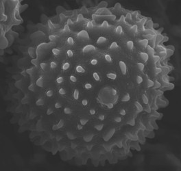

# [[Acanthopale]] 

 

## #has_/text_of_/abstract 

> **Acanthopale** is a plant genus of shrubs or subshrubs  in the Acanthaceae plant family. 
> The genus name is based on the classic Greek words for thorn ákantha and stake palum. 
> Some species in the genus are cultivated as ornamental plants.
>
> [Wikipedia](https://en.wikipedia.org/wiki/Acanthopale) 

## Phylogeny 

-   « Ancestral Groups  
    -   [Ruellieae](../Ruellieae.md)
    -   [Acanthaceae](../../Acanthaceae.md)
    -   [Lamiales](../../../Lamiales.md)
    -   [Asterids](../../../../Asterids.md)
    -  [Core Eudicots](../../../../../Core_Eudicots.md))
    -   [Eudicots](../../../../../../Eudicots.md)
    -   [Flowering_Plant](../../../../../../../Flowering_Plant.md)
    -   [Seed_Plant](../../../../../../../../Seed_Plant.md)
    -   [Land_Plant](../../../../../../../../../Land_Plant.md)
    -   [Green plants](../../../../../../../../../../Plants.md)
    -  [Eukarya](../../../../../../../../../../../Eukarya.md))
    -   [Tree of Life](../../../../../../../../../../../Tree_of_Life.md)

-   ◊ Sibling Groups of  Ruellieae
    -   [Ruellia s. l.](Ruellia_s._l.)
    -   Acanthopale
    -   [Brillantaisia](Brillantaisia.md)
    -   [Hemigraphis + Strobilanthes +         relatives](Hemigraphis_%2B_Strobilanthes_%2B_relatives)
    -   [Bravaisia](Bravaisia.md)
    -   [Suessenguthia](Suessenguthia.md)
    -   [Sanchezia](Sanchezia.md)
    -   [Louteridium](Louteridium.md)
    -   [Dyschoriste](Dyschoriste.md)
    -   [Phaulopsis](Phaulopsis.md)

-   » Sub-Groups 
	-   *Acanthopale albosetulosa*[ C. B. Clarke]
	-   *Acanthopale azaleoides*[ C. B. Clarke]
	-   *Acanthopale buchholzii*[ C. B. Clarke]
	-   *Acanthopale confertiflora*[ C. B. Clarke]
	-   *Acanothpale decempedalis*[ C. B. Clarke]
	-   *Acanthopale laxiflora*[ C. B. Clarke]
	-   *Acanthopale pubescens*[ C. B. Clarke ]

## Title Illustrations

-----------------------------------------------------------------------)
Scientific Name ::     Acanthopale decempedalis C. B. Clarke
Specimen Condition   Dead Specimen
Identified By        Erin A. Tripp
Life Cycle Stage ::     pollen
Copyright ::            © [Erin Tripp](mailto:erin.tripp@duke.edu) 

## Confidential Links & Embeds: 

### #is_/same_as ::[Acanthopale](Acanthopale.md)) 

### #is_/same_as :: [Acanthopale.public](/_public/bio/bio~Domain/Eukarya/Plants/Land_Plant/Seed_Plant/Flowering_Plant/Eudicots/Core_Eudicots/Asterids/Lamiales/Acanthaceae/Ruellieae/Acanthopale.public.md) 

### #is_/same_as :: [Acanthopale.internal](/_internal/bio/bio~Domain/Eukarya/Plants/Land_Plant/Seed_Plant/Flowering_Plant/Eudicots/Core_Eudicots/Asterids/Lamiales/Acanthaceae/Ruellieae/Acanthopale.internal.md) 

### #is_/same_as :: [Acanthopale.protect](/_protect/bio/bio~Domain/Eukarya/Plants/Land_Plant/Seed_Plant/Flowering_Plant/Eudicots/Core_Eudicots/Asterids/Lamiales/Acanthaceae/Ruellieae/Acanthopale.protect.md) 

### #is_/same_as :: [Acanthopale.private](/_private/bio/bio~Domain/Eukarya/Plants/Land_Plant/Seed_Plant/Flowering_Plant/Eudicots/Core_Eudicots/Asterids/Lamiales/Acanthaceae/Ruellieae/Acanthopale.private.md) 

### #is_/same_as :: [Acanthopale.personal](/_personal/bio/bio~Domain/Eukarya/Plants/Land_Plant/Seed_Plant/Flowering_Plant/Eudicots/Core_Eudicots/Asterids/Lamiales/Acanthaceae/Ruellieae/Acanthopale.personal.md) 

### #is_/same_as :: [Acanthopale.secret](/_secret/bio/bio~Domain/Eukarya/Plants/Land_Plant/Seed_Plant/Flowering_Plant/Eudicots/Core_Eudicots/Asterids/Lamiales/Acanthaceae/Ruellieae/Acanthopale.secret.md)

