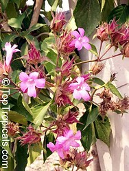
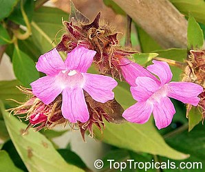

---
aliases:
- Suessenguthia
title: Suessenguthia
---

# [[Suessenguthia]] 

## #has_/text_of_/abstract 

> **Suessenguthia** is a genus of the Acanthaceae plant family comprising eight species of shrubs with showy, tubular flowers arranged in few-flowered heads. It occurs in the lowlands and Andean foothills of southern Peru, Bolivia, and the Brazilian state of Acre, often growing in small groups along rivers.
>
> Suessenguthia is similar to and closely related to the better known and larger genus Sanchezia.
>
> Suessenguthia multisetosa from eastern Bolivia is one of the more known species as it is cultivated for ornamental use.
>
> [Wikipedia](https://en.wikipedia.org/wiki/Suessenguthia) 

## Phylogeny 

-   « Ancestral Groups  
    -   [Ruellieae](../Ruellieae.md)
    -   [Acanthaceae](../../Acanthaceae.md)
    -   [Lamiales](../../../Lamiales.md)
    -   [Asterids](../../../../Asterids.md)
    -  [Core Eudicots](../../../../../Core_Eudicots.md))
    -   [Eudicots](../../../../../../Eudicots.md)
    -   [Flowering_Plant](../../../../../../../Flowering_Plant.md)
    -   [Seed_Plant](../../../../../../../../Seed_Plant.md)
    -   [Land_Plant](../../../../../../../../../Land_Plant.md)
    -   [Green plants](../../../../../../../../../../Plants.md)
    -  [Eukarya](../../../../../../../../../../../Eukarya.md))
    -   [Tree of Life](../../../../../../../../../../../Tree_of_Life.md)

-   ◊ Sibling Groups of  Ruellieae
    -   [Ruellia s. l.](Ruellia_s._l.)
    -   [Acanthopale](Acanthopale.md)
    -   [Brillantaisia](Brillantaisia.md)
    -   [Hemigraphis + Strobilanthes +         relatives](Hemigraphis_%2B_Strobilanthes_%2B_relatives)
    -   [Bravaisia](Bravaisia.md)
    -   Suessenguthia
    -   [Sanchezia](Sanchezia.md)
    -   [Louteridium](Louteridium.md)
    -   [Dyschoriste](Dyschoriste.md)
    -   [Phaulopsis](Phaulopsis.md)

-   » Sub-Groups 

## Introduction

[Erin Tripp]() 

*Suessenguthia* is a small genus of six species (Schmidt-Lebuhn 2003).
These are shrubs to treelets that genrally occur in wet or riparian
habitats in the eastern Andean foothills (Bolivia, Peru, and adjacent
lowlands in western Brazil). 

Recent phylogenetic analyses suggest *Suessenguthia* is paraphyletic and
that *Sanchezia* is monophyletic and nested within it (Schmidt-Lebuhn et
al. 2005). The two genera bear many morphological similarities, but
*Suessenguthia* species have 4 fertile stamens with anther appendages
(vs. 2 fertile, unappendaged stamens in *Sanchezia*). 

## Title Illustrations

----------------------)
Scientific Name ::     Suessenguthia multisetosa (Rusby) Wassh. & J.R.I.Wood
Location ::           Thailand
Specimen Condition   Live Specimen
Copyright ::            © 2002-2006 [TopTropicals.com](http://toptropicals.com/)

----------------------)
Scientific Name ::     Suessenguthia multisetosa (Rusby) Wassh. & J.R.I.Wood
Specimen Condition   Live Specimen
Copyright ::            © 2002-2006 [TopTropicals.com](http://toptropicals.com/)

## Confidential Links & Embeds: 

### #is_/same_as ::[Suessenguthia](Suessenguthia.md)) 

### #is_/same_as :: [Suessenguthia.public](/_public/bio/bio~Domain/Eukarya/Plants/Land_Plant/Seed_Plant/Flowering_Plant/Eudicots/Core_Eudicots/Asterids/Lamiales/Acanthaceae/Ruellieae/Suessenguthia.public.md) 

### #is_/same_as :: [Suessenguthia.internal](/_internal/bio/bio~Domain/Eukarya/Plants/Land_Plant/Seed_Plant/Flowering_Plant/Eudicots/Core_Eudicots/Asterids/Lamiales/Acanthaceae/Ruellieae/Suessenguthia.internal.md) 

### #is_/same_as :: [Suessenguthia.protect](/_protect/bio/bio~Domain/Eukarya/Plants/Land_Plant/Seed_Plant/Flowering_Plant/Eudicots/Core_Eudicots/Asterids/Lamiales/Acanthaceae/Ruellieae/Suessenguthia.protect.md) 

### #is_/same_as :: [Suessenguthia.private](/_private/bio/bio~Domain/Eukarya/Plants/Land_Plant/Seed_Plant/Flowering_Plant/Eudicots/Core_Eudicots/Asterids/Lamiales/Acanthaceae/Ruellieae/Suessenguthia.private.md) 

### #is_/same_as :: [Suessenguthia.personal](/_personal/bio/bio~Domain/Eukarya/Plants/Land_Plant/Seed_Plant/Flowering_Plant/Eudicots/Core_Eudicots/Asterids/Lamiales/Acanthaceae/Ruellieae/Suessenguthia.personal.md) 

### #is_/same_as :: [Suessenguthia.secret](/_secret/bio/bio~Domain/Eukarya/Plants/Land_Plant/Seed_Plant/Flowering_Plant/Eudicots/Core_Eudicots/Asterids/Lamiales/Acanthaceae/Ruellieae/Suessenguthia.secret.md)

