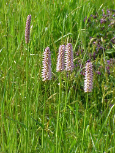
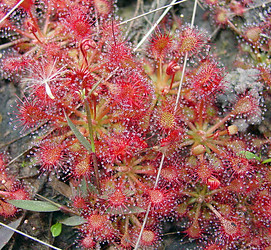
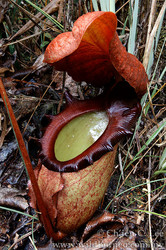

---
title: "non-core Caryophyllales"
---

# non-core Caryophyllales

## Polygonales 

## #has_/text_of_/abstract 

> **Polygonales** was an order of flowering plants recognized by several older systems 
> such as the Wettstein system, last revised in 1935, the Engler system, 
> in its update of 1964, and the Cronquist system, 1981. 
> Its circumscription was typically:
> - order Polygonales
> - family Polygonaceae
>
> In these systems the order is placed close to the order Caryophyllales 
> (or its predecessor Centrospermae). 
> Cronquist placed this order in his subclass Caryophyllidae of three orders. 
> Dahlgren placed the order Polygonales within the superorder Polygoniflorae, 
> alternatively Polygonanae.
>
> [Wikipedia](https://en.wikipedia.org/wiki/Polygonales) 

## Introduction

The non-core Caryophyllales clade (*sensu* Cuénoud *et al.* 2002), which
corresponds to the Polygonales of Judd *et al*. (2002), has only
recently been identified through molecular phylogenetic analysis. It
includes several families that were previously classified in Cronquist's
(1981) Rosidae or Dilleniidae.

### Characteristics

Possible synapomorphies for the non-core Caryophyllales (= Polygonales
*sensu* Judd *et al*. 2002) are scattered secretory cells containing
plumbagin, naphthaquinone (which has been lost in several clades), an
indumentum of stalked, gland-headed hairs, basal placentation (with
shifts to parietal in some Droseraceae and axile in Nepenthaceae), and
starchy endosperm (Judd *et al*. 2002). Polygonaceae and Plumbaginaceae
are united by ovaries with a single ovule and generally indehiscent
fruits such as achenes or nuts. The clade of Droseraceae, Nepenthaceae,
and relatives is probably supported by carnivory, circinate leaves, and
pollen grains in tetrads (Judd *et al.* 2002).

### Discussion of Phylogenetic Relationships

There are three major clades within non-core Caryophyllales:

1.  Polygonaceae (43 genera, 1,100 species; cosmopolitan) and
    Plumbaginaceae (22 genera, 800 species; cosmopolitan, but centered
    in the Mediterranean region) form a strongly supported clade, as
    they have in many previous analyses (e.g., Giannasi *et al*. 1992;
    Rettig *et al*. 1992).
2.  Tamaricaceae (5 genera, 90 species; Eurasia and Africa) and
    Frankeniaceae (monogeneric with 90 species; cosmopolitan)
3.  Carnivorous plants classified in Droseraceae (3 genera; 115 species;
    cosmopolitan), Drosophyllaceae (monospecific; Spain and Morocco),
    Dioncophyllaceae (3 monospecific genera; western Africa), and
    Nepenthaceae (monogeneric with 90 species; Madagascar to New
    Caledonia), together with Ancistrocladaceae (monogeneric with 12
    species; tropical Africa to Borneo and Taiwan).

The relationship between Droseraceae and Nepenthaceae, and their
relationship to Caryophyllidae *sensu* Cronquist (1981), was first
recognized on the basis of *rbcL* sequences (Albert *et al.* 1992; Chase
et al. 1993; Williams *et al.* 1994). Analyses of *matK* sequences alone
for several species of *Nepenthes, Drosera,* and *Ancistrocladus,* plus
*Drosophyllum* and all three genera of Dioncophyllaceae, resulted in a
well-supported tree with Droseraceae sister to a clade of Nepenthaceae ,
(*Drosophyllum* , (Dioncophyllaceae , Ancistrocladaceae)) (Meimberg *et
al*. 2000).

## Phylogeny 

-   « Ancestral Groups  
    -   [Caryophyllales](../Caryophyllales.md)
    -  [Core Eudicots](../../Core_Eudicots.md))
    -   [Eudicots](../../../Eudicots.md)
    -   [Flowering_Plant](../../../../Flowering_Plant.md)
    -   [Seed_Plant](../../../../../Seed_Plant.md)
    -   [Land_Plant](../../../../../../Land_Plant.md)
    -   [Green plants](../../../../../../../Plants.md)
    -  [Eukarya](../../../../../../../../Eukarya.md))
    -   [Tree of Life](../../../../../../../../Tree_of_Life.md)

-   ◊ Sibling Groups of  Caryophyllales
    -   non-core Caryophyllales
    -  [core Caryophyllales](Core_Caryophyllales.md))

-   » Sub-Groups 

## Title Illustrations

----------------------------------------------------------------------)
Scientific Name ::  Polygonum bistorta
Copyright ::         © 2004 [Kurt Stüber](http://www.biolib.de/) 

------------------------------)
Scientific Name ::     Drosera intermedia
Location ::           coastal Mississippi, USA
Acknowledgements     Photograph courtesy [InsectImages.org](http://www.insectimages.org/) (#1241028)
Specimen Condition   Live Specimen
Source Collection    [InsectImages.org](http://www.insectimages.org/)
Copyright ::            © James Henderson, Gulf South Research Corporation

-------------------------------------------------------------------------)
Scientific Name ::     Nepenthes rajah
Location ::           Sabah, Malaysia
Specimen Condition   Live Specimen
Identified By        Ch\'ien Lee
Life Cycle Stage ::     Mature plant
Body Part            Lower pitcher
Size                 c\. 20 cm long
Copyright ::            © 2006 [Chien Lee](http://www.wildborneo.com.my/) 

## Confidential Links & Embeds: 

### #is_/same_as ::[Polygonales](Polygonales.md)) 

### #is_/same_as :: [Polygonales.public](/_public/bio/bio~Domain/Eukarya/Plants/Land_Plant/Seed_Plant/Flowering_Plant/Eudicots/Core_Eudicots/Caryophyllales/Polygonales.public.md) 

### #is_/same_as :: [Polygonales.internal](/_internal/bio/bio~Domain/Eukarya/Plants/Land_Plant/Seed_Plant/Flowering_Plant/Eudicots/Core_Eudicots/Caryophyllales/Polygonales.internal.md) 

### #is_/same_as :: [Polygonales.protect](/_protect/bio/bio~Domain/Eukarya/Plants/Land_Plant/Seed_Plant/Flowering_Plant/Eudicots/Core_Eudicots/Caryophyllales/Polygonales.protect.md) 

### #is_/same_as :: [Polygonales.private](/_private/bio/bio~Domain/Eukarya/Plants/Land_Plant/Seed_Plant/Flowering_Plant/Eudicots/Core_Eudicots/Caryophyllales/Polygonales.private.md) 

### #is_/same_as :: [Polygonales.personal](/_personal/bio/bio~Domain/Eukarya/Plants/Land_Plant/Seed_Plant/Flowering_Plant/Eudicots/Core_Eudicots/Caryophyllales/Polygonales.personal.md) 

### #is_/same_as :: [Polygonales.secret](/_secret/bio/bio~Domain/Eukarya/Plants/Land_Plant/Seed_Plant/Flowering_Plant/Eudicots/Core_Eudicots/Caryophyllales/Polygonales.secret.md)

