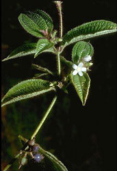
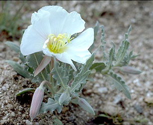

---
aliases:
- Myrtales
title: Myrtales
---

# [[Myrtales]] 

     

## #has_/text_of_/abstract 

> The **Myrtales** are an order of flowering plants 
> in the malvid clade of the rosid group of dicotyledons. 
> 
> Well-known members of Myrtales include: myrtle, pōhutukawa, bay rum tree, clove, guava, acca (feijoa), allspice, eucalyptus, crape myrtles, henna tree, pomegranate, water caltrop, loosestrifes, cupheas (cigar plants), evening primroses, fuchsias, willowherbs, white mangrove, leadwood tree, African birch, Koster's curse, and velvet tree. 
>
> [Wikipedia](https://en.wikipedia.org/wiki/Myrtales) 

## Phylogeny 

-   « Ancestral Groups  
    -   [Rosids](../Rosids.md)
    -  [Core Eudicots](../../Core_Eudicots.md))
    -   [Eudicots](../../../Eudicots.md)
    -   [Flowering_Plant](../../../../Flowering_Plant.md)
    -   [Seed_Plant](../../../../../Seed_Plant.md)
    -   [Land_Plant](../../../../../../Land_Plant.md)
    -   [Green plants](../../../../../../../Plants.md)
    -  [Eukarya](../../../../../../../../Eukarya.md))
    -   [Tree of Life](../../../../../../../../Tree_of_Life.md)

-   ◊ Sibling Groups of  Rosids
    -   [Gerrardina](Gerrardina)
    -   [Fagales](Fagales.md)
    -   [Cucurbitales](Cucurbitales.md)
    -   [Rosales](Rosales.md)
    -   [Fabales](Fabales.md)
    -   [Zygophyllales](Zygophyllales.md)
    -   [Oxalidales](Oxalidales.md)
    -   [Malpighiales](Malpighiales.md)
    -   [Celastrales](Celastrales.md)
    -   [Geraniales](Geraniales.md)
    -   [Crossosomatales](Crossosomatales.md)
    -   Myrtales
    -   [Brassicales](Brassicales.md)
    -   [Malvales](Malvales.md)
    -   [Sapindales](Sapindales.md)

-   » Sub-Groups
    -   [Onagraceae](Myrtales/Onagraceae.md)

## Title Illustrations

------------------------------------------------------------------------------)
Scientific Name ::    Clidemia hirta
Location ::          Native to tropical America, specimen photographed at Ranomafana National Park (Madagascar).
Comments            Koster\'s curse (Melastomataceae)
Creator             Photograph by Gerald and Buff Corsi
Source Collection   [CalPhotos](http://calphotos.berkeley.edu/)
Copyright ::           © 2000 [California Academy of Sciences](http://www.calacademy.org/) 

------------------------------------------------------------------------------)
Scientific Name ::     Oenothera californica
Location ::           Mojave Desert (San Bernardino County, California, USA)
Comments             California evening-primrose (Onagraceae)
Creator              Photograph by Jo-Ann Ordano
Specimen Condition   Live Specimen
Source Collection    [CalPhotos](http://calphotos.berkeley.edu/)
Copyright ::            © 2000 [California Academy of Sciences](http://www.calacademy.org/) 

------------------------------------------------------------------------------)
Scientific Name ::    Eucalyptus viminalis (Myrtaceae)
Location ::          Native to Australia, specimen photographed in Sunol (Alameda County, California, USA)
Comments            Manna gum
Creator             Photograph by Charles Webber
Source Collection   [CalPhotos](http://calphotos.berkeley.edu/)
Copyright ::           © 1998 [California Academy of Sciences](http://www.calacademy.org/) 

## Confidential Links & Embeds: 

### #is_/same_as ::[Myrtales](Myrtales.md)) 

### #is_/same_as :: [Myrtales.public](/_public/bio/bio~Domain/Eukarya/Plants/Land_Plant/Seed_Plant/Flowering_Plant/Eudicots/Core_Eudicots/Rosids/Myrtales.public.md) 

### #is_/same_as :: [Myrtales.internal](/_internal/bio/bio~Domain/Eukarya/Plants/Land_Plant/Seed_Plant/Flowering_Plant/Eudicots/Core_Eudicots/Rosids/Myrtales.internal.md) 

### #is_/same_as :: [Myrtales.protect](/_protect/bio/bio~Domain/Eukarya/Plants/Land_Plant/Seed_Plant/Flowering_Plant/Eudicots/Core_Eudicots/Rosids/Myrtales.protect.md) 

### #is_/same_as :: [Myrtales.private](/_private/bio/bio~Domain/Eukarya/Plants/Land_Plant/Seed_Plant/Flowering_Plant/Eudicots/Core_Eudicots/Rosids/Myrtales.private.md) 

### #is_/same_as :: [Myrtales.personal](/_personal/bio/bio~Domain/Eukarya/Plants/Land_Plant/Seed_Plant/Flowering_Plant/Eudicots/Core_Eudicots/Rosids/Myrtales.personal.md) 

### #is_/same_as :: [Myrtales.secret](/_secret/bio/bio~Domain/Eukarya/Plants/Land_Plant/Seed_Plant/Flowering_Plant/Eudicots/Core_Eudicots/Rosids/Myrtales.secret.md)

