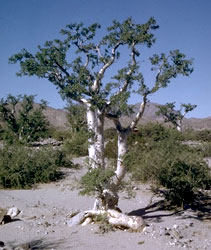

---
aliases:
- Sapindales
title: Sapindales
---

# [[Sapindales]] 

## #has_/text_of_/abstract 

> **Sapindales**  is an order of flowering plants. 
> Well-known members of Sapindales include citrus; maples, horse-chestnuts, lychees and rambutans; mangos and cashews; frankincense and myrrh; mahogany and neem.
>
> 
>
> The APG III system of 2009 includes it in the clade malvids (in rosids, in eudicots) 
> with the following nine families:
> - Anacardiaceae
> - Biebersteiniaceae
> - Burseraceae
> - Kirkiaceae
> - Meliaceae
> - Nitrariaceae (including Peganaceae and Tetradiclidaceae)
> - Rutaceae
> - Sapindaceae
> - Simaroubaceae
>
> The APG II system of 2003 allowed the optional segregation of families now included in the Nitrariaceae.
>
> In the classification system of Dahlgren the Rutaceae were placed in the order Rutales, 
> in the superorder Rutiflorae (also called Rutanae). 
> The Cronquist system of 1981 used a somewhat different circumscription, 
> including the following families:
> -Staphyleaceae
> -Melianthaceae
> -Bretschneideraceae
> -Akaniaceae
> -Sapindaceae- 
> -Hippocastanaceae
> -Aceraceae
> -Burseraceae
> -Anacardiaceae
> -Julianiaceae
> -Simaroubaceae
> -Cneoraceae
> -Meliaceae
> -Rutaceae
> -Zygophyllaceae
>
> The difference from the APG III system is not as large as may appear, 
> as the plants in the families Aceraceae and Hippocastanaceae stay in this order at APG III 
> (both included in family Sapindaceae). 
> 
> The species now composing the family Nitrariaceae in APG III 
> also belonged to this order in the Cronquist system as part of the family Zygophyllaceae, 
> while those now in the family Kirkiaceae were present as part of the family Simaroubaceae.
>
> [Wikipedia](https://en.wikipedia.org/wiki/Sapindales) 

## Phylogeny 

-
-   « Ancestral Groups  
    -   [Rosids](../Rosids.md)
    -  [Core Eudicots](../../Core_Eudicots.md))
    -   [Eudicots](../../../Eudicots.md)
    -   [Flowering_Plant](../../../../Flowering_Plant.md)
    -   [Seed_Plant](../../../../../Seed_Plant.md)
    -   [Land_Plant](../../../../../../Land_Plant.md)
    -   [Green plants](../../../../../../../Plants.md)
    -  [Eukarya](../../../../../../../../Eukarya.md))
    -   [Tree of Life](../../../../../../../../Tree_of_Life.md)

-   ◊ Sibling Groups of  Rosids
    -   [Gerrardina](Gerrardina)
    -   [Fagales](Fagales.md)
    -   [Cucurbitales](Cucurbitales.md)
    -   [Rosales](Rosales.md)
    -   [Fabales](Fabales.md)
    -   [Zygophyllales](Zygophyllales.md)
    -   [Oxalidales](Oxalidales.md)
    -   [Malpighiales](Malpighiales.md)
    -   [Celastrales](Celastrales.md)
    -   [Geraniales](Geraniales.md)
    -   [Crossosomatales](Crossosomatales.md)
    -   [Myrtales](Myrtales.md)
    -   [Brassicales](Brassicales.md)
    -   [Malvales](Malvales.md)
    -   Sapindales

-   » Sub-Groups
    -   [Anacardiaceae](Anacardiaceae)
    -   [Burseraceae](Burseraceae)

## Title Illustrations

)

  ------------------------------------------------------------------------------
  Scientific Name ::     Aesculus californica
  Comments             California buckeye (Sapindaceae)
  Creator              Photograph by G. Dallas and Margaret Hanna
  Specimen Condition   Live Specimen
  Source Collection    [CalPhotos](http://calphotos.berkeley.edu/)
  Copyright ::            © 1999 [California Academy of Sciences](http://www.calacademy.org/) 
  ------------------------------------------------------------------------------
)

  -------------------------------------------------------------------------
  Scientific Name ::     Dictamnus dasycarpus
  Location ::           Near Barabash-Levada village, Pogranichny distr., Primorsky Territory (Russian Federation)
  Comments             Rutaceae
  Specimen Condition   Live Specimen
  Source Collection    [CalPhotos](http://calphotos.berkeley.edu/)
  Copyright ::            © 1999 [Nick Kurzenko](mailto:kurzenko@ibss.dvo.ru) 
  -------------------------------------------------------------------------
)

  ------------------------------------------------------------------------------
  Scientific Name ::     Bursera microphylla
  Location ::           Baja California, La Gringa, near (Mexico)
  Comments             Elephant tree (Burseraceae)
  Creator              Photograph by Glenn Vargas
  Specimen Condition   Live Specimen
  Source Collection    [CalPhotos](http://calphotos.berkeley.edu/)
  Copyright ::            © 1999 [California Academy of Sciences](http://www.calacademy.org/) 
  ------------------------------------------------------------------------------

## Confidential Links & Embeds: 

### #is_/same_as ::[Sapindales](Sapindales.md)) 

### #is_/same_as :: [Sapindales.public](/_public/bio/bio~Domain/Eukarya/Plants/Land_Plant/Seed_Plant/Flowering_Plant/Eudicots/Core_Eudicots/Rosids/Sapindales.public.md) 

### #is_/same_as :: [Sapindales.internal](/_internal/bio/bio~Domain/Eukarya/Plants/Land_Plant/Seed_Plant/Flowering_Plant/Eudicots/Core_Eudicots/Rosids/Sapindales.internal.md) 

### #is_/same_as :: [Sapindales.protect](/_protect/bio/bio~Domain/Eukarya/Plants/Land_Plant/Seed_Plant/Flowering_Plant/Eudicots/Core_Eudicots/Rosids/Sapindales.protect.md) 

### #is_/same_as :: [Sapindales.private](/_private/bio/bio~Domain/Eukarya/Plants/Land_Plant/Seed_Plant/Flowering_Plant/Eudicots/Core_Eudicots/Rosids/Sapindales.private.md) 

### #is_/same_as :: [Sapindales.personal](/_personal/bio/bio~Domain/Eukarya/Plants/Land_Plant/Seed_Plant/Flowering_Plant/Eudicots/Core_Eudicots/Rosids/Sapindales.personal.md) 

### #is_/same_as :: [Sapindales.secret](/_secret/bio/bio~Domain/Eukarya/Plants/Land_Plant/Seed_Plant/Flowering_Plant/Eudicots/Core_Eudicots/Rosids/Sapindales.secret.md)

