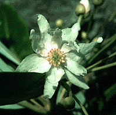

## Phylogeny 

-   « Ancestral Groups  
    -   [Magnoliids](../Magnoliids.md)
    -   [Flowering_Plant](../../Flowering_Plant.md)
    -   [Seed_Plant](../../../Seed_Plant.md)
    -   [Land_Plant](../../../../Land_Plant.md)
    -   [Green plants](../../../../../Plants.md)
    -  [Eukarya](../../../../../../Eukarya.md))
    -   [Tree of Life](../../../../../../Tree_of_Life.md)

-   ◊ Sibling Groups of  magnoliids
    -   [Piperales](Piperales.md)
    -   Canellales
    -   [Magnoliales](Magnoliales.md)
    -   [Laurales](Laurales.md)

-   » Sub-Groups 

# [[Canellales]] 

Image © 1995 M. J. Donoghue

## #has_/text_of_/abstract 

> **Canellales** is the botanical name for an order of flowering plants, 
> one of the four orders of the magnoliids. 
> 
> It is recognized by the most recent classification of flowering plants, the APG IV system. 
> It is defined to contain two families: 
> Canellaceae and Winteraceae, which comprise 136 species of fragrant trees and shrubs. 
> 
> The Canellaceae are found in tropical America and Africa, 
> and the Winteraceae are part of the Antarctic flora 
> (found in diverse parts of the southern hemisphere). 
> 
> Although the order was defined based on phylogenetic studies, 
> a number of possible synapomorphies have been suggested, relating to the pollen tube, 
> the seeds, the thickness of the integument, and other aspects of the morphology.
>
> Until 1999, these two families were not considered to be closely related. 
> Instead the Winteraceae were considered to be a primitive family 
> (due to the structure of the xylem and carpel, 
> a structure which now seems to be derived from xylem and carpels more typical of the angiosperms as a whole). 
> 
> The Canellaceae was often considered to be related to the Myristicaceae. 
> However, studies starting in 1999, based on molecular phylogeny or morphology, 
> have supported uniting these two families.
>
> [Wikipedia](https://en.wikipedia.org/wiki/Canellales) 

## Confidential Links & Embeds: 

### #is_/same_as ::[Canellales](Canellales.md)) 

### #is_/same_as :: [Canellales.public](/_public/bio/bio~Domain/Eukarya/Plants/Land_Plant/Seed_Plant/Flowering_Plant/Magnoliids/Canellales.public.md) 

### #is_/same_as :: [Canellales.internal](/_internal/bio/bio~Domain/Eukarya/Plants/Land_Plant/Seed_Plant/Flowering_Plant/Magnoliids/Canellales.internal.md) 

### #is_/same_as :: [Canellales.protect](/_protect/bio/bio~Domain/Eukarya/Plants/Land_Plant/Seed_Plant/Flowering_Plant/Magnoliids/Canellales.protect.md) 

### #is_/same_as :: [Canellales.private](/_private/bio/bio~Domain/Eukarya/Plants/Land_Plant/Seed_Plant/Flowering_Plant/Magnoliids/Canellales.private.md) 

### #is_/same_as :: [Canellales.personal](/_personal/bio/bio~Domain/Eukarya/Plants/Land_Plant/Seed_Plant/Flowering_Plant/Magnoliids/Canellales.personal.md) 

### #is_/same_as :: [Canellales.secret](/_secret/bio/bio~Domain/Eukarya/Plants/Land_Plant/Seed_Plant/Flowering_Plant/Magnoliids/Canellales.secret.md)

