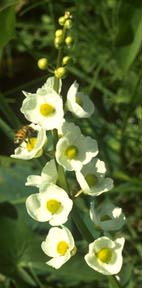

---
title: Alismatanae
---

# [[Alismatanae]] 

 

## #has_/text_of_/abstract 

> The Alismatales (alismatids) are an order of flowering plants including about 4,500 species. 
> Plants assigned to this order are mostly tropical or aquatic. 
> Some grow in fresh water, some in marine habitats. 
> Perhaps the most important food crop in the order is the taro plant, Colocasia esculenta.
>
> [Wikipedia](https://en.wikipedia.org/wiki/Alismatales) 

## Introduction

[William J. Hahn]()

The pondweeds and relatives are almost exclusively aquatic or marine and
show numerous specializations for this habitat. Many of these features
are reductions in form which have confounded attempts at phylogenetic
resolution for the group (Dahlgren and Rasmussen, 1983; Les and Haynes,
1995). The superorder includes 15 families, 56 genera, and approximately
500 species.

### Characteristics

Morphological synapomorphies for the alismatids include presence of
intravaginal squamulae, lack of an endosperm, and root hair cells
shorter than epidermal cells. (Dahlgren and Rasmussen, 1983; Dahlgren et
al, 1985; Dalgren and Bremer, 1985).

## Phylogeny 

-   « Ancestral Groups  
    -   [Monocot](../Monocot.md)
    -   [Flowering_Plant](../../Flowering_Plant.md)
    -   [Seed_Plant](../../../Seed_Plant.md)
    -   [Land_Plant](../../../../Land_Plant.md)
    -   [Green plants](../../../../../Plants.md)
    -  [Eukarya](../../../../../../Eukarya.md))
    -   [Tree of Life](../../../../../../Tree_of_Life.md)

-   ◊ Sibling Groups of  Monocotyledons
    -   Alismatanae
    -   [Aranae](Aranae.md)
    -   [Liliales](Liliales.md)
    -   [Asparagales](Asparagales.md)
    -   [Pandanales](Pandanales.md)
    -   [Dioscoreales](Dioscoreales.md)
    -   [Palms](Palms.md)
    -   [Zingiberanae](Zingiberanae.md)
    -   [Commelinanae](Commelinanae.md)

-   » Sub-Groups 

## Confidential Links & Embeds: 

### #is_/same_as ::[Alismatanae](Alismatanae.md)) 

### #is_/same_as :: [Alismatanae.public](/_public/bio/bio~Domain/Eukarya/Plants/Land_Plant/Seed_Plant/Flowering_Plant/Monocot/Alismatanae.public.md) 

### #is_/same_as :: [Alismatanae.internal](/_internal/bio/bio~Domain/Eukarya/Plants/Land_Plant/Seed_Plant/Flowering_Plant/Monocot/Alismatanae.internal.md) 

### #is_/same_as :: [Alismatanae.protect](/_protect/bio/bio~Domain/Eukarya/Plants/Land_Plant/Seed_Plant/Flowering_Plant/Monocot/Alismatanae.protect.md) 

### #is_/same_as :: [Alismatanae.private](/_private/bio/bio~Domain/Eukarya/Plants/Land_Plant/Seed_Plant/Flowering_Plant/Monocot/Alismatanae.private.md) 

### #is_/same_as :: [Alismatanae.personal](/_personal/bio/bio~Domain/Eukarya/Plants/Land_Plant/Seed_Plant/Flowering_Plant/Monocot/Alismatanae.personal.md) 

### #is_/same_as :: [Alismatanae.secret](/_secret/bio/bio~Domain/Eukarya/Plants/Land_Plant/Seed_Plant/Flowering_Plant/Monocot/Alismatanae.secret.md)

