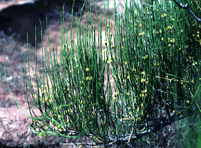
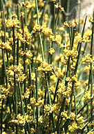
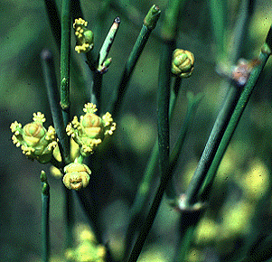
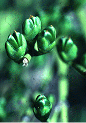

---
aliases:
- Ephedra
- Ephedraceae
- Ephedrales
- joint-pine
- jointfir
- Mormon-tea
- "Brigham tea"
- mahuang
- 麻黄
- 麻黃
title: Ephedra
---

# [[Ephedra]] 

      
Image copyright © 1995 David R. Maddison

## #has_/text_of_/abstract 

> Ephedra is a genus of gymnosperm shrubs. As of February 2025 there were 77 recognized species.  
> 
> The various species of Ephedra are widespread in many arid regions of the world, 
> ranging across southwestern North America, southern Europe, northern Africa, 
> southwest and central Asia, northern China, and western South America. 
> 
> It is the only extant genus in its family, Ephedraceae, and order, Ephedrales, 
> and one of the three living members of the division Gnetophyta alongside Gnetum and Welwitschia.
>
> In temperate climates, most Ephedra species grow on shores 
> or in sandy soils with direct sun exposure. 
> 
> Common names in English include joint-pine, jointfir, Mormon-tea, or Brigham tea. 
> The Chinese name for Ephedra species is mahuang (simplified Chinese: 麻黄; traditional Chinese: 麻黃; 
> pinyin: máhuáng; Wade–Giles: ma-huang; lit. 'hemp yellow'). 
> 
> Ephedra is the origin of the name of the stimulant ephedrine, 
> which the plants contain in significant concentration.
>
> [Wikipedia](https://en.wikipedia.org/wiki/Ephedra%20(plant)) 

## Phylogeny 

-   « Ancestral Groups  
    -   [Gnetales](../Gnetales.md)
    -   [Seed_Plant](../../Seed_Plant.md)
    -   [Land_Plant](../../../Land_Plant.md)
    -   [Green plants](../../../../Plants.md)
    -  [Eukarya](../../../../../Eukarya.md))
    -   [Tree of Life](../../../../../Tree_of_Life.md)

-   ◊ Sibling Groups of  Gnetales
    -   Ephedra
    -   [Gnetum](Gnetum.md)

-   » Sub-Groups 
	-   *Ephedra alata*
	-   *Ephedra altissima*
	-   *Ephedra americana*
	-   *Ephedra antisyphilitica*
	-   *Ephedra aphylla*
	-   *Ephedra aspera*
	-   *Ephedra boelckei*
	-   *Ephedra breana*
	-   *Ephedra californica*
	-   *Ephedra chilensis*
	-   *Ephedra compacta*
	-   *Ephedra coryi*
	-   *Ephedra cutleri*
	-   *Ephedra distachya*
	-   *Ephedra equisetina*
	-   *Ephedra fasciculata*
	-   *Ephedra fedtschenkoae*
	-   *Ephedra foeminea*
	-   *Ephedra foliata*
	-   *Ephedra fragilis*
	-   *Ephedra frustillata*
	-   *Ephedra funerea*
	-   *Ephedra gerardiana*
	-   *Ephedra gracilis*
	-   *Ephedra holoptera*
	-   *Ephedra intermedia*
	-   *Ephedra lepidosperma*
	-   *Ephedra likiangensis*
	-   *Ephedra lomatolepis*
	-   *Ephedra major*
	-   *Ephedra minuta*
	-   *Ephedra monosperma*
	-   *Ephedra multiflora*
	-   *Ephedra nevadensis*
	-   *Ephedra ochreata*
	-   *Ephedra oxyphylla*
	-   *Ephedra pachyclada*
	-   *Ephedra pedunculata*
	-   *Ephedra przewalski*
	-   *Ephedra rupestris*
	-   *Ephedra sarcocapa*
	-   *Ephedra saxatilis*
	-   *Ephedra sinica*
	-   *Ephedra strobilacea*
	-   *Ephedra torreyana*
	-   *Ephedra triandra*
	-   *Ephedra trifurca*
	-   *Ephedra trifurcata*
	-   *Ephedra tweediana*
	-   *Ephedra viridis*

## Confidential Links & Embeds: 

### #is_/same_as ::[Ephedra](Ephedra.md)) 

### #is_/same_as :: [Ephedra.public](/_public/bio/bio~Domain/Eukarya/Plants/Land_Plant/Seed_Plant/Gnetales/Ephedra.public.md) 

### #is_/same_as :: [Ephedra.internal](/_internal/bio/bio~Domain/Eukarya/Plants/Land_Plant/Seed_Plant/Gnetales/Ephedra.internal.md) 

### #is_/same_as :: [Ephedra.protect](/_protect/bio/bio~Domain/Eukarya/Plants/Land_Plant/Seed_Plant/Gnetales/Ephedra.protect.md) 

### #is_/same_as :: [Ephedra.private](/_private/bio/bio~Domain/Eukarya/Plants/Land_Plant/Seed_Plant/Gnetales/Ephedra.private.md) 

### #is_/same_as :: [Ephedra.personal](/_personal/bio/bio~Domain/Eukarya/Plants/Land_Plant/Seed_Plant/Gnetales/Ephedra.personal.md) 

### #is_/same_as :: [Ephedra.secret](/_secret/bio/bio~Domain/Eukarya/Plants/Land_Plant/Seed_Plant/Gnetales/Ephedra.secret.md)

