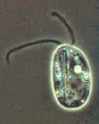

---
aliases:
  - Protists
  - protoctist
  - Protoctista
  - Protista
  - protist
  - Protist
  - Միաբջիջներ
  - Պրոտոզոաներ
  - Պրոտոզոններ
  - Protistas
  - Protisto
  - Protisti
  - პროტისტები
  - Споралылар
  - បឋមត្ថិកសត្វ
  - 원생생물
  - Protistai
  - protisti
  - Протисти
  - പ്രോട്ടിസ്റ്റ
  - प्रोटिस्टा
  - Protister
  - Protisten
  - Protistar
  - Protisty
  - پروٹسٹ
  - Ch'ulla kawsaykuq
  - Protiste
  - Протисты / Простейшие
  - Протистар
  - ප්රෝටිස්ටා රාජධානිය
  - Urdjur / Protozoer / Protister
  - அதிநுண்ணுயிரி
  - ప్రోటిస్టా
  - โปรติสต์
  - Meʻamoʻuimuʻa
  - اولانیات
  - Protistad
  - Sinh vật nguyên sinh
  - פראטיסטן
  - 原生生物
  - 原生生物界
  - تکیاختگان
  - Algloomad
  - Frumdýr
  - Prvoky
  - Найпростіші
  - طلائعيات
  - প্ৰটিষ্টা
  - İbtidailər
  - Prótisten
  - Пратысты
  - Протиста
  - প্রোটিস্ট
  - شانشینی پێشەنگییەکان
  - prvoci / Protisté
  - Protosoa
  - Protozo / Protister / Protist
  - Πρώτιστα
  - Protistoj
  - protobacteria
  - Protistid
  - Alkueliöt
  - Protistes
  - Uurdiarten
  - Protischte
  - פרוטיסטים
  - प्रोटिस्ट
  - Pwotis
  - protiszták
  - Véglények
has_id_wikidata: Q10892
title: The other protists
taxon_common_name:
  - Միաբջիջներ
  - Պրոտոզոաներ
  - Պրոտոզոններ
  - Protistas
  - Protisto
  - Protisti
  - პროტისტები
  - Споралылар
  - បឋមត្ថិកសត្វ
  - 원생생물
  - Protistai
  - protisti
  - Протисти
  - പ്രോട്ടിസ്റ്റ
  - प्रोटिस्टा
  - Protister
  - Protisten
  - Protistar
  - Protisty
  - پروٹسٹ
  - Ch'ulla kawsaykuq
  - Protiste
  - Протисты / Простейшие
  - Протистар
  - ප්රෝටිස්ටා රාජධානිය
  - protisti
  - Urdjur / Protozoer / Protister
  - அதிநுண்ணுயிரி
  - ప్రోటిస్టా
  - โปรติสต์
  - Meʻamoʻuimuʻa
  - اولانیات
  - Protistad
  - Sinh vật nguyên sinh
  - פראטיסטן
  - 原生生物
  - 原生生物
  - 原生生物界
  - تکیاختگان
  - Protisten
  - Algloomad
  - Frumdýr
  - Prvoky
  - Найпростіші
  - 原生生物
  - Protiste
  - طلائعيات
  - প্ৰটিষ্টা
  - İbtidailər
  - Протистар
  - Prótisten
  - Пратысты
  - Пратысты
  - Протиста
  - প্রোটিস্ট
  - Protisti
  - Protist
  - شانشینی پێشەنگییەکان
  - protisti
  - prvoci / Protisté
  - Protosoa
  - Protozo / Protister / Protist
  - Πρώτιστα
  - Protistoj
  - protobacteria
  - Protistid
  - Alkueliöt
  - Protistes
  - Uurdiarten
  - Protischte
  - פרוטיסטים
  - प्रोटिस्ट
  - Protisti
  - Pwotis
  - protiszták
  - Véglények
NBN_System_Key: NBNSYS0100004887
described_by_source:
  - '[[../../../WikiData/WD~Brockhaus_and_Efron_Encyclopedic_Dictionary,602358]]'
  - '[[_Standards/WikiData/WD~Encyclopædia_Britannica_11th_edition,867541]]'
  - '[[_Standards/WikiData/WD~Granat_Encyclopedic_Dictionary,4532138]]'
  - '[[_Standards/WikiData/WD~Great_Soviet_Encyclopedia_(1926_1947),20078554]]'
studied_by: '[[_Standards/WikiData/WD~protistology,2467781]]'
instance_of:
  - '[[_Standards/WikiData/WD~grade,2612572]]'
  - '[[_Standards/WikiData/WD~paraphyletic_group,58051350]]'
  - '[[_Standards/WikiData/WD~taxon,16521]]'
topic_has_template: '[[_Standards/WikiData/WD~Template_Protist_structures,20346012]]'
inception: -2100000000-01-01T00:00:00Z
subclass_of: '[[_Standards/WikiData/WD~organism,7239]]'
taxon_rank: '[[_Standards/WikiData/WD~kingdom,36732]]'
Commons_category: Protista
taxon_name: Protista
montage_image: http://commons.wikimedia.org/wiki/Special:FilePath/Protist%20collage.jpg
image: http://commons.wikimedia.org/wiki/Special:FilePath/DysnectesBrevis.jpg
pronunciation_audio: http://commons.wikimedia.org/wiki/Special:FilePath/LL-Q9610%20%28ben%29-Tahmid-%E0%A6%AA%E0%A7%8D%E0%A6%B0%E0%A7%8B%E0%A6%9F%E0%A6%BF%E0%A6%B8%E0%A7%8D%E0%A6%9F.wav
EPPO_Code: 1PROTK
---

# [[Protist]] 

#is_a/bio-Kingdom 
#is_a :: [[../../Taxon_Rank/bio~Kingdom|bio~Kingdom]]  
#is_/same_as :: [[../../../WikiData/WD~Protist,10892|WD~Protist,10892]] 

  .jpg) 

## #has_/text_of_/abstract 

> A protist ( PROH-tist) or protoctist is any eukaryotic organism 
> that is not an animal, land plant, or fungus. 
> 
> **Protists** do not form a natural group, or clade, but are a paraphyletic grouping of 
> all descendants of the last eukaryotic common ancestor excluding land plants, animals, and fungi.
>
> Protists were 
> historically regarded as a separate taxonomic kingdom known as Protista or Protoctista. 
> 
> With the advent of phylogenetic analysis and electron microscopy studies, 
> the use of Protista as a formal taxon was gradually abandoned. 
> In modern classifications, protists are spread across several eukaryotic clades called supergroups, 
> such as Archaeplastida (photoautotrophs that includes land plants), SAR, 
> Obazoa (which includes fungi and animals), Amoebozoa and "Excavata".
>
> Protists represent an extremely large genetic and ecological diversity in all environments, 
> including extreme habitats. 
> 
> Their diversity, larger than for all other eukaryotes, has only been discovered in recent decades 
> through the study of environmental DNA and is still in the process of being fully described. 
> 
> They are present in all ecosystems 
> as important components of the biogeochemical cycles and trophic webs. 
> 
> They exist abundantly and ubiquitously in a variety of mostly unicellular forms 
> that evolved multiple times independently, such as free-living algae, amoebae and slime moulds, 
> or as important parasites. 
> 
> Together, they compose an amount of biomass that doubles that of animals. 
> They exhibit varied types of nutrition (such as phototrophy, phagotrophy or osmotrophy), 
> sometimes combining them (in mixotrophy). 
> 
> They present unique adaptations not present in multicellular animals, fungi or land plants. 
> The study of protists is termed protistology.
>
> [Wikipedia](https://en.wikipedia.org/wiki/Protist) 

## Phylogeny 

-   « Ancestral Groups  
    -  [Eukarya](../Eukarya.md) 
    -   [Tree of Life](../Tree_of_Life.md)

-   ◊ Sibling Groups of  Eukaryotes
    -  [Choanoflagellates](Choanoflagellates.md) 
    -  [Animals](Animals.md) 
    -  [Fungi](Fungi.md) 
    -  [Stramenopiles](Stramenopiles.md) 
    -  [Alveolate](Alveolate.md) 
    -  [Rhodophyta](Rhodophyta.md) 
    -  [Green plants](Plant.md) 
    -   The other protists

-   » Sub-Groups
    -   [Ancyromonas](Protist/Ancyromonas.md)
    -   [Luffisphaera](Protist/Luffisphaera.md)
    -   [Apusomonads](Protist/Apusomonads.md)
    -   [Chlorarachniophytes](Protist/Chlorarachniophytes.md)
	-   *Acantharea* [(a type of radiolaria)]
	-   *[Ancyromonas](Protist/Ancyromonas.md "go to ToL page")* [(genus
	    of heterotrophic flagellates)]
	-   *[Apusomonads](Protist/Apusomonads.md "go to ToL page")*
	    [(several genera of heterotrophic flagellates)]
	-   *Biomyxa* [(genus of free-living amoebae)]
	-   *Centroheliozoa* [(several genera of heliozoa)]
	-   *Cercomonads* [(several genera of heterotrophic
	    flagellates)]
	-   *[Chlorarachniophytes](Protist/Chlorarachniophytes.md "go to ToL page")*
	    [(amoeboid organisms with symbiotic algal plastids)]
	-   *Coelosporidium* [(parasitic flagellates)]
	-   *Collodictyon* [(genus of heterotrophic flagellates)]
	-   *Copromyxids* [(slime-mould like protists)]
	-   *Cryothecomonas* [(genus of heterotrophic
	    flagellates)]
	-   *Cryptomonads* [(several genera of algal and heterotrophic
	    flagellates)]
	-   *Desmothoracids* [(several genera of heliozoon-like
	    protists)]
	-   *Dimorphids* [(several genera of heliozoon-like
	    flagellates)]
	-   *Diphylleia* [(genus of heterotrophic flagellates)]
	-   *Discocelis* [(genus of heterotrophic flagellates)]
	-   *Ebriids* [(several genera of heterotrophic
	    flagellates)]
	-   *Ellobiopsids* [(several genera of parasitic
	    flagellates)]
	-   *Entamoebidae* [(several genera of amitochondriate and parasitic
	    amoebae)]
	-   *Excavates* [(flagellates, diplomonads, jakobids, retortamonads,
	    Trimastix, Carpedediemonas, heterolobosea, etc.)]
	-   *Euglenozoa* [(flagellates, euglenids and
	    kinetoplastids)]
	-   *Fonticula* [(a genus of slime-mould-like protists)]
	-   *Glaucophytes* [(protists with photosynthetic
	    endosymbionts)]
	-   *Granuloreticulosa* [(amoebae, mostly Reticulomyxa and
	    foraminifera)]
	-   *Gymnophrea* [(several genera of amoebae)]
	-   *Gymnosphaerida* [(a type of heliozoon)]
	-   *Haplosporids* [(parasitic sporozoa)]
	-   *Haptophytes* [(algal flagellates)]
	-   *Kathablepharids* [(several genera of heterotrophic
	    flagellates)]
	-   *Komokiacea* [(large marine amoebae)]
	-   *[Luffisphaera](Protist/Luffisphaera.md "go to ToL page")*
	    [(marine protists)]
	-   *Ministeria* [(genus of heterotrophic flagellates)]
	-   *Multicilia* [(genus of heterotrophic flagellates)]
	-   *Nephridiophagids* [(parasitic protists)]
	-   *Nucleariidae* [(amoebae with thin pseudopodia)]
	-   *Oxymonads* [(several genera of heterotrophic
	    flagellates)]
	-   *Parabasalids* [(several genera of parasitic heterotrophic
	    flagellate)]
	-   *Paramyxea* [(parasitic sporozoa)]
	-   *Pelobionts* [(several genera of amitochondriate
	    flagellates)]
	-   *Phaeodarea* [(a type of radiolaria)]
	-   *Phagodinium* [(parasitic flagellates)]
	-   *Phalansterium* [(genus of heterotrophic flagellates)]
	-   *Plasmodiophorids* [(parasitic flagellates)]
	-   *Polycystinea* [(a type of radiolaria)]
	-   *Pseudospora* [(parasitic amoebo-flagellates)]
	-   *Ramicristates* [(most amoebae, including dictyostelid and
	    myxomycete slime moulds and Hyperamoeba)]
	-   *Rosette agent* [(parasitic protist)]
	-   *Spironemidae* [(several genera of heterotrophic
	    flagellates)]
	-   *Spongomonads* [(several genera of heterotrophic
	    flagellates)]
	-   *Stephanopogon* [(genus of heterotrophic flagellates)]
	-   *Sticholonche* [(genus of heliozoa with mobile arms)]
	-   *Telonema* [(genus of heterotrophic flagellates)]
	-   *Thaumatomonads* [(several genera of heterotrophic
	    flagellates)]
	-   *Vampyrellids* [(fungus- and alga-eating amoebae)]
	-   *Xenophyophores* [(large marine amoebae)]
	

## Title Illustrations

---------------------------------------------------------------------------------

Scientific Name ::     Entosiphon sulcatum (Euglenozoa)
  Comments             A heterotrophic euglenid. Phase contrast micrograph of a living cell.
  Specimen Condition   Live Specimen
  Copyright ::            © 2000 [David J. Patterson](http://www.bio.usyd.edu.au/Protsvil/index.htm) 

---------------------------------------------------------------------------------
.jpg) 
  Scientific Name ::     Myxomycetes
  Location ::           La Selva Biological Station, Costa Rica
  Comments             Plasmodium of a myxomycete slime mould (Ramicristates) dripping from a leaf in the rainforest understory.
  Specimen Condition   Live Specimen
  Copyright ::            © 2000 [Greg and Marybeth Dimijian](http://www.dimijianimages.com/) 

## Confidential Links & Embeds: 

### #is_/same_as :: [Protist](/_Standards/bio/bio~Domain/Eukarya/Protist.md) 

### #is_/same_as :: [Protist.public](/_public/bio/bio~Domain/Eukarya/Protist.public.md) 

### #is_/same_as :: [Protist.internal](/_internal/bio/bio~Domain/Eukarya/Protist.internal.md) 

### #is_/same_as :: [Protist.protect](/_protect/bio/bio~Domain/Eukarya/Protist.protect.md) 

### #is_/same_as :: [Protist.private](/_private/bio/bio~Domain/Eukarya/Protist.private.md) 

### #is_/same_as :: [Protist.personal](/_personal/bio/bio~Domain/Eukarya/Protist.personal.md) 

### #is_/same_as :: [Protist.secret](/_secret/bio/bio~Domain/Eukarya/Protist.secret.md)

