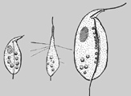

## Phylogeny 

-   « Ancestral Groups  
    -   [Apusomonads](../Apusomonads.md)
    -   [The other protists](The_other_protists)
    -  [Eukarya](../../../Eukarya.md))
    -   [Tree of Life](../../../Tree_of_Life.md)

-   ◊ Sibling Groups of  Apusomonads
    -   [Apusomonas](Apusomonas.md)
    -   Amastigomonas

-   » Sub-Groups
    -   [Amastigomonas debruynei](Amastigomonas_debruynei)
    -   [Amastigomonas filosa](Amastigomonas_filosa)
    -   [Amastigomonas mutabilis](Amastigomonas_mutabilis)
    -   [Amastigomonas terricola](Amastigomonas_terricola)

# *Amastigomonas* [De Saedeleer 1931]

## Thecamonas [Larsen and Patterson 1990] 

[David J. Patterson](http://www.tolweb.org/)

-   *Amastigomonas bermudensis*
-   *[Amastigomonas     debruynei](Amastigomonas_debruynei)*
-   *[Amastigomonas     filosa](Amastigomonas_filosa)*
-   *[Amastigomonas     mutabilis](Amastigomonas_mutabilis)*
-   *[Amastigomonas     terricola](Amastigomonas_terricola)*
-   *Amastigomonas klosteria*
-   *Amastigomonas gigantea*
-   *Amastigomonas griebensis*
-   *Amastigomonas marina*
-   *Amastigomonas muscula*

Containing group: [Apusomonads](../Apusomonads.md)

## Introduction

*Amastigomonas* (also called *Thecamonas* (Larsen and Patterson, 1990))
is a very widespread and common genus. The genus has been reported from
around the world, most records are from marine habitats, but it has also
been reported from soils and freshwaters. The organism glides on the
substrate with its anterior flagellum moving slightly. The genus eats
bacteria, and food is ingested using pseudopodia that are produced by
the ventral surface.

Twelve nominal species have been assigned to this genus, but a number of
these are barely distinguishable and have been rendered into synonymy.
The most detailed survey of the genus is that of Molina and Nerad
(1991), and the most recent comments are those of Lee and Patterson
(2000).

### Characteristics

The species in this genus have the characters typical of all
apusemonads. No generic synapomorphies have been found to date.

### Discussion of Phylogenetic Relationships

Sister group relationships within the genus have not been explored. It
may be that the genus is paraphyletic, and that *Apusomonas* cannot even
serve as an outgroup.

### References

De Saedeleer H. 1931. Nieuwe of wenig bekende Flagellaten.
Naturwetenschapplijk Tijdschrift, 13, 89-96.

Larsen J. and Patterson D. J. 1990. Some flagellates (Protista) from
tropical marine sediments. J. Nat. Hist., 24, 801-937.

Lee, W. J. and Patterson, D. J. 2000. Heterotrophic flagellates
(Protista) from marine sediments of Botany Bay, Australia. Journal of
Natural History, 34: 483-562.

Molina, F. I. and Nerad, T. A., 1991. Ultrastructure of Amastigomonas
bermudensis ATCC 50234 sp.nov. - a new heterotrophic marine flagellate,
European Journal of Protistology, 27, 386-396.

Patterson, D. J. 1999. The diversity of eukaryotes. American Naturalist
154: S96-124.

## Title Illustrations

)

  --------------------------------------------------------------------------------
  Scientific Name ::  Amastigomonas debruynei, Amastigomonas filosa (2), Amastigomonas proboscidea (3)
  Copyright ::         © 2000 [David J. Patterson](http://www.bio.usyd.edu.au/Protsvil/index.htm) 
  --------------------------------------------------------------------------------

## Confidential Links & Embeds: 

### #is_/same_as ::[Amastigomonas](Amastigomonas.md)) 

### #is_/same_as :: [Amastigomonas.public](/_public/bio/bio~Domain/Eukarya/Protist/Apusomonads/Amastigomonas.public.md) 

### #is_/same_as :: [Amastigomonas.internal](/_internal/bio/bio~Domain/Eukarya/Protist/Apusomonads/Amastigomonas.internal.md) 

### #is_/same_as :: [Amastigomonas.protect](/_protect/bio/bio~Domain/Eukarya/Protist/Apusomonads/Amastigomonas.protect.md) 

### #is_/same_as :: [Amastigomonas.private](/_private/bio/bio~Domain/Eukarya/Protist/Apusomonads/Amastigomonas.private.md) 

### #is_/same_as :: [Amastigomonas.personal](/_personal/bio/bio~Domain/Eukarya/Protist/Apusomonads/Amastigomonas.personal.md) 

### #is_/same_as :: [Amastigomonas.secret](/_secret/bio/bio~Domain/Eukarya/Protist/Apusomonads/Amastigomonas.secret.md)

