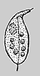
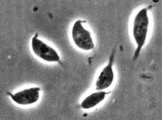
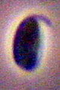

## Phylogeny 

-   « Ancestral Groups  
    -   [Amastigomonas](../Amastigomonas.md)
    -   [Apusomonads](../../Apusomonads.md)
    -   [The other protists](The_other_protists)
    -  [Eukarya](../../../../Eukarya.md))
    -   [Tree of Life](../../../../Tree_of_Life.md)

-   ◊ Sibling Groups of  Amastigomonas
    -   Amastigomonas debruynei
    -   [Amastigomonas filosa](Amastigomonas_filosa)
    -   [Amastigomonas mutabilis](Amastigomonas_mutabilis)
    -   [Amastigomonas terricola](Amastigomonas_terricola)

-   » Sub-Groups 

# *Amastigomonas debruynei* [de Saedeleer 1931] 

[David J. Patterson](http://www.tolweb.org/)

Containing group: *[Amastigomonas](../Amastigomonas.md)*

## Introduction

This species of *Amastigomonas* is distinguished by its size, by the
lack of any excrescences, and by the short anterior flagellum.

### Characteristics

Description: Cell 3-7.5 µm long, dorso-ventrally flattened, flexible but
not amoeboid. The anterior flagellum emerges from the tip of a laterally
directed sleeve, the posterior flagellum trails under the cell and
occasionally protrudes behind the cell; strands of cytoplasm may be
drawn out behind the cell. The nucleus is situated in the anterior left
of the cell.

### Distribution

This species has been recorded from marine sites in subtropical and
tropical Australia, North Atlantic, Brazil, Arctic Canada, Denmark,
England, Gulf of Finland, Greenland, Hawaii and Panama, as well as from
freshwater sites in Australia and greater Europe (Ekelund and Patterson,
1997; Lee and Patterson, 2000).

### Discussion

*Amastigomonas* is the senior synonym of *Thecamonas*. *Amastigomonas
debruynei* is indistinguishable from *Thecamonas trahens*, *A.
borokensis* and *A. caudata* (Ekebom et al., 1996; Lee and Patterson,
2000). The most similar species are *A. bermudensis* Molina and Nerad,
1991 and *A. terricola* Ekelund and Patterson 1997. *A. bermudensis* is,
at 8 - 11.5 µm, marginally larger, and *A. terricola* has a longer
anterior flagellum. *A. mutabilis* is said to be distinguishable because
it measures up to 15 µm and often has lines of granules located
ventrally adjacent to the posterior flagellum. *A. debruynei* is
distinguished from *A. filosa* because it lacks the thin cytoplasmic
extensions which are distinctive for *A. filosa*. We suspect that some
of these differences will not be sustainable. The genus has not been
extensively documented. Additional studies suggest that there will be a
continuum of form which embraces *A. debruynei*, *A. bermudensis*, *A.
terricola* and perhaps even *A. mutabilis*.

### References

Ekelund, F. and Patterson, D. J. 1997. Some flagellates from a
cultivated garden soil in Australia. Archiv für Protistenkunde 148:
461-478.

Ekebom, J., Patterson, D. J. and Vors, N. 1996. Heterotrophic
flagellates from coral reef sediments (Great Barrier Reef, Australia).
Archiv für Protistenkunde 146: 251-272.

Larsen, J. and Patterson, D. J. 1990. Some flagellates (Protista) from
tropical marine sediments. Journal of Natural History 24: 801-937.

Lee, W. J. and Patterson, D. J. 2000. Heterotrophic flagellates
(Protista) from marine sediments of Botany Bay, Australia. Journal of
Natural History 34: 483-562.

## Title Illustrations

)

  --------------------------------------------------------------------------------
  Scientific Name ::  Amastigomonas debruynei
  Copyright ::         © 2000 [David J. Patterson](http://www.bio.usyd.edu.au/Protsvil/index.htm) 
  --------------------------------------------------------------------------------
)

  ---------------------------------------------------------------------------------
  Scientific Name ::     Amastigomonas debruynei
  Comments             phase contrast light micrographs of living cells
  Specimen Condition   Live Specimen
  Copyright ::            © 2000 [David J. Patterson](http://www.bio.usyd.edu.au/Protsvil/index.htm) 
  ---------------------------------------------------------------------------------
)

  ---------------------------------------------------------------------------------
  Scientific Name ::     Amastigomonas debruynei
  Comments             phase contrast light micrographs of living cell
  Specimen Condition   Live Specimen
  Copyright ::            © 2000 [David J. Patterson](http://www.bio.usyd.edu.au/Protsvil/index.htm) 
  ---------------------------------------------------------------------------------

## Confidential Links & Embeds: 

### #is_/same_as :: [debruynei](/_Standards/bio/bio~Domain/Eukarya/Protist/Apusomonads/Amastigomonas/debruynei.md) 

### #is_/same_as :: [debruynei.public](/_public/bio/bio~Domain/Eukarya/Protist/Apusomonads/Amastigomonas/debruynei.public.md) 

### #is_/same_as :: [debruynei.internal](/_internal/bio/bio~Domain/Eukarya/Protist/Apusomonads/Amastigomonas/debruynei.internal.md) 

### #is_/same_as :: [debruynei.protect](/_protect/bio/bio~Domain/Eukarya/Protist/Apusomonads/Amastigomonas/debruynei.protect.md) 

### #is_/same_as :: [debruynei.private](/_private/bio/bio~Domain/Eukarya/Protist/Apusomonads/Amastigomonas/debruynei.private.md) 

### #is_/same_as :: [debruynei.personal](/_personal/bio/bio~Domain/Eukarya/Protist/Apusomonads/Amastigomonas/debruynei.personal.md) 

### #is_/same_as :: [debruynei.secret](/_secret/bio/bio~Domain/Eukarya/Protist/Apusomonads/Amastigomonas/debruynei.secret.md)

