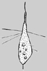
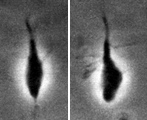

---
aliases:
  - filosa
title: Amastigomonas filosa
---

## Phylogeny 

-   « Ancestral Groups  
    -   [Amastigomonas](../Amastigomonas.md)
    -   [Apusomonads](../../Apusomonads.md)
    -   [The other protists](The_other_protists)
    -  [Eukarya](../../../../Eukarya.md) 
    -   [Tree of Life](../../../../Tree_of_Life.md)

-   ◊ Sibling Groups of  Amastigomonas
    -   [Amastigomonas debruynei](Amastigomonas_debruynei)
    -   Amastigomonas filosa
    -   [Amastigomonas mutabilis](Amastigomonas_mutabilis)
    -   [Amastigomonas terricola](Amastigomonas_terricola)

-   » Sub-Groups 

# *Amastigomonas filosa* [Larsen and Patterson 1990] 

[David J. Patterson](http://www.tolweb.org/)

Containing group: *[Amastigomonas](../Amastigomonas.md)*

## Introduction

This species of *Amastigomonas* is distinguished by having fine threads
emerging from the sides of the body. It has been reported once from
marine sediments. Otherwise, little known of its biology.

### References

Larsen, J. and Patterson, D. J. 1990. Some flagellates (Protista) from
tropical marine sediments. Journal of Natural History 24: 801-937.

## Title Illustrations

 

  ---------------------------------------------------------------------------------
  scientific_name ::     Amastigomonas filosa
  specimen_condition ::  Live Specimen
  copyright ::            © 2000 [David J. Patterson](http://www.bio.usyd.edu.au/Protsvil/index.htm) 
 
  ---------------------------------------------------------------------------------
 

  ---------------------------------------------------------------------------------
  scientific_name ::     Amastigomonas filosa
  Comments             phase contrast light micrographs of living cell
  specimen_condition ::  Live Specimen
  copyright ::            © 2000 [David J. Patterson](http://www.bio.usyd.edu.au/Protsvil/index.htm) 
 
  ---------------------------------------------------------------------------------

## Confidential Links & Embeds: 

### #is_/same_as :: [[/_Standards/bio/bio~Domain/Eukarya/Protist/Apusomonads/Amastigomonas/filosa|filosa]] 

### #is_/same_as :: [[/_public/bio/bio~Domain/Eukarya/Protist/Apusomonads/Amastigomonas/filosa.public|filosa.public]] 

### #is_/same_as :: [[/_internal/bio/bio~Domain/Eukarya/Protist/Apusomonads/Amastigomonas/filosa.internal|filosa.internal]] 

### #is_/same_as :: [[/_protect/bio/bio~Domain/Eukarya/Protist/Apusomonads/Amastigomonas/filosa.protect|filosa.protect]] 

### #is_/same_as :: [[/_private/bio/bio~Domain/Eukarya/Protist/Apusomonads/Amastigomonas/filosa.private|filosa.private]] 

### #is_/same_as :: [[/_personal/bio/bio~Domain/Eukarya/Protist/Apusomonads/Amastigomonas/filosa.personal|filosa.personal]] 

### #is_/same_as :: [[/_secret/bio/bio~Domain/Eukarya/Protist/Apusomonads/Amastigomonas/filosa.secret|filosa.secret]] 

