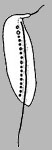
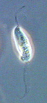

## Phylogeny 

-   « Ancestral Groups  
    -   [Amastigomonas](../Amastigomonas.md)
    -   [Apusomonads](../../Apusomonads.md)
    -   [The other protists](The_other_protists)
    -  [Eukarya](../../../../Eukarya.md))
    -   [Tree of Life](../../../../Tree_of_Life.md)

-   ◊ Sibling Groups of  Amastigomonas
    -   [Amastigomonas debruynei](Amastigomonas_debruynei)
    -   [Amastigomonas filosa](Amastigomonas_filosa)
    -   Amastigomonas mutabilis
    -   [Amastigomonas terricola](Amastigomonas_terricola)

-   » Sub-Groups 

# *Amastigomonas mutabilis* [(Griessmann 1913) Molina and Nerad 1991] 

[David J. Patterson](http://www.tolweb.org/)

Containing group: *[Amastigomonas](../Amastigomonas.md)*

## Introduction

This species of *Amastigomonas* is distinguished by its large size and
by having granules lying adjacent to the trailing flagellum on its
ventral side.

### Characteristics

The species is usually elliptical in shape and has been reported to be
from 7 to 16 µm long. It is, like other members of the genus,
dorso-ventrally flattened and flexible. There is a flexible sleeve
around the base of the anterior flagellum. This flagellum is about 0.5
times the length of the cell, and it is the same thickness as the
posterior flagellum. The recurrent posterior flagellum is slightly
longer than the cell and trails under the body, to which it attaches
loosely in a slight groove. The nucleus is situated subapically near the
right margin of the cell. Some cells have granules alongside the
recurrent flagellum.

### Distribution

This species has been recorded from marine sites in subtropical
Australia, Brazil, Denmark, England, France, Greenland and North
Atlantic (Lee and Patterson, 2000).

### Discussion

This species was first described as *Rhynchomonas mutabilis* (Griessmann
1913). It was then transferred to *Thecamonas* by Larsen and Patterson
(1990) and to *Amastigomonas* by Molina and Nerad (1991). The species is
distinguished because it is bigger than the more common *A. debruynei*,
because it has a longer anterior flagellum and because it may have
ventral granules. However, as noted under *A. debruynei*, the
distinctions may not be sustainable as *A. debruynei* overlaps with *A.
bermudensis* in size (*A. bermudensis* is 8-11.5 µm long) , and *A.
bermudensis* overlaps with *A. mutabilis*. Also, *A. mutabilis* overlaps
with *A. terricola* in the appareance of the anterior flagllum.

### References

Griessmann, K. 1913. Über marine Flagellaten. Archiv für Protistenkunde
32 (year 1914): 1-78.

Larsen, J. and Patterson, D. J. 1990. Some flagellates (Protista) from
tropical marine sediments. Journal of Natural History 24: 801-937.

Lee, W. J. and Patterson, D. J. 2000. Heterotrophic flagellates
(Protista) from marine sediments of Botany Bay, Australia. Journal of
Natural History 34: 483-562.

Molina, F. I. and Nerad, T. A. 1991. Ultrastructure of Amastigomonas
bermudensis ATCC 50234 sp.nov. - a new heterotrophic marine flagellate.
European Journal of Protistology 27: 386-396.

## Title Illustrations

)

  --------------------------------------------------------------------------------
  Scientific Name ::  Amastigomonas mutabilis
  Copyright ::         © 2000 [David J. Patterson](http://www.bio.usyd.edu.au/Protsvil/index.htm) 
  --------------------------------------------------------------------------------
)

  --------------------------------------------------------------------------------
  Scientific Name ::  Amastigomonas mutabilis
  Copyright ::         © 2000 [David J. Patterson](http://www.bio.usyd.edu.au/Protsvil/index.htm) 
  --------------------------------------------------------------------------------

## Confidential Links & Embeds: 

### #is_/same_as :: [mutabilis](/_Standards/bio/bio~Domain/Eukarya/Protist/Apusomonads/Amastigomonas/mutabilis.md) 

### #is_/same_as :: [mutabilis.public](/_public/bio/bio~Domain/Eukarya/Protist/Apusomonads/Amastigomonas/mutabilis.public.md) 

### #is_/same_as :: [mutabilis.internal](/_internal/bio/bio~Domain/Eukarya/Protist/Apusomonads/Amastigomonas/mutabilis.internal.md) 

### #is_/same_as :: [mutabilis.protect](/_protect/bio/bio~Domain/Eukarya/Protist/Apusomonads/Amastigomonas/mutabilis.protect.md) 

### #is_/same_as :: [mutabilis.private](/_private/bio/bio~Domain/Eukarya/Protist/Apusomonads/Amastigomonas/mutabilis.private.md) 

### #is_/same_as :: [mutabilis.personal](/_personal/bio/bio~Domain/Eukarya/Protist/Apusomonads/Amastigomonas/mutabilis.personal.md) 

### #is_/same_as :: [mutabilis.secret](/_secret/bio/bio~Domain/Eukarya/Protist/Apusomonads/Amastigomonas/mutabilis.secret.md)

