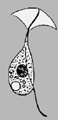

## Phylogeny 

-   « Ancestral Groups  
    -   [Amastigomonas](../Amastigomonas.md)
    -   [Apusomonads](../../Apusomonads.md)
    -   [The other protists](The_other_protists)
    -  [Eukarya](../../../../Eukarya.md))
    -   [Tree of Life](../../../../Tree_of_Life.md)

-   ◊ Sibling Groups of  Amastigomonas
    -   [Amastigomonas debruynei](Amastigomonas_debruynei)
    -   [Amastigomonas filosa](Amastigomonas_filosa)
    -   [Amastigomonas mutabilis](Amastigomonas_mutabilis)
    -   Amastigomonas terricola

-   » Sub-Groups 

# *Amastigomonas terricola* [Ekelund and Patterson 1997] 

[David J. Patterson](http://www.tolweb.org/)

Containing group: *[Amastigomonas](../Amastigomonas.md)*

## Introduction

This species of *Amastigomonas* is distinguished by its size, by the
lack of any excrescences and by the relatively long anterior flagellum.

### Characteristics

This species is about 5 µm long. The cell is very flexible. It tapers at
the anterior end, and the anterior flagellum is directed to the front of
the cell. The proximal part of the anterior flagellum is enclosed in the
anterior thin part of the theca to form the rostrum. The rostrum is
about the same length as the cell. The posterior trailing flagellum is
about twice as long as the cell, and it adheres to the cell. A
contractile vacuole is situated at the posterior end of the cell.
Movement is erratic, the cell glides along the substrate with small
jerks, the anterior flagellum beats fast during movement, and the cell
often changes its direction.

### Distribution

This species has been recorded from soil in Australia (Ekelund and
Patterson, 1997).

### Discussion

This species is most similar to *A. debruynei*, but it has a slightly
longer anterior flagellum and a tapering anterior end. It is likely that
this distinction cannot be sustained, as continuing work suggests a
continuum of form that embraces this species, *A. debruynei*, *A.
bermudensis*, and perhaps even *A. mutabilis*.

### References

Ekelund, F. and Patterson, D. J. 1997. Some flagellates from a
cultivated garden soil in Australia. Archiv für Protistenkunde 148:
461-478.

## Title Illustrations

)

  --------------------------------------------------------------------------------
  Scientific Name ::  Amastigomonas terricola
  Copyright ::         © 2000 [David J. Patterson](http://www.bio.usyd.edu.au/Protsvil/index.htm) 
  --------------------------------------------------------------------------------

## Confidential Links & Embeds: 

### #is_/same_as :: [terricola](/_Standards/bio/bio~Domain/Eukarya/Protist/Apusomonads/Amastigomonas/terricola.md) 

### #is_/same_as :: [terricola.public](/_public/bio/bio~Domain/Eukarya/Protist/Apusomonads/Amastigomonas/terricola.public.md) 

### #is_/same_as :: [terricola.internal](/_internal/bio/bio~Domain/Eukarya/Protist/Apusomonads/Amastigomonas/terricola.internal.md) 

### #is_/same_as :: [terricola.protect](/_protect/bio/bio~Domain/Eukarya/Protist/Apusomonads/Amastigomonas/terricola.protect.md) 

### #is_/same_as :: [terricola.private](/_private/bio/bio~Domain/Eukarya/Protist/Apusomonads/Amastigomonas/terricola.private.md) 

### #is_/same_as :: [terricola.personal](/_personal/bio/bio~Domain/Eukarya/Protist/Apusomonads/Amastigomonas/terricola.personal.md) 

### #is_/same_as :: [terricola.secret](/_secret/bio/bio~Domain/Eukarya/Protist/Apusomonads/Amastigomonas/terricola.secret.md)

