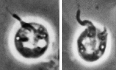

## Phylogeny 

-   « Ancestral Groups  
    -   [Apusomonads](../Apusomonads.md)
    -   [The other protists](The_other_protists)
    -  [Eukarya](../../../Eukarya.md))
    -   [Tree of Life](../../../Tree_of_Life.md)

-   ◊ Sibling Groups of  Apusomonads
    -   Apusomonas
    -   [Amastigomonas](Amastigomonas.md)

-   » Sub-Groups
    -   [Apusomonas proboscidea](Apusomonas_proboscidea)
    -   [Apusomonas         australiensis](Apusomonas_australiensis)

# *Apusomonas* [Aléxéieff 1924]

## Rostromonas [Karpov S. A. & Zhukov, B. F. 1980] 

[David J. Patterson](http://www.tolweb.org/)

-   *[Apusomonas     proboscidea](Apusomonas_proboscidea)*
-   *[Apusomonas     australiensis](Apusomonas_australiensis)*

Containing group: [Apusomonads](../Apusomonads.md)

## Introduction

The genus *Apusomonas* includes flattened gliding flagellates in which
the anterior flagellum emerges from a projecting mastigophore. There are
two flagella, and both insert near the projecting end of the
mastigophore. The second flagellum runs backwards to lie under the
cell - and usually it cannot be seen. The mastigophore beats slowly as
the cell moves.

Species in this genus eat bacteria, with the food being ingested taken
ventrally. Temporary cysts may be formed, and the genus is
cryptobiotic - i.e. the organism can dry out. The genus is common in
soils (world-wide) and has also been reported from fresh-waters.

There are two species. The type species is *A. proboscidea* Aléxéieff
1924.

This genus has a clear identity ([sensu Patterson 1999](http://www.tolweb.org/accessory/Lineages_of_Eukaryotes?acc_id=49)).
It was not reported for 50 years after the publication of the original
description by Aléxéieff. In 1974 Vickerman and co-workers published a
detailed light- and scanning-electron microscopy which has provided the
genus with its current identity. The delay between the original paper
and that of Vickerman and colleagues may explain why the same taxon was
studied independently by Karpov and Zhukov (1986) under the name
*Rostromonas*.

### Characteristics

*Apusomonas* is distinguished from *Amastigomonas* principally because
it has a mastigophore, an anterior prolongation of the cell into which
the flagellum inserts. Species are separated on the shape of the cell.

### References

Cavalier-Smith, T. and Chao, E. E. 1995. The opalozoan Apusomonas is
related to the common ancestor of animals, fungi and choanoflagellates.
Proceedings of the Royal Society of London B 261:1-6.

Ekelund, F. and Patterson, D. J. 1997. Some flagellates from a
cultivated garden soil in Australia. Archiv für Protistenkunde
148:461-478.

Karpov, S. A. & Mylnikov, A. P. 1989. Biology and ultrastructure of
colourless flagellates Apusomonadida ord. n. Zoologischkei Zhurnal
58:5-17. (in Russian)

Karpov, S. A. & Zhukov, B. F. 1980. Rostromonas applanata gen. et sp. n.
(Zoomastigophorea, Protozoa) a new representative of freshwater fauna.
Zoologischkei Zhurnal 59:1733-1735. (in Russian)

Karpov, S. A. & Zhukov, B. F. 1986. Ultrastructure and taxonomic
position of Apusomonas proboscidea Aléxéieff. Archiv für Protistenkunde
131:13-26.

Patterson, D. J. 1999. The diversity of eukaryotes. American Naturalist
154 (suppl.):S96-S124.

Vickerman, K., Darbyshire, J.F. and Ogden, C.G. 1974. Apusomonas
proboscidea Aléxéieff 1924, An Unusual Phagotrophic Flagellate from
Soil. Archiv für Protistenkunde 116:254-269.

## Title Illustrations

)

  --------------------
  Scientific Name ::     Apusomonas proboscidea, Apusomonas australiensis
  Comments             Phase contrast micrograph of living cells
  Specimen Condition   Live Specimen
  Copyright ::            © 2000 Flemming Ekelund
  --------------------

## Confidential Links & Embeds: 

### #is_/same_as :: [Apusomonas](/_Standards/bio/bio~Domain/Eukarya/Protist/Apusomonads/Apusomonas.md) 

### #is_/same_as :: [Apusomonas.public](/_public/bio/bio~Domain/Eukarya/Protist/Apusomonads/Apusomonas.public.md) 

### #is_/same_as :: [Apusomonas.internal](/_internal/bio/bio~Domain/Eukarya/Protist/Apusomonads/Apusomonas.internal.md) 

### #is_/same_as :: [Apusomonas.protect](/_protect/bio/bio~Domain/Eukarya/Protist/Apusomonads/Apusomonas.protect.md) 

### #is_/same_as :: [Apusomonas.private](/_private/bio/bio~Domain/Eukarya/Protist/Apusomonads/Apusomonas.private.md) 

### #is_/same_as :: [Apusomonas.personal](/_personal/bio/bio~Domain/Eukarya/Protist/Apusomonads/Apusomonas.personal.md) 

### #is_/same_as :: [Apusomonas.secret](/_secret/bio/bio~Domain/Eukarya/Protist/Apusomonads/Apusomonas.secret.md)

