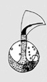

---
title: "Apusomonas proboscidea"
---

## Phylogeny 

-   « Ancestral Groups  
    -   [Apusomonas](../Apusomonas.md)
    -   [Apusomonads](../../Apusomonads.md)
    -   [The other protists](The_other_protists)
    -  [Eukarya](../../../../Eukarya.md))
    -   [Tree of Life](../../../../Tree_of_Life.md)

-   ◊ Sibling Groups of  Apusomonas
    -   Apusomonas proboscidea
    -   [Apusomonas         australiensis](Apusomonas_australiensis)

-   » Sub-Groups 

# *Apusomonas proboscidea* [Aléxéieff 1924] 

[David J. Patterson](http://www.tolweb.org/)

Containing group: *[Apusomonas](../Apusomonas.md)*

## Introduction

This species of *Apusomonas* is distinguished by having a rounded body.
It has been reported from Australia and Europe.

*A. proboscidea* seems to be a typical, common soil flagellate
(Vickerman et al. 1974, Ekelund and Patterson, 1997). It has only been
reported a few times from aquatic habitats: from freshwater, under the
name *Rostromonas applanata* (Karpov and Zhukov, 1980), and from
estuarine habitats (unpublished data).

### Characteristics

Cells are 7 - 8 µm long, dorso-ventrally flattened, roundish to slightly
ovate in outline. A flexible mastigophore, approximately the same length
as the cell, arises in a cavity about one third of the cell length from
the posterior end. The ensheathed anterior flagellum arises at the
distal end of the mastigophore. The sheath plus flagellum are about half
the cell length and about one third as broad as the mastigophore. The
last half to one third of the anterior flagellum is not sheathed. There
is a collar-like structure where the mastigophore leaves the cell
anteriorly. The nucleus is situated in the posterior of the cell, a
contractile vacuole is located to the left hand side of the cell and
near the middle. The cell glides over the substrate, the flagellum beats
rapidly to the left, the stroke covering an angle of about 45°, the
mastigophore is held stiff most of the time and moves only when the cell
changes direction.

### References

Ekelund, F. and Patterson, D. J. 1997. Some flagellates from a
cultivated garden soil in Australia. Archiv für Protistenkunde
148:461-478.

Karpov S. A.& Zhukov, B. F. 1980. Rostromonas applanata gen. et sp. n.
(Zoomastigophorea, Protozoa) a new representative of freshwater fauna.
Zoologischkei Zhurnal 59:1733-1735. (in Russian)

Karpov S. A.& Zhukov, B. F. 1986. Ultrastructure and taxonomic position
of Apusomonas proboscidea Aléxéieff. Archiv für Protistenkunde 131:13-26

Vickerman, K. Darbyshire, J.F. and Ogden, C.G., 1974: Apusomonas
proboscidea Aléxéieff 1924, An unusual phagotrophic flagellate from
soil. Archiv für Protistenkunde 116:254-269.

## Title Illustrations

)

  -------------
  Scientific Name ::     Apusomonas proboscidea
  Comments             Line drawing of living cell
  Specimen Condition   Live Specimen
  Copyright ::            © 2000 Flemming Ekelund
  -------------

## Confidential Links & Embeds: 

### #is_/same_as ::[proboscidea](proboscidea.md)) 

### #is_/same_as :: [proboscidea.public](/_public/bio/bio~Domain/Eukarya/Protist/Apusomonads/Apusomonas/proboscidea.public.md) 

### #is_/same_as :: [proboscidea.internal](/_internal/bio/bio~Domain/Eukarya/Protist/Apusomonads/Apusomonas/proboscidea.internal.md) 

### #is_/same_as :: [proboscidea.protect](/_protect/bio/bio~Domain/Eukarya/Protist/Apusomonads/Apusomonas/proboscidea.protect.md) 

### #is_/same_as :: [proboscidea.private](/_private/bio/bio~Domain/Eukarya/Protist/Apusomonads/Apusomonas/proboscidea.private.md) 

### #is_/same_as :: [proboscidea.personal](/_personal/bio/bio~Domain/Eukarya/Protist/Apusomonads/Apusomonas/proboscidea.personal.md) 

### #is_/same_as :: [proboscidea.secret](/_secret/bio/bio~Domain/Eukarya/Protist/Apusomonads/Apusomonas/proboscidea.secret.md)

