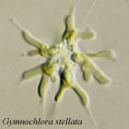
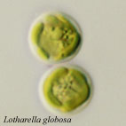
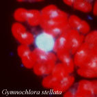
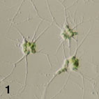
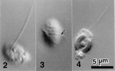
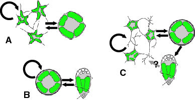
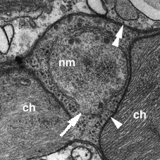
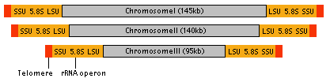
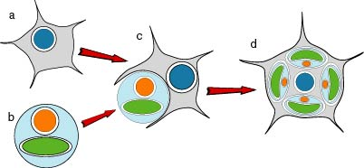

---
aliases:
  - Chlorarachniophytes
title: Chlorarachniophytes
---

# [[Chlorarachniophytes]] 

#is_a/bio-Phylum  
#is_a :: [[../../../Taxon_Rank/bio~Kingdom/bio~Phylum|bio~Phylum]]  

[Ken-ichiro Ishida and Geoff I. McFadden](http://www.tolweb.org/)

Containing group: [The other protists](../Protist.md)

## Introduction

If you find a green amoeba in your sea water sample, it may be a member
of the chlorarachniophytes. The green color is caused by chloroplasts,
which are permanently housed in the amoeba cell. Although the
chloroplasts contain chlorophylls a and b, chlorarachniophytes are
phylogenetically distinct from other chlorophyll b-containing eukaryotes
(the chlorophytes and the euglenophytes), and constitute an independent
phylum: Chlorarachniophyta, which was established only two decades ago
(Hibberd and Norris 1984, Hibberd 1990). The group consists of four
genera and five species, and there are also several species waiting to
be named (Ishida et al. 1999, Ishida et al. 2000).

Although they are an obscure and little known group of algae,
chlorarachniophytes have been a magnet for evolutionary biologists
interested in the origin and the evolution of chloroplasts. This is
because they are one of the groups that acquired their chloroplasts via
a secondary endosymbiosis, in which a non-photosynthetic eukaryote
engulfed an eukaryotic alga and retained it as a photosynthetic
organelle (McFadden et al. 1994, McFadden et al. 1997). Indeed
chlorarachniophytes are one of two groups (the other is cryptomonads)
that provide watertight evidence for secondary chloroplast acquisition.
Both chlorarachniophytes and cryptomonads have nucleomorphs, the reduced
nuclei of the algal endosymbiont that gave rise to the chloroplasts
(Ludwig and Gibbs 1989, McFadden et al. 1994, Gilson and McFadden 1996,
Ishida et al. 1999). The nucleomorphs, and particularly the genes they
contain, have been the Rosetta Stone to understanding secondary
endosymbiosis. Chlorarachniophytes are, therefore, a key group for
understanding how chloroplasts have spread to many different groups of
eukaryotes. Much chlorarachniophyte research has focused on searching
for origins of the host and the endosymbiont components (Bhattacharya et
al. 1995, McFadden et al. 1995, Van de Peer et al. 1996, Cavalier-Smith
and Chao 1997, Ishida et al. 1997, Van de Peer and DeWachter 1997,
Keeling et al 1998, Durnford et al. 1999, Ishida et al. 1999, Keeling
2001) in order to dissect who the partners were and what has happened to
them in the ensuing amalgamation. A complementary line of enquiry has
been to understand the molecular and cellular biology of the nucleomorph
genome (McFadden et al. 1994, Gilson and McFadden 1995, Gilson and
McFadden 1996, Gilson and McFadden 1997, Gilson et al. 1997, Gilson and
McFadden 1998).

### Characteristics

All known chlorarachniophytes are unicellular and photosynthetic with
green chloroplasts. The group is characterised by the following
features:

-   Chloroplasts contain chlorophylls *a* and *b*.
-   Amoeboid cells have filose pseudopodia (Fig. 1)
-   Flagellated cells bear a single flagellum (Figs 2-4) that wraps
    around the cell while it swims (Fig. 3).
-   Each chloroplast has a prominent projecting pyrenoid, and is
    surrounded by four envelope membranes (Fig. 5).
-   A [nucleomorph](#Thenucleomorph) is present in a space between the
    second and third envelope membranes of each chloroplast (Fig. 5).
-   Thylakoids are often loosely stacked in three.
-   The principal storage carbohydrate is beta-1,3-glucan, which is
    stored in cytoplasmic vesicles that are often tightly associated
    with pyrenoids (McFadden et al. 1997).
-   Mitochondrial cristae are tubular.

{height="142"
width="142"} {height="142" width="230"}

Figure 1. Amoeboid cells of *Lotharella amoeboformis* extending many
filose pseudopodia.\
Figure 2-4. Flagellated cells of *L. globosa*. Each has a single
flagellum that wraps around the cell body when it swims (Arrow). Images
copyright © 2001 K. Ishida

Figure 5. Chloroplast (ch) of *L. amoeboformis* with a projecting
pyrenoid (py) sheathed by a cytoplasmic storage vesicle (sv) that
contains beta-1,3 glucan. A nucleomorph (nm) is located in a space
between two pairs of chloroplast envelope membranes near the base of the
pyrenoid. Image copyright © 2001 K. Ishida

#### Habitat

Chlorarachniophytes live in warm (tropical to temperate) marine
environments, probably throughout the world. Amoeboid and coccoid
species have been found from coastal areas, while flagellated members
have been found in oceanic waters as picoplankton.

#### Ultrastructural diversity

Among the chlorarachniophytes, there is a remarkable diversity in
ultrastructure of the pyrenoid and localization of the nucleomorph.
These traits are used as key characteristics for the generic
classification (Ishida et al. 1996).

#### Life Cycle and Reproduction

The basic life cycle of the chlorarachniophytes comprises amoeboid,
coccoid and flagellated cell stages (Fig. 6-C). However, the patterns of
the life cycle vary among species, and some species lack one or two of
those stages (Fig. 6-A,B) (Ishida and Hara 1994, Ishida et al 1996,
Ishida et al. 2000). Coccoid cells in some species are regarded as cysts
(Hibberd 1990). Characteristics of life cycle patterns are used to
distinguish species in the group (Ishida and Hara 1994, Ishida et al.
2000). Asexual reproduction is carried out by either normal mitotic cell
division or zoospore formation. Sexual reproduction has been reported
from two species: *Chlorarachnion reptans* and *Cryptochlora perforans*.
In *C. reptans*, two different types of cells, amoeboid and coccoid,
fuse to form a zygote (anisogamy) (Grell 1990), while in *C. perforans*,
the fusion occurs between two amoeboid cells (isogamy) (Beutrich and
Schnetter 1993).

Figure 6. Life cycles of *G. stellata* that lacks walled and flagellated
cell stages (A), *L. globosa* that lacks an amoeboid cell stage (B), and
*L. amoeboformis* that has all three cell stages (C). Image copyright ©
2001 K. Ishida

### The nucleomorph

The nucleomorph is a small double membraned organelle located in a space
between the second and the third membranes of the chloroplast envelope
(Fig. 7). This organelle is the vestigial nucleus of the eukaryotic
algal endosymbiont that gave rise to the chloroplasts of
chlorarachniophytes (McFadden et al. 1994). The double membranes
surrounding this organelle are considered to have originated from the
nuclear envelope of the endosymbiont as there are nuclear pore-like gaps
in the double envelope (Hibberd and Norris 1984).

Figure 7. A nucleomorph (nm) which is located in a space between the
inner (arrowhead) and the outer (double arrowheads) pairs of chloroplast
envelope membranes. Nucleomorph envelope has a gap (arrow) that is
probably homologous to the nuclear pore of an ordinary nucleus. ch:
chloroplast. Image copyright © 2001 K. Ishida

The nucleomorph contains its own genome, which is about 380 kb - the
smallest eukaryotic genome known (Gilson and McFadden 1996). The genome
consists of three linear chromosomes (Fig. 8), and both ends of each
chromosome are capped by telomeres and ribosomal RNA gene cistrons
(Gilson and McFadden 1996). It has been estimated that there are about
300 protein genes encoded by this genome (Gilson and McFadden 1997).
These genes are arranged in the chromosomes in a highly compacted
manner. However, the genes also contain numerous introns, although the
introns are extraordinarily small ranging in size from 18 bp to 21bp,
smaller than any other spliceosomal introns (Gilson and McFadden 1996).
Genes encoded by the nucleomorph genome are mostly \'housekeeping
genes\', genes for maintaining its replication and expression systems
(Gilson and McFadden 1996). Only a few chloroplast-targeted proteins are
encoded by the nucleomorph, suggesting that the majority of
nuclear-encoded chloroplast genes are now in the host\'s nuclear genome
(Gilson and McFadden 1996).

Figure 8. Structure of nucleomorph chromosomes. Image copyright © 2001
K. Ishida

Like other DNA-containing organelles, the nucleomorph is autonomous.
Nucleomorph division takes place just before chloroplast division by the
sequential infolding of the inner and outer membranes of the nucleomorph
envelope (Ludwig and Gibbs 1989). No spindle formation has been observed
during the nucleomorph division. How the chromosomes are correctly
segregated into two daughter nucleomorphs is still not clear.

Other than in chlorarachniophytes, a nucleomorph is also found in the
cryptomonads: flagellates with chloroplasts containing chlorophylls *a*
and *c* and phycobilins. Despite the striking similarity in structure
and genome organization between the two nucleomorphs (Gilson et al.
1998), their origins are clearly different: the cryptomonad nucleomorph
came from a red algal endosymbiont, while the chlorarachniophyte one
came from a green algal endosymbiont (see [Relationships to Other Organisms](#RelationshipstoOtherOrganisms)). Nucleomorphs are thus an
excellent example of parallel evolution---the miniaturisation of
eukaryotic nuclei to common endpoints (Gilson and McFadden 2001).

### Relationships to Other Organisms

Since the chlorarachniophytes arose from a secondary endosymbiosis (Fig.
9), we must consider relationships of the host component and of the
endosymbiont to other organisms separately.

All reported molecular phylogenetic analyses (nuclear-encoded small
subunit ribosomal RNA gene, tubulin subunits, and actin proteins) on the
origin of the host component concur that a heterotrophic
amoeboflagellate lineage consisting of the cercomonads and the
euglyphinids is the closest relative of the chlorarachniophytes
(Bhattacharya et al. 1995, Cavalier-Smith and Chao 1997, Van de Peer et
al. 1996, Keeling et al 1998, Ishida et al. 1999, Keeling 2001).
However, morphological and ultrastructural data have failed to indicate
any particular group of organisms as the closest relative of the host
component of the chlorarachniophytes.

For the endosymbiont, all data (including pigment composition and
molecular phylogenies) indicate that a green alga was the endosymbiont.
However, exactly which green alga was the actual ancestor of the
chloroplast is still controversial. Xanthophyll pigment composition
suggests that a certain group of the prasinophytes is a possible
ancestor of the chloroplast (Sasa et al. 1992). On the other hand,
different molecular phylogenetic analyses have suggested alternative
candidates: the ulvophytes (Ishida et al.1997, Ishida et al. 1999) or
the trebouxiophytes (Van de Peer et al. 1996).

Figure 9. Hypothetical process of the secondary endosymbiotic
acquisition of chloroplasts in the chlorarachniophytes. a) an
amoeboflagellate eukaryote. b) a green alga. c) engulfment of the green
alga by the amoeboflagellate host. d) extant chlorarachniophyte cell
containing green chloroplasts each with four envelope membranes and a
nucleomorph. Image copyright © 2001 K. Ishida

Cavalier-Smith (1999) proposed the cabozoan theory which states that the
chlorarachniophytes and the euglenophytes share a common photosynthetic
ancestor that acquired its chloroplast by a secondary endosymbiosis from
a green alga. However, molecular phylogeny of the chloroplast EF-Tu
(Ishida et al. 1997), and the lack of any observable relationships
(morphological or molecular) between chlorarachniophytes and euglenoids
lead us to believe that they acquired their chloroplasts separately.

### Discussion of Phylogenetic Relationships

The phylogenetic relationships among chlorarachniophyte species have
been studied using nuclear- and nucleomorph-encoded SSUrRNA genes
(Gilson and McFadden 1998, Ishida et al. 1999). The SSUrRNA gene trees
published so far indicate that:

-   The chlorarachniophytes are monophyletic.
-   The *Lotharella* and/or *Gymnochlora* lineages tend to branch out at
    the base of the chlorarachniophyte lineage.
-   *Chlorarachnion* is monophyletic.
-   Flagellated strains form a monophyletic clade.

However, the relationship among major clades is still unclear and the
genus *Lotharella* may not be monophyletic, because *Gynmochlora
stellata* may be closely related to *L. amoeboformis* (Ishida et al.
1999, Ishida et al. 2000). Futhermore, the phylogenetic position of
*Cryptochlora perforans* is not clear, because neither molecular nor
ultrastructural data are yet available.

## Phylogeny 

-   « Ancestral Groups  
    -   [The other protists](The_other_protists)
    -  [Eukarya](../../Eukarya.md) 
    -   [Tree of Life](../../Tree_of_Life.md)

-   ◊ Sibling Groups of  The other protists
    -   [Ancyromonas](Ancyromonas.md)
    -   [Luffisphaera](Luffisphaera.md)
    -   [Apusomonads](Apusomonads.md)
    -   Chlorarachniophytes

-   » Sub-Groups 

### References

**Review Articles**

Gilson, P. R., and G. I. McFadden. 1995. The chlorarachniophyte: a cell
with two different nuclei and two different telomeres. Chromosoma
103:635-641.

Gilson, P. R., and G. I. McFadden. 1997. Good things in small packages:
the tiny genomes of chlorarachniophyte endosymbionts. BioEssays
19:167-173.

Gilson, P. R., U.-G. Maier and G. I. McFadden 1997. Size isn\'t
everything: lessons in genetic miniturisation from nucleomorphs. Curr.
Opinion Genet. Dev. 7:800-806

Hibberd, D. J. 1990. Phylum Chlorarachnida. Pp. 288-292 In L. Margulis,
J. O. Corliss, M. Melkonian and D. J. Chapman, eds. Handbook of
Protoctista. Jones and Bartlett, Boston.

McFadden, G. I., P. R. Gilson, and C. J. Hofmann 1997. Division
Chlorarachniophyta. In D. Bhattacharya, ed. Origins of Algae and Their
Plastids. pp.175-185. Springer-Verlag Wien New York.

**Original Research Articles**

Beutlich, A., and R. Schnetter. 1993. The life cycle of *Cryptochlora
perforans* (Chlorarachniophyta). Bot. Acta 106:441-447.

Bhattacharya, D., T. Helmchen, and M. Melkonian. 1995. Molecular
evolutionary analyses of nuclear-encoded small subunit ribosomal RNA
identify an independent rhizopod lineage containing the Euglyphina and
the Chlorarachniophyta. J. Eukaryot. Microbiol. 42:65-69.

Cavalier-Smith, T. 1999. Principles of protein and lipid targeting in
secondary symbiogenesis: euglenoid, dinoflagellate, and sporozoan
plastid origins and the eukaryote family tree. J. Eukaryot. Microbiol.
46:347-366.

Cavalier-Smith, T., and E. E. Chao. 1997. Sarcomonad ribosomal RNA
sequences, rhizopod phylogeny, and the origin of euglyphid amoebae.
Arch. Protistenkd. 147:227-236.

Durnford, D. G., J. A. Deane, S. Tan, G. I. McFadden, E. Gantt, and B.
R. Green. 1999. A phylogenetic assessment of the eukaryotic
light-harvesting antenna proteins, with implications for plastid
evolution. J. Mol. Evol. 48:59-68.

Gilson, P. R., and G. I. McFadden. 1996. The miniaturized nuclear genome
of a eukaryotic endosymbiont contains genes that overlap, genes that are
cotranscribed, and the smallest known spliceosomal introns. Proc. Natl.
Acad. Sci. USA 93:7737-7742.

Gilson, P. R., and G. I. McFadden. 1998. Molecular, morphological and
phylogenetic characterization of six chlorarachniophyte strains. Phycol.
Res. 47:7-20.

Grell, K. G. 1990. Some light microscope observations on *Chlorarachnion
reptans* Geitler. Arch. Protistenkd. 138:271-290.

Hibberd, D. J., and R. E. Norris. 1984. Cytology and ultrastructure of
*Chlorarachnion reptans* (Chlorarachniophyta divisio nova,
Chlorarachniophyceae classis nova). J. Phycol. 20:310-330

Ishida K. and Y. Hara 1994. Taxonomic studies on the Chlorarachniophyta.
I. *Chlorarachnion globosum* sp. nov. Phycologia 33(5):351-358

Ishida K., T. Nakayama and Y. Hara 1996. Taxonomic studies on the
Chlorarachniophyta. II. Generic delimitation of the chlorarachniophytes
and description of *Gymnochlora stellata* gen. et sp. nov. and
*Lotharella* gen. nov. Phycological Research 44(1):37-45

Ishida K., Y. Cao, M. Hasegawa, N. Okada and Y. Hara 1997. The origin of
chlorarachniophyte plastids, as inferred from phylogenetic comparisons
of amino acid sequences of EF-Tu. Journal of Molecular Evolution
45:682-68

Ishida K., B. R. Green, T. Cavalier-Smith 1999. Diversification of a
Chimaeric Algal Group, the Chlorarachniophytes: Phylogeny of Nuclear and
Nucleomorph Small Subunit rRNA Genes. Molecular Biology and Evolution
16(3):321-331

Ishida K., N. Ishida, and Y. Hara 2000. *Lotharella amoeboformis* sp.
nov.: a New Species of Chlorarachniophytes from Japan. Phycological
Research 48(4):221-230

Keeling P. J., J. A. Deane, and G. I. McFadden 1998. The phylogenetic
position of alpha- and beta-tubulins from the *Chlorarachnion* host and
*Cercomonas* (Cercozoa). J. Eukaryot. Microbiol. 45:561-570

Keeling P. J. 2001. Foraminifera and Cercozoa are related in actin
phylogeny: two orphans find a home? J. Eukaryot. Microbiol. (in press)

Ludwig, M. and S. P. Gibbs 1989. Evidence that the nucleomorphs of
*Chlorarachnion reptans* (Chlorarachniophyceae) are vestigial nuclei:
morphology, division and DNA-DAPI fluorescence. J. Phycol 25:385-394.

McFadden, G. I., P. R. Gilson, C. J. B. Hofmann, G. J. Adcock, and U.-G.
Maier 1994. Evidence that an amoeba acquired a chloroplast by retaining
part of an engulfed eukaryotic alga. Proc. Natl. Acad. Sci. USA
91:3690-3694.

McFadden, G. I., P. R. Gilson, and R. Waller 1995. Molecular phylogeny
of chlorarachniophytes based on plastid rRNA and rbcL sequences. Arch.
Protistenkd. 145:231-239.

McFadden, G. I., P. R. Gilson, and I. M. Sims 1997. Preliminary
characterization of carbohydrate stores from chlorarachniophytes
(Division: Chlorarachniophyta). Phycol. Res. 45:145-151.

Sasa, T., Takaichi, S., Hatakeyama, N. and Watanabe, M. M. 1992. A novel
carotenoid ester, loroxanthin dodecenoate, from *Pyramimonas parkeae*
(Prasinophyceae) and a chlorarachniophycean alga. Plant Cell Physiol.
33:921-5.

Van de Peer, Y., S. A. Rensing, U.-G. Maier, and R. De Wachter. 1996.
Substitution rate calibration of small subunit ribosomal RNA identifies
chlorarachniophyte endosymbionts as remnants of green algae. Proc. Natl.
Acad. Sci. USA 93:7732-7736.

Van de Peer, Y., and R. De Wachter. 1997. Evolutionary relationships
among the eukaryotic crown taxa taking into account site-to-site rate
variation in 18S rRNA. J. Mol. Evol. 45:619-630.

## Title Illustrations

)

  -----------------------------------------------------------------------------
  Scientific Name ::  Gymnochlora stellata
  Comments          coccoid cells
  Copyright ::         © 2001 [Ken-ichiro Ishida](mailto:ishdak@kenroku.kanazawa-u.ac.jp) 
 
  -----------------------------------------------------------------------------
)

  -----------------------------------------------------------------------------
  Scientific Name ::  Lotharella globosa
  Comments          Coccoid cells
  Copyright ::         © 2001 [Ken-ichiro Ishida](mailto:ishdak@kenroku.kanazawa-u.ac.jp) 
 
  -----------------------------------------------------------------------------
)

  -----------------------------------------------------------------------------
  Scientific Name ::  Gymnochlora stellata
  Comments          Fluorescent micrograph of a cell stained with DAPI, showing chloroplasts (red autofluorescences), a nuclear DNA (a big blue-white sphare) and probable nucleomorph DNAs (small blue-white dots).
  Copyright ::         © 2001 [Ken-ichiro Ishida](mailto:ishdak@kenroku.kanazawa-u.ac.jp) 
 
  -----------------------------------------------------------------------------

## Confidential Links & Embeds: 

### #is_/same_as :: [Chlorarachniophytes](/_Standards/bio/bio~Domain/Eukarya/Protist/Chlorarachniophytes.md) 

### #is_/same_as :: [Chlorarachniophytes.public](/_public/bio/bio~Domain/Eukarya/Protist/Chlorarachniophytes.public.md) 

### #is_/same_as :: [Chlorarachniophytes.internal](/_internal/bio/bio~Domain/Eukarya/Protist/Chlorarachniophytes.internal.md) 

### #is_/same_as :: [Chlorarachniophytes.protect](/_protect/bio/bio~Domain/Eukarya/Protist/Chlorarachniophytes.protect.md) 

### #is_/same_as :: [Chlorarachniophytes.private](/_private/bio/bio~Domain/Eukarya/Protist/Chlorarachniophytes.private.md) 

### #is_/same_as :: [Chlorarachniophytes.personal](/_personal/bio/bio~Domain/Eukarya/Protist/Chlorarachniophytes.personal.md) 

### #is_/same_as :: [Chlorarachniophytes.secret](/_secret/bio/bio~Domain/Eukarya/Protist/Chlorarachniophytes.secret.md)

