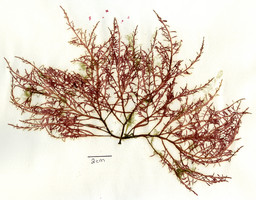
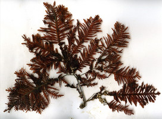
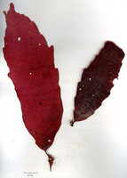
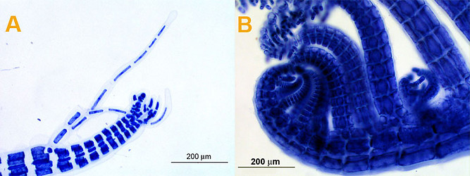
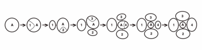
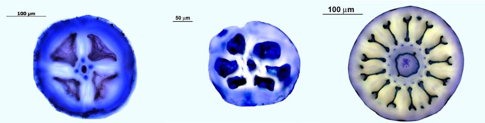
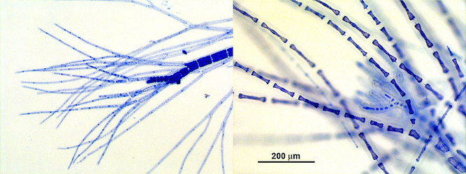
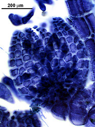
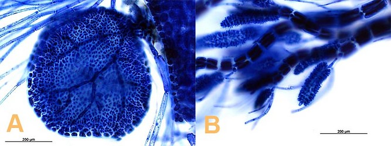

## Phylogeny 

-   « Ancestral Groups  
    -  [Ceramiales](../Ceramiales.md))
    -  [Florideophyceae](../../Florideophyceae.md))
    -  [Rhodophyta](../../../Rhodophyta.md))
    -  [Eukarya](../../../../Eukarya.md))
    -   [Tree of Life](../../../../Tree_of_Life.md)

-   ◊ Sibling Groups of  Ceramiales
    -   Rhodomelaceae

-   » Sub-Groups 

# [[Rhodomelaceae]] 

   

## #has_/text_of_/abstract 

> **Rhodomelaceae** is estimated to be the largest red algae family, with about 125 genera and over 700 species.
>
> [Wikipedia](https://en.wikipedia.org/wiki/Rhodomelaceae) 

## Introduction

[Brooke Stuercke and D. Wilson Freshwater]() 

The Rhodomelaceae is estimated to be the largest red algal family
(Scagel, 1953; Dawson, 1966; Abbott, 1999) with about 125 genera and
some 700 species recognized worldwide (Kraft, 1981). 

This family displays great diversity in vegetative structure 
but appears to be uniform in reproductive development (Scagel, 1953; Dawson, 1966).

Rhodomelaceae are uniaxial and polysiphonious. 

The polysiphonious structure results from the cells of the central axial filament 
cutting off pericentral cells by longitudinal tangential divisions (Stegenga, et al. 1997). 

The Rhodomelaceae differ from other Ceramiales families 
by the formation of pericentral cells in an alternating fashion.

### Characteristics

-   Thalli range from having simple, radial symmetry to complex,
    bilateral symmetry or dorsiventral organization\

-   Apices are straight, strongly curved dorsally, or spirally inrolled
    (Fig. 1)\

   )\
    Fig. 1. Rhodomelaceae apices. A. *Polysiphonia* sp. B.
    *Herposiphonia* sp.. © 2005 [Brooke     Stuercke](mailto:bs8253@uncw.edu)

-   Specific formation of pericentral cells where they are cut off in an
    alternating sequence (Fig. 2)\

   )\
    Fig. 2. Sequential transverse section views of axial cell (A)
    divisions to form pericentral cells (labeled 1 thru 4) in an
    alternating fashion.  The developmental sequence goes from youngest
    segments on the left to older segments on the right. Drawing depicts
    a species with 4 pericentral cells. © [D. Wilson     Freshwater](mailto:freshwaterw@uncw.edu)

-   Number of pericentral cells ranges from 4 to 24 (Fig. 3)\

   )\
    Polysiphonia spp.. © 2005 [Brooke Stuercke](mailto:bs8253@uncw.edu)

    Fig. 3. Transverse sections showing variation in the number of
    pericentral cells in the Rhodomelaceae.

-   Presence of trichoblast, either pigmented and persistent usually
    associated with vegetative plants or colorless and deciduous usually
    associated with reproductive plants (Fig. 4)\

   )\
    Fig. 4. Rhodomelaceae trichoblasts. Colorless, deciduous trichoblast
    in a *Polysiphonia* species (left) and pigmented, persistent
    trichoblasts in a *Murrayella* sp. (right). © [Brooke     Stuercke](mailto:bs8253@uncw.edu)

-   Four-celled carpogonial branch

-   Cystocarps with distinct pericarp (Fig. 5)\

   )\
    Fig. 5. *Polysiphonia* sp. cystocarp. © 2005 [Brooke     Stuercke](mailto:bs8253@uncw.edu)

-   Spermatangia, in most cases, are associated with trichoblasts.\

-   Spermatangial heads can display an array of forms, such as, discoid
    (Fig. 6A) cylindro-conical (Fig. 6B), globose, or lobed.\

   )\
    Fig. 6. Comparison of spermatangia within the Rhodomelaceae. A.
    Plate-like spermatangia of *Acanthophora spicifera*. B.
    Cylindro-conical spermatangia of *Polysiphonia* sp. © 2005 [Brooke     Stuercke](mailto:bs8253@uncw.edu)

-    Tetrasporangia are generally borne on pericentral cells (Fig. 7)\

## Title Illustrations

---------------------------------------------------------------------------
 
Scientific Name ::     Chondria dasyphylla (Woodward) C. Agardh
Location ::           Onslow Bay, North Carolina 27m depth
Specimen Condition   Dead Specimen
Identified By        D. Wilson Freshwater
Behavior             Rather beautiful swaying
Collection           WNC2004-065
Collector            D. Wilson Freshwater & Ken Johns
Copyright ::            © 2006 [D. Wilson Freshwater](mailto:freshwaterw@uncw.edu) 

--------------------------------------------------------------------------
 
Scientific Name ::     Melanamansia fimbrifolia R.E. Norris
Location ::           Grant\'s Reef, Sodwana Bay, KwaZulu-Natal, South Africa 52-55m depth
Specimen Condition   Dead Specimen
Identified By        D. Wilson Freshwater
Behavior             Growing on sediment covered deep reef
Collection           WNC2006-036
Collector            D. Wilson Freshwater & Kerry Sink
Copyright ::            © [D. Wilson Freshwater](mailto:freshwaterw@uncw.edu) 

-------------------------------------------------------------------------
 
Scientific Name ::  Lenormandiopsis nozawae R.E. Norris
Location ::        Grant\'s Reef, Sodwana Bay, KwaZulu-Natal, South Africa 52-55m depth
Identified By     D. Wilson Freshwater
Behavior          Growing on sediment covered reef.
Collection        Herbarium specimen WNC2006-031
Collector         D. Wilson Freshwater & Ken Johns
Copyright ::         © [D. Wilson Freshwater](mailto:freshwaterw@uncw.edu) 

## Confidential Links & Embeds: 

### #is_/same_as :: [Rhodomelaceae](/_Standards/bio/bio~Domain/Eukarya/Rhodophyta/Florideophyceae/Ceramiales/Rhodomelaceae.md) 

### #is_/same_as :: [Rhodomelaceae.public](/_public/bio/bio~Domain/Eukarya/Rhodophyta/Florideophyceae/Ceramiales/Rhodomelaceae.public.md) 

### #is_/same_as :: [Rhodomelaceae.internal](/_internal/bio/bio~Domain/Eukarya/Rhodophyta/Florideophyceae/Ceramiales/Rhodomelaceae.internal.md) 

### #is_/same_as :: [Rhodomelaceae.protect](/_protect/bio/bio~Domain/Eukarya/Rhodophyta/Florideophyceae/Ceramiales/Rhodomelaceae.protect.md) 

### #is_/same_as :: [Rhodomelaceae.private](/_private/bio/bio~Domain/Eukarya/Rhodophyta/Florideophyceae/Ceramiales/Rhodomelaceae.private.md) 

### #is_/same_as :: [Rhodomelaceae.personal](/_personal/bio/bio~Domain/Eukarya/Rhodophyta/Florideophyceae/Ceramiales/Rhodomelaceae.personal.md) 

### #is_/same_as :: [Rhodomelaceae.secret](/_secret/bio/bio~Domain/Eukarya/Rhodophyta/Florideophyceae/Ceramiales/Rhodomelaceae.secret.md)

