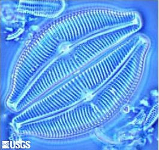
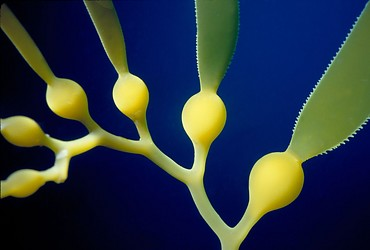

---
aliases:
  - Stramenopiles
  - heterokonts
title: Stramenopiles
---

# [[Stramenopiles]] 

#is_a/bio-Kingdom 
#is_a :: [[../../Taxon_Rank/bio~Kingdom|bio~Kingdom]]  

   

## #has_/text_of_/abstract 

> The **Stramenopiles**, also called heterokonts, are protists 
> distinguished by the presence of stiff tripartite external hairs. 
> 
> In most species, the hairs are attached to flagella, 
> in some they are attached to other areas of the cellular surface, 
> and in some they have been secondarily lost 
> (in which case relatedness to stramenopile ancestors 
> is evident from other shared cytological features or from genetic similarity). 
> 
> Stramenopiles represent one of the three major clades in the SAR supergroup, 
> along with Alveolata and Rhizaria.
>
> Stramenopiles are eukaryotes; most are single-celled, but some are multicellular including some large seaweeds, the brown algae.  The group includes a variety of algal protists, heterotrophic flagellates, opalines and closely related proteromonad flagellates (all endobionts in other organisms); the actinophryid Heliozoa, and oomycetes. The tripartite hairs characteristic of the group have been lost in some of the included taxa – for example in most diatoms.
>
> Many stramenopiles are unicellular flagellates, and most others produce flagellated cells at some point in their lifecycles, for instance as gametes or zoospores. Most flagellated heterokonts have two flagella; the anterior flagellum has one or two rows of stiff hairs or mastigonemes, and the posterior flagellum is without such embellishments, being smooth, usually shorter, or in a few cases not projecting from the cell.
>
> The term 'heterokont' is used both as an adjective – indicating that a cell has two dissimilar flagella, and as the name of a taxon. The groups included in that taxon have however varied widely, creating the 'heterokont problem', now resolved by the definition of the stramenopiles.
>
> [Wikipedia](https://en.wikipedia.org/wiki/Stramenopile) 

## Introduction
[J. Craig Bailey](Stramenopiles.md)) 

This grouping of protists arose largely from molecular studies 
which categorically confirmed that algae (previously referred to as Heterokonts or Chrysophytes) 
were related to a variety of non algal protists - 
such as the heterotrophic bicosoecid flagellates and the fungal oomycetes (Leipe et al, 1994). 

The group was informally named by Patterson (1989) 
and was based at that time on cytological evidence. 

The hairs which define this group are a distinctive subset of hairs encountered in protists, 
and are distinguished by having a long hollow shaft that gives rise to a small number of fine hairs, 
and the entire structure inserts into the cell by a basal region. 

These hairs usually occur on the flagella. 

A number of supposed stramenopiles are thought (opalines) or known (diatoms) to have lost the hairs. The stramenopiles is a very major grouping of eukaryotes containing some organisms with the 
largest linear dimensions known in the eukaryotic world (brown algae), 
as well as ecologically very important organisms - such as the diatoms.

## Characteristics

Tubulocristate protists with tripartite tubular hairs or derived from such organisms.

## Phylogeny 

-   « Ancestral Groups  
    -  [Eukarya](../Eukarya.md) 
    -   [Tree of Life](../Tree_of_Life.md)

-   ◊ Sibling Groups of  Eukaryotes
    -  [Choanoflagellates](Choanoflagellates.md) 
    -  [Animals](Animals.md) 
    -  [Fungi](Fungi.md) 
    -   Stramenopiles
    -  [Alveolate](Alveolate.md) 
    -  [Rhodophyta](Rhodophyta.md) 
    -  [Green plants](Plant.md) 
    -   [The other protists](The_other_protists)

-   » Sub-Groups

    -  [Labyrinthulomycetes](Stramenopiles/Labyrinthulomycetes.md) 

## Title Illustrations

  ---------------------
 
scientific_name ::   Cymbella tumida
Acknowledgements   Photograph courtesy of the U.S. Geological Survey

-----------------------------
 

scientific_name ::                    Macrocystis
location ::                          Channel Islands, California, USA
Acknowledgements                    This image is licensed under the [Attribution-NonCommercial-ShareAlike 2.0 Creative Commons License](http://creativecommons.org/licenses/by-nc-sa/2.0/)
source: [flickr: kelp geometry](http://flickr.com/photos/51262603@N00/46490998/)
specimen_condition ::                 Live Specimen
Source Collection                   [Flickr](http://flickr.com/)
copyright ::                           © [Tom Gruber](http://flickr.com/people/51262603@N00/)

## Confidential Links & Embeds: 

### #is_/same_as :: [[/_Standards/bio/bio~Domain/Eukarya/Stramenopiles|Stramenopiles]] 

### #is_/same_as :: [[/_public/bio/bio~Domain/Eukarya/Stramenopiles.public|Stramenopiles.public]] 

### #is_/same_as :: [[/_internal/bio/bio~Domain/Eukarya/Stramenopiles.internal|Stramenopiles.internal]] 

### #is_/same_as :: [[/_protect/bio/bio~Domain/Eukarya/Stramenopiles.protect|Stramenopiles.protect]] 

### #is_/same_as :: [[/_private/bio/bio~Domain/Eukarya/Stramenopiles.private|Stramenopiles.private]] 

### #is_/same_as :: [[/_personal/bio/bio~Domain/Eukarya/Stramenopiles.personal|Stramenopiles.personal]] 

### #is_/same_as :: [[/_secret/bio/bio~Domain/Eukarya/Stramenopiles.secret|Stramenopiles.secret]] 

