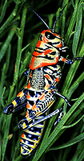
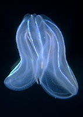
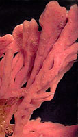

# [[Animals]] 

    

Animalia and their sibling groups within the domain Eukaryota share a common ancestry.

#is_/same_as :: [[../../../WikiData/WD~Animal,729]] 

## #has_/text_of_/abstract 

> **Animals** are multicellular, eukaryotic organisms in the biological kingdom Animalia. 
> 
> With few exceptions, animals consume organic material, breathe oxygen, have myocytes 
> and are able to move, can reproduce sexually, 
> and grow from a hollow sphere of cells, the blastula, during embryonic development. 
> 
> Animals form a clade, meaning that they arose from a single common ancestor. 
> Over 1.5 million living animal species have been described, of which around 1.05 million are insects, over 85,000 are molluscs, and around 65,000 are vertebrates. 
> 
> It has been estimated there are as many as 7.77 million animal species on Earth. 
> Animal body lengths range from 8.5 μm (0.00033 in) to 33.6 m (110 ft). 
> They have complex ecologies and interactions with each other and their environments, 
> forming intricate food webs. 
> The scientific study of animals is known as zoology, 
> and the study of animal behaviour is known as ethology.
>
> The animal kingdom is divided into five major clades, 
> namely Porifera, Ctenophora, Placozoa, Cnidaria and Bilateria. 
> 
> Most living animal species belong to the clade Bilateria, a highly proliferative clade 
> whose members have a bilaterally symmetric and significantly cephalised body plan, 
> and the vast majority of bilaterians belong to two large clades: 
> - the protostomes, which includes organisms such as arthropods, molluscs, flatworms, annelids and nematodes; and 
> - the deuterostomes, which include echinoderms, hemichordates and chordates, the latter of which contains the vertebrates. 
> - The much smaller basal phylum Xenacoelomorpha have an uncertain position within Bilateria.
>
> Animals first appeared in the fossil record in the late Cryogenian period and diversified in the subsequent Ediacaran period in what is known as the Avalon explosion. Earlier evidence of animals is still controversial; the sponge-like organism Otavia has been dated back to the Tonian period at the start of the Neoproterozoic, but its identity as an animal is heavily contested. Nearly all modern animal phyla first appeared in the fossil record as marine species during the Cambrian explosion, which began around 539 million years ago (Mya), and most classes during the Ordovician radiation 485.4 Mya. Common to all living animals, 6,331 groups of genes have been identified that may have arisen from a single common ancestor that lived about 650 Mya during the Cryogenian period.
>
> Historically, Aristotle divided animals into those with blood and those without. Carl Linnaeus created the first hierarchical biological classification for animals in 1758 with his Systema Naturae, which Jean-Baptiste Lamarck expanded into 14 phyla by 1809. In 1874, Ernst Haeckel divided the animal kingdom into the multicellular Metazoa (now synonymous with Animalia) and the Protozoa, single-celled organisms no longer considered animals. In modern times, the biological classification of animals relies on advanced techniques, such as molecular phylogenetics, which are effective at demonstrating the evolutionary relationships between taxa.
>
> Humans make use of many other animal species for food (including meat, eggs, and dairy products), for materials (such as leather, fur, and wool), as pets and as working animals for transportation, and services. Dogs, the first domesticated animal, have been used in hunting, in security and in warfare, as have horses, pigeons and birds of prey; while other terrestrial and aquatic animals are hunted for sports, trophies or profits. Non-human animals are also an important cultural element of human evolution, having appeared in cave arts and totems since the earliest times, and are frequently featured in mythology, religion, arts, literature, heraldry, politics, and sports.
>
> [Wikipedia](https://en.wikipedia.org/wiki/Animal) 

## Characteristics

Here are some key differences between Animalia and their sibling groups:

### Mode of Nutrition:

Animals are predominantly heterotrophic organisms, 
meaning they obtain their nutrients by ingesting and digesting organic matter. 
They typically have specialized feeding structures such as mouths, digestive tracts, 
and associated organs like stomachs or intestines.

Fungi are also heterotrophic but obtain their nutrients through absorption rather than ingestion. They secrete enzymes that break down organic matter in their environment, 
and then absorb the resulting nutrients through their cell walls. 
Fungi often grow on or within their food source 
and can decompose a wide range of organic materials.

### Cell Wall Composition

Animals lack cell walls in their cells. 
Instead, their cells are typically surrounded by a flexible plasma membrane.

Fungi have cell walls primarily composed of chitin, a structural polysaccharide. 
This provides rigidity and support to fungal cells and distinguishes them from animals, 
which lack chitinous cell walls.

### Body Organization:

Animals exhibit a wide range of body plans and organizational structures, 
from simple tissues to complex organ systems. 
They often display symmetry (such as radial or bilateral) and have specialized sensory organs, 
nervous systems, and locomotion strategies.

Choanoflagellates are unicellular or colonial organisms with a single flagellum 
surrounded by a collar of microvilli. 
While they share some cellular similarities with animals 
(such as the presence of collar cells resembling choanocytes found in sponges), 
they lack the tissue differentiation and complex body plans characteristic of animals.

### Reproduction and Life Cycle: 
Animals exhibit diverse reproductive strategies, including sexual and asexual reproduction. 
Many animals have complex life cycles involving distinct larval and adult stages, 
as well as various modes of development (such as direct or indirect development).

Fungi reproduce sexually and/or asexually, often producing spores as a means of dispersal. 
They may have complex life cycles involving both sexual and asexual stages, 
but these are typically simpler than the life cycles of animals.

### Ecological Roles:

Animals occupy diverse ecological niches and play various roles in ecosystems 
as predators, prey, scavengers, pollinators, and more. 
They contribute to nutrient cycling, energy flow, and ecosystem stability 
through their __interactions with other organisms__ and their environments.

Fungi are essential decomposers in ecosystems, 
breaking down organic matter and recycling nutrients. 
They form symbiotic relationships with plants (such as mycorrhizae) and other organisms, contributing to nutrient uptake and enhancing plant growth.

These differences highlight the diverse adaptations and ecological roles 
of animals and their sibling groups within the broader context of eukaryotic diversity.

## Phylogeny 

-   « Ancestral Groups  
    -   [Eukaryotes](Eukaryotes)
    -   [Tree of Life](../Tree_of_Life.md)

-   ◊ Sibling Groups of  Eukaryotes
    -   [Choanoflagellates](Choanoflagellates)
    -   Animals
    -   [Fungi](Fungi)
    -   [Stramenopiles](Stramenopiles)
    -   [Alveolates](Alveolates)
    -   [Rhodophyta](Rhodophyta)
    -   [Green plants](Plants.md)
    -   [The other protists](The_other_protists)

-   » Sub-Groups

    -   [Bilateria](Bilateria.md)
    -   [Myxozoa](Myxozoa.md)
    -   [Cnidaria](Cnidaria.md)
    -   [Ctenophora](Ctenophora.md)
    -   [Placozoa](Placozoa.md)
    -   [Sponge](Animals/Sponge.md)

## Title Illustrations

----------------------------------------------------------------------------------------

  Scientific Name ::  Dactylotum variegatum 
  Location ::        Arizona
  Comments          A colorful grasshopper (Bilateria)
  Copyright ::         © 1995 [Joseph L. Spencer](http://www.inhs.uiuc.edu/staff/index.php?action=list&user_name=spencer1) 

----------------------------------------------------------------------------------------

  Scientific Name ::  Ctenophora
  Comments          A comb jelly from the Texas State Aquarium
  Copyright ::         © [Greg and Marybeth Dimijian](http://www.dimijianimages.com/) 

----------------------------------------------------------------------------

  Scientific Name ::  Haliclona
  Comments          A sponge (Porifera)
  Creator           Photograph by David Remsen
  Copyright ::         © 1995 [Marine Biological Laboratory, Woods Hole](http://www.mbl.edu/) 

-------------------------------------------------------------------------------

  Scientific Name ::     Haliplanella luciae
  Comments             A sea anemone (Cnidaria)
  Acknowledgements     Photograph from Gray Museum Slide Collection
  Specimen Condition   Live Specimen
  Copyright ::            © 1995 [Marine Biological Laboratory, Woods Hole](http://www.mbl.edu/) 

