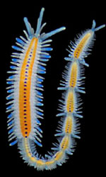
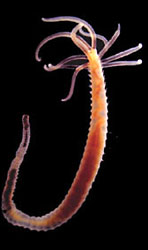
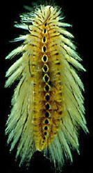

# Annelida

 Segmented worms: bristleworms, ragworms, earthworms, leeches and their allies 

 
 
 

## #has_/text_of_/abstract 

> The annelids (), also known as the segmented worms, are animals that comprise the phylum **Annelida** (; from Latin  anellus 'little ring'). The phylum contains over 22,000 extant species, including ragworms, earthworms, and leeches. The species exist in and have adapted to various ecologies – some in marine environments as distinct as tidal zones and hydrothermal vents, others in fresh water, and yet others in moist terrestrial environments.
>
> The annelids are bilaterally symmetrical, triploblastic, coelomate, invertebrate organisms. They also have parapodia for locomotion. Most textbooks still use the traditional division into polychaetes (almost all marine), oligochaetes (which include earthworms) and leech-like species. Cladistic research since 1997 has radically changed this scheme, viewing leeches as a sub-group of oligochaetes and oligochaetes as a sub-group of polychaetes. In addition, the Pogonophora, Echiura and Sipuncula, previously regarded as separate phyla, are now regarded as sub-groups of polychaetes. Annelids are considered members of the Lophotrochozoa, a "super-phylum" of protostomes that also includes molluscs, brachiopods, and nemerteans.
>
> The basic annelid form consists of multiple segments. Each segment has the same sets of organs and, in most polychaetes, has a pair of parapodia that many species use for locomotion. Septa separate the segments of many species, but are poorly defined or absent in others, and Echiura and Sipuncula show no obvious signs of segmentation. In species with well-developed septa, the blood circulates entirely within blood vessels, and the vessels in segments near the front ends of these species are often built up with muscles that act as hearts. The septa of such species also enable them to change the shapes of individual segments, which facilitates movement by peristalsis ("ripples" that pass along the body) or by undulations that improve the effectiveness of the parapodia. In species with incomplete septa or none, the blood circulates through the main body cavity without any kind of pump, and there is a wide range of locomotory techniques – some burrowing species turn their pharynges inside out to drag themselves through the sediment.
>
> Earthworms are oligochaetes that support terrestrial food chains both as prey and predators, and in some regions are important in aeration and enriching of soil. The burrowing of marine polychaetes, which may constitute up to a third of all species in near-shore environments, encourages the development of ecosystems by enabling water and oxygen to penetrate the sea floor. In addition to improving soil fertility, annelids serve humans as food and as bait. Scientists observe annelids to monitor the quality of marine and fresh water. Although blood-letting is used less frequently by doctors than it once was, some leech species are regarded as endangered because they have been over-harvested for this purpose in the last few centuries. Ragworms' jaws are studied by engineers as they offer an exceptional combination of lightness and strength.
>
> Since annelids are soft-bodied, their fossils are rare – mostly jaws and the mineralized tubes that some of the species secreted. Although some late Ediacaran fossils may represent annelids, the oldest known fossil that is identified with confidence comes from about 518 million years ago in the early Cambrian period. Fossils of most modern mobile polychaete groups appeared by the end of the Carboniferous, about 299 million years ago. Palaeontologists disagree about whether some body fossils from the mid Ordovician, about 472 to 461 million years ago, are the remains of oligochaetes, and the earliest indisputable fossils of the group appear in the Paleogene period, which began 66 million years ago.
>
> [Wikipedia](https://en.wikipedia.org/wiki/Annelid) 

## Phylogeny 

-   « Ancestral Groups  
    -   [Bilateria](Bilateria)
    -   [Animals](Animals)
    -   [Eukaryotes](Eukaryotes)
    -   [Tree of Life](../../../Tree_of_Life.md)

-   ◊ Sibling Groups of  Bilateria
    -   [Deuterostomia](Deutero.md)
    -   [Arthropoda](Arthropoda)
    -   [Onychophora](Onychophora)
    -   [Tardigrade](Tardigrade.md)
    -   [Nematoda](Nematoda)
    -   [Nematomorpha](Nematomorpha)
    -   [Kinorhyncha](Kinorhyncha)
    -   [Loricifera](Loricifera)
    -   [Priapulida](Priapulida)
    -   [Arrow_Worm](Arrow_Worm.md)
    -   [Gastrotricha](Gastrotricha)
    -   [Rotifera](Rotifera)
    -   [Gnathostomulida](Gnathostomulida)
    -   [Limnognathia maerski](Limnognathia_maerski)
    -   [Cycliophora](Cycliophora)
    -   [Mesozoa](Mesozoa)
    -   [Platyhelminthes](Platyhelminthes)
    -   Annelida
    -   [Bryozoa](Bryozoa)
    -   [Sipuncula](Sipuncula)
    -   [Mollusca](Mollusca)
    -   [Nemertea](Nemertea)
    -   [Entoprocta](Entoprocta)
    -   [Phoronida](Phoronida)
    -   [Brachiopoda](Brachiopoda)

-   » Sub-Groups
    -   [Phyllodocida](Phyllodocida.md)

## Introduction

[Greg W. Rouse, Fredrik Pleijel, and Damhnait McHugh]()

Annelida is a group commonly referred to as segmented worms, 
and they are found worldwide from the deepest marine sediments 
to the soils in our city parks and yards. 

Through most of the 20th century Annelida was split into three major groups; 
Polychaeta, Oligochaeta (earthworms etc.) and Hirudinea (leeches). 

Earthworms and leeches are the familiar annelids for most people, 
but polychaetes comprise the bulk of the diversity of Annelida 
and are found in nearly every marine habitat, from intertidal algal mats downwards. 

There are even pelagic polychaetes that swim or drift, preying on other plankton, 
and a few groups occurring in fresh water and moist terrestrial surroundings. 

Around 9000 species of polychaetes are currently recognized 
with several thousand more names in synonymy, 
and the overall systematics of the group remains unstable
(Rouse and Pleijel, 2001).

It is now recognized that Oligochaeta and Hirudinea, 
comprised of several thousand species, form a clade 
and should be referred to either as Oligochaeta (Siddall et al., 2001) 
or Clitellata (Martin, 2001).

Moreover, it is possible that this group may well belong inside
Polychaeta, thus making Polychaeta synonymous with Annelida (McHugh,
1997; Westheide, 1997; Westheide et al., 1999). Echiura (spoon worms),
at one time regarded as an annelid group (Sedgwick, 1898), has been
excluded from Annelida for many years (Newby, 1940). Evidence now
suggests they are in fact annelids (Hessling and Westheide, 2002;
McHugh, 1997), though their placement within the group is unresolved.
The former phyla Pogonophora and Vestimentifera have also recently
become regarded as a single, clearly annelid, group (Bartolomaeus, 1995;
Nielsen, 1995; Rouse and Fauchald, 1995), and are now known by the
original name, Siboglinidae (see Rouse and Fauchald , 1997 and McHugh
1997). Undoubted annelid fossils, such as
[*Canadia*](http://www.nmnh.si.edu/paleo/shale/pcanadia.htm), are known
from the Burgess Shale deposits.

Until relatively recently the most commonly used system to divide
polychaetes was as \'Errantia\' and \'Sedentaria\'. This was essentially
a system of convenience with no real intention of depicting evolutionary
relationships. This classification was supplanted in the 1960s and 1970s
by ones which split polychaetes into as many as 22 orders with no
explicit linkage between them (Fauchald and Rouse, 1997). A recent
cladistic analysis of Annelida and other groups has resulted in a new
classification of polychaetes (Rouse and Fauchald, 1997), with the group
split into two main clades Scolecida and Palpata. Scolecida is a small
group of less than 1000 named species, and these worms are all burrowers
of one form or another, with bodies reminiscent of earthworms. Palpata
comprises the vast majority of polychaetes and is divided into Aciculata
and Canalipalpata. Aciculata contains about half of the polychaete
species and largely encompasses the old taxonomic group Errantia.
Representatives of this lineage are characterized by having internal
supporting chaetae, or aciculae, in the parapodia. It includes major
groups such as Phyllodocida and Eunicida, which tend to be mobile forms
with well developed eyes and parapodia for rapid locomotion.
Canalipalpata, a group with more than 5000 named species, is
distinguished by having long grooved palp structures that are used for
feeding. Canalipalpata is divided into Sabellida, Spionida and
Terebellida. Most of these groups' members live in tubes and use their
palps to feed in various ways.

### Characteristics

#### Synapomorphies of Annelida

The monophyly of Annelida is not well supported and only two
morphological features are worthy of discussion; segmentation and
chaetae. Nuchal organs represent another possible apomorphy and are
discussed in the section on sensory structures (see [plesiomorphies and other features](http://www.tolweb.org/accessory/Characteristics_of_Annelida?acc_id=57)).

##### 1. Metamerism (segmentation)

Annelids have three body regions (Fig. 2). The majority of the body is
comprised of repeated units called segments. The original French use of
the name Annélides (Lamarck, 1802) comes from the Latin word 'anellus',
meaning a little ring, in reference to the presence of the ring-like
segments. Each segment is, in principle, limited by septa dividing it
from neighbouring segments, and has a fluid-filled cavity within
referred to as a coelom. Structures such as the excretory, locomotory
and respiratory organs are generally repeated in each segment. Segments
are formed sequentially in annelids and are established during
development from growth zones located at the posterior end of the body;
so the youngest segment in the body of an annelid is always the most
posterior. The only parts of the annelid body that are not segmental are
the head and a terminal post-segmental region called the pygidium. The
head is comprised of two units, the prostomium and the peristomium. The
postsegmental pygidium includes the zone from which new segments are
proliferated during growth. The proposed homology of segmentation seen
in annelids with that seen in Arthropoda has been used to unite the two
as Articulata, a grouping that dates back to Cuvier (1817). The homology
of this segmentation has been questioned recently, with arthropods now
viewed by many as closer to taxa such as Nematoda (Aguinaldo et al.,
1997). This suggests that the form of segmentation seen in annelids may
in fact represent an apomorphy. With regards to the supposedly
unsegmented Echiura, their reinstatement within Annelida (see McHugh
1997) suggests that their apparently unsegmented body in fact represents
a series of fused segments (see Hessling and Westheide 2002).

Figure 2. *Ophryotrocha* (Dorvilleidae). Sandgerdi Iceland. Copyright ©
20001 Greg Rouse.

##### 2. Chaetae

A distinctive feature of annelids are structures called chaetae (Fig.
3). Chaetae (also called setae) are bundles of chitinous, thin-walled
cylinders held together by sclerotinized protein. They are produced by a
microvillar border of certain invaginated epidermal cells and so can be
defined as cuticular structures that develop within epidermal follicles.
Chaetae show a huge amount of variation, from long thin filaments
(capillary chaetae) to stout multi-pronged hooks (Fig. 3). Apart from
annelids, chaetae are found in Echiura and Brachiopoda. There is now
good evidence (Hessling and Westheide, 2002; McHugh, 1997) that the
former group falls within Annelida. The position of Brachiopoda is
controversial (Lüter, 2000b; Lüter and Bartolomaeus, 1997; Stechmann and
Schlegel, 1999) and the homology of their chaetae with those of annelids
is unresolved (Lüter, 2000a). There is a distinct possibility therefore
that chaetae represent an apomorphy for Annelida.

Figure 3. *Proscoloplos* (Orbiniidae). Bondi, Australia. SEM and Light
micrographs. Copyright © 2001 Greg Rouse.
### Discussion of Phylogenetic Relationships

The most recent comprehensive systematization of polychaetes, that
proposed by Rouse and Fauchald (1997) from their cladistic parsimony
analyses, has been used here (Fig. 1) with some alterations (see Rouse
and Pleijel, 2001). Allowing for the likely errors in the placement of
many taxa, and the fact that there were conflicting results included in
the original analyses, the most fundamental problem inherent in the
systematization used here may be that of the placement of the root for
any tree of Annelida.

Basal annelids, according to Rouse and Fauchald (1997), are taxa such as
Clitellata/Oligochaeta and simple-bodied forms within Scolecida. Their
trees also excludes Echiura from Annelida. This result was based on
outgroup choices such as Mollusca and Sipuncula, and may well be
misleading. Alternative hypotheses are therefore worth outlining, though
they do not follow normal cladistic practice. Storch (1968), following a
detailed study on the musculature of Annelida, proposed that
scale-worms, a diverse clade within Phyllodocida, are representative of
the plesiomorphic condition for Annelida. He suggested that there was a
radiation from this group, but that Chrysopetalidae were most closely
related to scale-worms. The implication of his hypothesis is that
Phyllodocida represents a paraphyletic group, from which all other
polychaete taxa arise. Westheide (1997) (and see Westheide et al., 1999)
suggests that the basic (i.e., plesiomorphic) \'body plan\' of Annelida
comprises features meaning that the root of the Annelida tree would be
placed with taxa from Aciculata. This would either result in a
paraphyletic Phyllodocida or Amphinomida, depending on which taxon is
used as the root (Fig. 4).

 

Figure 4.

From a molecular perspective, McHugh (1997) found Clitellata,
Pogonophora (= Siboglinidae) and Echiura nested among various
polychaetes using sequence data from elongation factor 1 alpha in a
parsimony analysis (Fig. 4). The placement by McHugh (1997) of
Pogonophora as a polychaete group was congruent with Rouse and
Fauchald's (1997) results, but those of Clitellata and Echiura were
markedly different. The conflict between this molecular sequence data
and the morphological results could be caused by several factors. One
possibility is that Clitellata/Oligochaeta and Echiura have lost a
number of morphological features that would help identify their sister
group among polychaetes. Further morphological study, combined with
sequence data, may uncover these \'losses\' (see Hessling and Westheide,
2002). However, the molecular sequence data sets assembled to date have
been marked by both a limited number of taxa and characters. An
exception is Brown et al. (1999), where DNA sequence data from three
nuclear genes across a wide taxonomic diversity of annelids was subject
to parsimony analysis. They recovered some morphological groupings such
as Cirratulidae, Terebellidae and Eunicida, but did not show a
monophyletic Phyllodocida or Aciculata, nor did they find any parts of
these taxa to be basal groups of Annelida. However, some expected
groupings were not recovered. Martin (2001) found that the placement of
Clitellata/Oligochaeta among polychaetes could not be resolved, and he
could not recover a monophyletic Annelida owing to the placement of taxa
such as Mollusca and Sipuncula. None of the major taxa used here, such
as Palpata, Aciculata, Phyllodocida, Canalipalpata, Sabellida or
Terebellida were recovered in Martin\'s (2001) analysis. Also less
diverse taxa such as Nereididae, Spionidae and Aphroditiformia were not
recovered.

#### Does the fossil record help?

In a review of the fossil record of annelids Rouse and Pleijel (2001)
suggested that the oldest unequivocal fossil polychaetes, such as
*Canadia* from the Cambrian, belong within Phyllodocida. Subsequent
fossil polychaetes that can be confidently placed outside Phyllodocida
do not appear until the Carboniferous. No other fossil polychaetes from
the Cambrian can be unequivocally assigned to extant polychaete taxa.
There are several likely appearances from the Ordovician, including
Serpulidae, Spionidae and the radiation of Eunicida. Ensuing appearances
suggest that by the end of the Carboniferous most major polychaetes
lineages had appeared. The exception appears to be Scolecida, with the
earliest known fossils being the dubious *Archarenicola* (Arenicolidae)
from the Triassic, and one assignable to Paraonidae from the Cretaceous.
With the rooting option employed in Figure 1, it appears that some of
the earliest appearing fossil polychaetes belong to derived clades
(e.g., Eunicida and Phyllodocida). This could be interpreted in two
ways: (1) the root placement in Figure 1 is wrong, and so Aciculata,
comprised of Amphinomida, Eunicida and Phyllodocida, may in fact
represent a paraphyletic \'stem\' group for the rest of polychaetes; (2)
a number of major polychaete clades had already evolved in, or before,
the \'Cambrian explosion\', but fossils have not yet been found. The
third possibility is that the overall topology used in Figure 1 may be
profoundly incorrect. If we accept that the basic topology shown in
Figure 1 is correct, but do not root the tree, then a diagram as shown
in Figure 5 is the result. This may represent the most conservative
representation of our understanding of annelid relationships.

Figure 5.

## Title Illustrations

----------------------------------------------------------------------

Scientific Name ::  Autolytus pachycerus
Location ::        Bondi, Australia
Comments          Syllidae
Copyright ::         © 2001 [Greg W. Rouse](http://mbrd.ucsd.edu/) 

----------------------------------------------------------------------

Scientific Name ::  Acrocirrus validus
Location ::        Misaki, Japan
Comments          Acrocirridae
Copyright ::         © 1999 [Greg W. Rouse](http://mbrd.ucsd.edu/) 

----------------------------------------------------------------------

Scientific Name ::  Chloeia
Location ::        Misaki, Japan
Comments          Amphinomidae
Copyright ::         © 1999 [Greg W. Rouse](http://mbrd.ucsd.edu/) 

----------------------------------------------------------------------

Scientific Name ::  Hirudinea
Location ::        Sydney, Australia
Comments          unidentified leech
Copyright ::         © 1998 [Greg W. Rouse](http://mbrd.ucsd.edu/) 

## Confidential Links & Embeds: 

### #is_/same_as :: [Annelida](/_Standards/bio/bio~Domain/Eukaryotes/Animals/Bilateria/Annelida.md) 

### #is_/same_as :: [Annelida.public](/_public/bio/bio~Domain/Eukaryotes/Animals/Bilateria/Annelida.public.md) 

### #is_/same_as :: [Annelida.internal](/_internal/bio/bio~Domain/Eukaryotes/Animals/Bilateria/Annelida.internal.md) 

### #is_/same_as :: [Annelida.protect](/_protect/bio/bio~Domain/Eukaryotes/Animals/Bilateria/Annelida.protect.md) 

### #is_/same_as :: [Annelida.private](/_private/bio/bio~Domain/Eukaryotes/Animals/Bilateria/Annelida.private.md) 

### #is_/same_as :: [Annelida.personal](/_personal/bio/bio~Domain/Eukaryotes/Animals/Bilateria/Annelida.personal.md) 

### #is_/same_as :: [Annelida.secret](/_secret/bio/bio~Domain/Eukaryotes/Animals/Bilateria/Annelida.secret.md)

