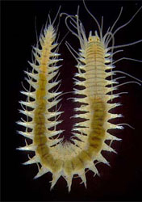
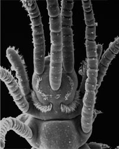

# [[Phyllodocida]] 

 
 

## #has_/text_of_/abstract 

> **Phyllodocida** is an order of polychaete worms in the subclass Aciculata. 
> 
> These worms are mostly marine, though some are found in brackish water. 
> Most are active benthic creatures, moving over the surface or burrowing in sediments, 
> or living in cracks and crevices in bedrock. 
> 
> A few construct tubes in which they live and some are pelagic, 
> swimming through the water column. 
> 
> There are estimated to be more than 4,600 accepted species in the order.
>
> [Wikipedia](https://en.wikipedia.org/wiki/Phyllodocida) 

## Phylogeny 

-   « Ancestral Groups  
    -   [Annelida](Annelida)
    -   [Bilateria](Bilateria)
    -   [Animals](Animals)
    -   [Eukaryotes](Eukaryotes)
    -   [Tree of Life](../../../../Tree_of_Life.md)

-   ◊ Sibling Groups of  Annelida
    -   Phyllodocida

-   » Sub-Groups
    -   [Hesionidae](Hesionidae.md)
    -   [Minor holopelagic         Phyllodocida](Minor_holopelagic_Phyllodocida)

## Introduction

[Fredrik Pleijel and Greg W. Rouse]()

The name Phyllodocida was introduced by Dales (1962) 
for a group with very similar composition to the one represented in the tree above
(except Myzostomida; [see below](#DiscussionofPhylogeneticRelationships)). 

Phyllodocida, together with Amphinomida and Eunicida, 
makes up the major part of Aciculata,
approximately corresponding to what in earlier literature was referred
to as \"errant polychaetes\". The exact number of described species
within Phyllodocida is difficult to assess, but we estimate that more
than 3500 species names are treated as valid today.

Figure 2. Undescribed Sphaerodoridae from Lizard Island (Australia).
Copyright © 2002 Greg Rouse

Most Phyllodocida are active animals that move over and in sediments, or
live in cracks and crevices in hard surfaces. Only a few construct tubes
and have more sessile life-styles. Many are brightly coloured, with
beautiful pigmentation patterns. While most Phyllodocida live their
adult lives on the bottom, a number of different groups spend their
whole lives being pelagic (=holopelagic); these tend to be transparent.

The majority of Phyllodocida are marine, although some occur in brackish
waters and a few nereidids and nephtyids live in freshwater, and some
nereidids occur in terrestrial habitats (e.g., Wesenberg-Lund, 1958).
More familiar members of Phyllodocida include those that are common
intertidally, including rag worms (*Nereis* and allies), which are
commercially important as fish bait, various scale-worms, and the
venomous blood-worms (*Glycera*). Adult sizes are highly variable,
ranging from a few mm to over a meter in length.

### Characteristics

Suggested synapomorphies for Phyllodocida include ventrally positioned
sensory palps, an axial eversible pharynx, presence of anterior enlarged
cirri, compound chaetae with a single ligament, and metanephromixia
(Glasby, 1993; Rouse and Fauchald, 1997). However, this list may appear
much more impressive than it actually is, as most of these features are
homoplastic (Fig. 3, for example, shows a nereidid compound chaeta with
double ligaments), and virtually all require further study. Also, as
discussed in the
[Annelida](tree?group=Annelida&contgroup=Bilateria#DiscussionofPhylogeneticRelationships)
page, it has been suggested that Phyllodocida may be a basal
paraphyletic grade of annelids, although this has generally not been
supported by morphological data.

Figure 3. Compound chaeta of a nereidid with double ligaments between
blade and shaft. Copyright © 1997 Fredrik Pleijel.

The prostomium of Phyllodocida generally has one or two pairs of eyes
(although a number of blind members exists), a dorsal pair of antennae,
a ventral pair of sensory palps, and a pair of nuchal organs situated at
the posterior edge of the prostomium (Fig. 4). The palps and paired
antennae may look similar, as in phyllodocids (Fig. 4) and glycerids
(Fig. 9), or the palps may be larger and more elaborated, as in
hesionids and nereidids (Fig. 5).

Figure 4. A phyllodocid, *Sige fusigera*, Sweden, anterior end in dorsal
view, arrows indicate palp, paired antenna (P ANT) and nuchal organ (NO)
on the left side. Copyright © 1987 Fredrik Pleijel.

Figure 5. A nereidid, *Hediste diversicolor*, Sweden, anterior end in
ventral view. Arrows indicate paired antenna (PA), palpostyle (PS) and
palpophore (PP), right side. Copyright © 2000 Fredrik Pleijel.

The peristomium is a ring, but is often dorsally concealed by the
prostomium and first segment. (Note, however, that there are
uncertainties in some groups as to what actually constitutes the
peristomium vs. the first segment, such as in nereidids.) There is an
axial muscular proboscis (eversible pharynx), that in many taxa is
distally or internally equipped with one or several pairs of jaws (Fig.
6).

Figure 6. Everted proboscis of a nereidid, *Neanthes vaalii*, showing
jaws. When retracted (right) the jaws of nereidids are held inside the
body. Copyright © 2004 Greg Rouse.

Segment 1 and, sometimes, several following segments tend to differ from
\"normal\" segments in having enlarged dorsal and ventral cirri and
reduced parapodial lobes and chaetae. Otherwise, most have many segments
that are similar to each other, usually without abrupt changes of
parapodia and chaetae, but gradually shifting in proportions along the
body. Both uni- and biramous parapodia occur, and chaetae appear in a
large variety of shapes, including simple and compound ones. Dorsal and
ventral parapodial cirri are almost always present, and there is usually
a single pair of pygidial cirri. Although most members would appear to
have separate sexes, a number of hermaphrodites also exist. Some
Phyllodocida, especially within nereidids and syllids, undergo drastic
morphological changes in association with reproduction.

### Discussion of Phylogenetic Relationships

When introduced by Dales (1962), the name Phyllodocida did not include
Myzostomida. This latter group of symbionts on echinoderms, mainly
crinoids, was referred to Phyllodocida by Rouse and Fauchald (1997),
although this has recently been challenged by Eeckhaut et al. (2000),
who based on molecular evidence suggested that they instead are more
closely related to flatworms. The issue remains unresolved, but we here
tentatively treat them as members of Phyllodocida.

As noted in the Introduction, the features supporting Phyllodocida may
be homoplastic, and there are two obvious problems \"threatening\" the
monophyly of this group. One is the suggestion that the root of the
polychaete tree, or even the annelid tree, is situated within the
Phyllodocida, an issue that is discussed in the [Annelida Discussion of Phylogenetic Relationships](tree?group=Annelida&contgroup=Bilateria#DiscussionofPhylogeneticRelationships).
Another is the relationships to other taxa within Aciculata. Both the
two other major Aciculata clades, Eunicida and Amphinomida, are
identified by a number of unique and unreversed features, and both of
these clearly appear monophyletic. However, considering the weak support
for the group, there are possibilities that Eunicida and/or Amphinomida
have their sistergroup(s) within Phyllodocida.

Identified and named major subgroups in the tree above (Fig. 1) include
Aphroditiformia, Nereidiformia, and Glyceriformia. Of these,
Aphroditiformia are united by the obvious feature presence of elytrae
(\"scales\") on a number of alternating segments (Fig. 7).

Figure 7. Unidentified polynoid scaleworm (Aphroditiformia) commensal on
a crinoid. Note bright red elytrae. Copyright © 1998 Greg Rouse.

The position of Pisionidae (Fig. 8), though, is more uncertain, and in
the consensus tree above this is illustrated by their position in a
basal polytomy. Rouse and Fauchald (1997) classified them together with
*Paralacydonia* and Glyceriformia, whereas in Pleijel and Dahlgren
(1998) they appeared as sister to the scale-worms (see Pleijel, 2001a
for further references).

Figure 8. *Pisione* sp. from Lizard Island (Australia). Copyright © 2002
Greg Rouse

The delineation of Nereidiformia is not straightforward. The composition
here is in agreement with Glasby (1993), and with some but not all of
the topologies obtained by the morphology-based analyses of Pleijel and
Dahlgren (1998). In these two studies there is full consensus on the
monophyly of a group including Hesionidae, Nereididae and
Chrysopetalidae, as evidenced by the presence of a special internal
structure in the chaetae (compartmentalized medulla),
and---possibly---by having biarticulated palps, although this latter
feature may be present as a homoplasy in some other groups as well. Some
of the resulting trees in a recent combined molecular (CO1) and
morphological study by Dahlgren et al. (2000) indicated the possibility
that Pilargidae could be part of that group as well, although without
strong support.

Glyceriformia includes Glyceridae and Goniadidae, a group well supported
by the presence of a unique cone-shaped and ringed prostomium (Fig. 8),
of which the major part anterior actually may represent the basal
portion of the fused palps (see e.g., Orrhage, 1999). A recent, detailed
revision of the former group by Böggemann (2002) supported the
traditional view that Glyceridae and Goniadidae are sister taxa.

Figure 9. *Glycera* sp. from Japan. Copyright © 1998 Greg Rouse.

The \"Minor holopelagic taxa\" include Iospilidae, *Pontodora*, and
Typhloscolecidae. They are highly unlikely to constitute a single clade,
but their relationships within Phyllodocida are currently unknown, and
they are here listed as a single terminal for convenience only. Other
holopelagic groups include Tomopteridae and Lopadorhynchidae, the former
of unknown position (presumably) within Phyllodocida, and the latter
possibly with a sistergroup relationship among benthic Phyllodocidae
(e.g., Uschakov, 1972), or even with several different sistergroups
within that taxon, such that they are polyphyletic (Pleijel, 2001b).
Alciopidae were recently referred to as a subgroup within Phyllodocidae,
and renamed as Alciopini (Pleijel, 2001b); however, their more precise
relationships among phyllodocids are uncertain, although Pleijel (2001b)
suggested that they may be sought among *Pirakia*, *Pterocirrus* or
*Sige*.

Figure 10. Left *Lacydonia*, South Australia, dorsal view, copyright ©
2004 Greg Rouse, right *Phyllodoce citrina*, Norway, anterior end,
dorsal view, copyright © 2004 Fredrik Pleijel.
### Classification

  ------------------- -------
  Phyllodocida                                                                                    

     Aphroditiformia                                                   

                                   Acoetidae\                          
                                                 Aphroditidae\                       
                                                              Eulepethidae\                       
                                                              Pholoidae\                          
                                                              Polynoidae\                         
                                                              Sigalionidae                        

                                Nereidiformia                                                     

                                                              Chrysopetalidae\                    
                                                              Hesionidae\                         
                                                              Nautiliniellidae\                   
                                                              Nereididae\                         
                                                              Pilargidae\                         
                                                              Syllidae\                           
                                                              Nereidiformia                       
                                                              incertae sedis                      
                                                              (*Microphthalmus*,                  
                                                              *Hesionides*)                       

                                Glyceriformia                                                     

                                                              Glyceridae\                         
                                                              Goniadidae                          

                                *Ichthyotomus*                                                    

                                Lopadorhynchidae                                                  

                                \"Minor\" holopelagic                                             
                                Phyllodocida (Iospilidae,                                         
                                *Pontodora*,                                                      
                                Typhloscolecidae)                                                 

                                Myzostomids                                                       

                                Nephtyidae                                                        

                                *Paralacydonia*                                                   

                                Unnamed clade                                                     

                                                              Phyllodocidae\                      
                                                              *Lacydonia*                         

                                Sphaerodoridae                                                    

                                Tomopteridae                                                      

                                Phyllodocida incertae sedis                                       
                                (*Antonbruunia*, *Struwela*,                                      
                                *Yndolacia*)                                                      
  ------------------- -------

## Title Illustrations

----------------------------------------------------------------------

Scientific Name ::  Nereimyra punctata
Location ::        south-western Iceland
Comments          Hesionidae
Copyright ::         © 2001 [Greg W. Rouse](http://mbrd.ucsd.edu/) 

------------------------------------------------------------------------

Scientific Name ::  Syllidae
Location ::        Massachusetts, USA
Copyright ::         © 1997 [Fredrik Pleijel](mailto:pleijel@mnhn.fr) 

------------------------------------------------------------------------

Scientific Name ::  Notophyllum foliosum
Location ::        Trondheim, Norway
Comments          Phyllodocidae
Copyright ::         © 2002 [Fredrik Pleijel](mailto:pleijel@mnhn.fr) 

## Confidential Links & Embeds: 

### [Phyllodocida](/_Standards/bio/bio~Domain/Eukaryotes/Animals/Bilateria/Annelida/Phyllodocida.md) 

### [Phyllodocida.public](/_public/bio/bio~Domain/Eukaryotes/Animals/Bilateria/Annelida/Phyllodocida.public.md) 

### [Phyllodocida.internal](/_internal/bio/bio~Domain/Eukaryotes/Animals/Bilateria/Annelida/Phyllodocida.internal.md) 

### [Phyllodocida.protect](/_protect/bio/bio~Domain/Eukaryotes/Animals/Bilateria/Annelida/Phyllodocida.protect.md) 

### [Phyllodocida.private](/_private/bio/bio~Domain/Eukaryotes/Animals/Bilateria/Annelida/Phyllodocida.private.md) 

### [Phyllodocida.personal](/_personal/bio/bio~Domain/Eukaryotes/Animals/Bilateria/Annelida/Phyllodocida.personal.md) 

### [Phyllodocida.secret](/_secret/bio/bio~Domain/Eukaryotes/Animals/Bilateria/Annelida/Phyllodocida.secret.md)

