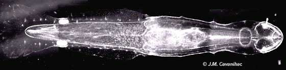

# [[Arrow_Worm]]

Arrow Worms 

 

## #has_/text_of_/abstract 

> The **Chaetognatha**  or chaetognaths  (meaning bristle-jaws) 
> are a phylum of predatory marine worms that are a major component of plankton worldwide. 
> 
> Commonly known as arrow worms, they are mostly pelagic; 
> however about 20% of the known species are benthic, and can attach to algae and rocks. 
> 
> They are found in all marine waters, from surface tropical waters 
> and shallow tide pools to the deep sea and polar regions. 
> 
> Most chaetognaths are transparent and are torpedo shaped, but some deep-sea species are orange. 
> They range in size from 2 to 120 millimetres (0.1 to 4.7 in).
>
> Chaetognaths were first recorded by the Dutch naturalist Martinus Slabber in 1775. 
> As of 2021, biologists recognize 133 modern species assigned to over 26 genera and eight families. 
> Despite the limited diversity of species, the number of individuals is large.
>
> Arrow worms are strictly related to and possibly belonging to Gnathifera, 
> a clade of protostomes that do not belong to either Ecdysozoa or Lophotrochozoa.
>
> [Wikipedia](https://en.wikipedia.org/wiki/Chaetognatha) 

### Information on the Internet

-   [Chaetognatha](http://academic.evergreen.edu/t/thuesene/chaetognaths/chaetognaths.htm). Erik V. Thuesen, Evergreen State College, Olympia, Washington.
-   [Chaetognatha of the     World](http://nlbif.eti.uva.nl/bis/chaetognatha.php?menuentry=zoeken&id=&selected=wetenschap). A.Pierrot-Bults, Zoological Museum, University of Amsterdam.
-   [The Chaetognath, a strange     creature](http://www.microscopy-uk.org.uk/mag/artjan00/chaet.html). Micscape magazine article by Jean-Marie Cavanihac.
-   [A bioluminescent     chaetognath](http://lifesci.lscf.ucsb.edu/%7Ehaddock/abstracts/chaeto.html). S. H. D. Haddock and J. F. Case

## Phylogeny 

-   « Ancestral Groups  
    -   [Bilateria](Bilateria)
    -   [Animals](Animals)
    -   [Eukaryotes](Eukaryotes)
    -   [Tree of Life](../../../Tree_of_Life.md)

-   ◊ Sibling Groups of  Bilateria
    -   [Deuterostomia](Deutero.md)
    -   [Arthropoda](Arthropoda)
    -   [Onychophora](Onychophora)
    -   [Tardigrade](Tardigrade.md)
    -   [Nematoda](Nematoda)
    -   [Nematomorpha](Nematomorpha)
    -   [Kinorhyncha](Kinorhyncha)
    -   [Loricifera](Loricifera)
    -   [Priapulida](Priapulida)
    -   Chaetognatha
    -   [Gastrotricha](Gastrotricha)
    -   [Rotifera](Rotifera)
    -   [Gnathostomulida](Gnathostomulida)
    -   [Limnognathia maerski](Limnognathia_maerski)
    -   [Cycliophora](Cycliophora)
    -   [Mesozoa](Mesozoa)
    -   [Platyhelminthes](Platyhelminthes)
    -   [Annelida](Annelida)
    -   [Bryozoa](Bryozoa)
    -   [Sipuncula](Sipuncula)
    -   [Mollusca](Mollusca)
    -   [Nemertea](Nemertea)
    -   [Entoprocta](Entoprocta)
    -   [Phoronida](Phoronida)
    -   [Brachiopoda](Brachiopoda)

-   » Sub-Groups
    -   [Spadella](Spadella)
    -   [Paraspadella](Paraspadella)
    -   [Krohnitta](Krohnitta)
    -   [Sagitta](Sagitta)
    -   [Serratosagitta](Serratosagitta)
    -   [Parasagitta](Parasagitta)
    -   [Aidanosagitta](Aidanosagitta)
    -   [Flaccisagitta](Flaccisagitta)
    -   [Decipisagitta](Decipisagitta)
    -   [Ferosagitta](Ferosagitta)
    -   [Pseudosagitta](Pseudosagitta)
    -   [Solidosagitta](Solidosagitta)
    -   [Zonosagitta](Zonosagitta)
    -   [Eukrohnia](Eukrohnia)
    -   [Heterokrohnia](Heterokrohnia)
    -   [Archeterokrohnia](Archeterokrohnia)
    -   [Krohnittella](Krohnittella)

## Title Illustrations

--------------------------------------------------------------------------

Scientific Name ::  Spadella
Creator           J. M. Cavanihac
Copyright ::         © [BIODIDAC](http://biodidac.bio.uottawa.ca/index.htm) 

