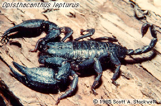

---
title: Ischnuridae
---

## Phylogeny 

-   « Ancestral Groups  
    -   [Scorpionoidea](../Scorpionoidea.md)
    -   [Scorpion](../../Scorpion.md)
    -   [Scorpionida](Scorpionida)
    -   [Arachnida](Arachnida)
    -   [Arthropoda](Arthropoda)
    -   [Bilateria](Bilateria)
    -   [Animals](Animals)
    -   [Eukaryotes](Eukaryotes)
    -   [Tree of Life](../../../../../../../../../Tree_of_Life.md)

-   ◊ Sibling Groups of  Scorpionoidea
    -   [Scorpionidae](Scorpionidae.md)
    -   [Diplocentridae](Diplocentridae.md)
    -   Ischnuridae
    -   [Bothriuridae](Bothriuridae.md)

-   » Sub-Groups 

# [[Ischnuridae]] 

 

## #has_/text_of_/abstract 

> Hemiscorpius is the sole genus of the scorpion family Hemiscorpiidae, 
> with about 16 described species. Before Hemiscorpiidae, 
> the term used for the family was **Ischnuridae**, 
> which had to be changed due to a naming conflict with the damselfly family of the same name. 
> They at one point also held the name Liochelidae.
>
> In 2015, research on the evolution, biogeography and phylogeny 
> of the families Hormuridae, Hemiscorpiidae, and Heteroscorpionidae 
> left Hemiscorpiidae with a single genus, Hemiscorpius, 
> the remaining 15 merged or transferred to other families.
>
> [Wikipedia](https://en.wikipedia.org/wiki/Hemiscorpius) 

### Information on the Internet

-   The [Scorpion     Emporium](http://wrbu.si.edu/www/stockwell/emporium/emporium.html)

## Title Illustrations

----------
Opisthacanthus lepturus.
Photograph copyright © 1985, Scott A. Stockwell.

Copyright ::   © 1985 Scott A. Stockwell

## Confidential Links & Embeds: 

### #is_/same_as :: [Ischnuridae](/_Standards/bio/bio~Domain/Eukaryotes/Animals/Bilateria/Arthropoda/Chelicerata/Arachnida/Scorpionida/Scorpion/Scorpionoidea/Ischnuridae.md) 

### #is_/same_as :: [Ischnuridae.public](/_public/bio/bio~Domain/Eukaryotes/Animals/Bilateria/Arthropoda/Chelicerata/Arachnida/Scorpionida/Scorpion/Scorpionoidea/Ischnuridae.public.md) 

### #is_/same_as :: [Ischnuridae.internal](/_internal/bio/bio~Domain/Eukaryotes/Animals/Bilateria/Arthropoda/Chelicerata/Arachnida/Scorpionida/Scorpion/Scorpionoidea/Ischnuridae.internal.md) 

### #is_/same_as :: [Ischnuridae.protect](/_protect/bio/bio~Domain/Eukaryotes/Animals/Bilateria/Arthropoda/Chelicerata/Arachnida/Scorpionida/Scorpion/Scorpionoidea/Ischnuridae.protect.md) 

### #is_/same_as :: [Ischnuridae.private](/_private/bio/bio~Domain/Eukaryotes/Animals/Bilateria/Arthropoda/Chelicerata/Arachnida/Scorpionida/Scorpion/Scorpionoidea/Ischnuridae.private.md) 

### #is_/same_as :: [Ischnuridae.personal](/_personal/bio/bio~Domain/Eukaryotes/Animals/Bilateria/Arthropoda/Chelicerata/Arachnida/Scorpionida/Scorpion/Scorpionoidea/Ischnuridae.personal.md) 

### #is_/same_as :: [Ischnuridae.secret](/_secret/bio/bio~Domain/Eukaryotes/Animals/Bilateria/Arthropoda/Chelicerata/Arachnida/Scorpionida/Scorpion/Scorpionoidea/Ischnuridae.secret.md)

