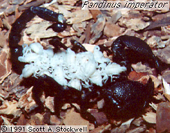

# Scorpionidae 

 

## #has_/text_of_/abstract 

> **Scorpionidae** is a family of burrowing scorpions 
> or pale-legged scorpions in the superfamily Scorpionoidea. 
> 
> The family was established by Pierre André Latreille, 1802.
>
> [Wikipedia](https://en.wikipedia.org/wiki/Scorpionidae) 

### Information on the Internet

-   The [Scorpion     Emporium](http://wrbu.si.edu/www/stockwell/emporium/emporium.html)

## Phylogeny 

-   « Ancestral Groups  
    -   [Scorpionoidea](../Scorpionoidea.md)
    -   [Scorpion](../../Scorpion.md)
    -   [Scorpionida](Scorpionida)
    -   [Arachnida](Arachnida)
    -   [Arthropoda](Arthropoda)
    -   [Bilateria](Bilateria)
    -   [Animals](Animals)
    -   [Eukaryotes](Eukaryotes)
    -   [Tree of Life](../../../../../../../../../Tree_of_Life.md)

-   ◊ Sibling Groups of  Scorpionoidea
    -   Scorpionidae
    -   [Diplocentridae](Diplocentridae.md)
    -   [Ischnuridae](Ischnuridae.md)
    -   [Bothriuridae](Bothriuridae.md)

-   » Sub-Groups 

## Title Illustrations

----------
Pandinus imperator.
Photograph copyright © 1991, Scott A. Stockwell.

Copyright ::   © 1991 Scott A. Stockwell

## Confidential Links & Embeds: 

### [Scorpionidae](/_Standards/bio/bio~Domain/Eukaryotes/Animals/Bilateria/Arthropoda/Chelicerata/Arachnida/Scorpionida/Scorpion/Scorpionoidea/Scorpionidae.md) 

### [Scorpionidae.public](/_public/bio/bio~Domain/Eukaryotes/Animals/Bilateria/Arthropoda/Chelicerata/Arachnida/Scorpionida/Scorpion/Scorpionoidea/Scorpionidae.public.md) 

### [Scorpionidae.internal](/_internal/bio/bio~Domain/Eukaryotes/Animals/Bilateria/Arthropoda/Chelicerata/Arachnida/Scorpionida/Scorpion/Scorpionoidea/Scorpionidae.internal.md) 

### [Scorpionidae.protect](/_protect/bio/bio~Domain/Eukaryotes/Animals/Bilateria/Arthropoda/Chelicerata/Arachnida/Scorpionida/Scorpion/Scorpionoidea/Scorpionidae.protect.md) 

### [Scorpionidae.private](/_private/bio/bio~Domain/Eukaryotes/Animals/Bilateria/Arthropoda/Chelicerata/Arachnida/Scorpionida/Scorpion/Scorpionoidea/Scorpionidae.private.md) 

### [Scorpionidae.personal](/_personal/bio/bio~Domain/Eukaryotes/Animals/Bilateria/Arthropoda/Chelicerata/Arachnida/Scorpionida/Scorpion/Scorpionoidea/Scorpionidae.personal.md) 

### [Scorpionidae.secret](/_secret/bio/bio~Domain/Eukaryotes/Animals/Bilateria/Arthropoda/Chelicerata/Arachnida/Scorpionida/Scorpion/Scorpionoidea/Scorpionidae.secret.md)

