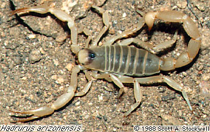

# [[Iuridae]] 

 

## #has_/text_of_/abstract 

> The **Iuridae** are a family of scorpions. 
> Six genera and at least 20 described species are placed in the Iuridae.
>
> [Wikipedia](https://en.wikipedia.org/wiki/Iuridae) 
> 
### Information on the Internet

-   The [Scorpion     Emporium](http://wrbu.si.edu/www/stockwell/emporium/emporium.html)

## Phylogeny 

-   « Ancestral Groups  
    -   [Vaejovoidea](../Vaejovoidea.md)
    -   [Scorpion](../../Scorpion.md)
    -   [Scorpionida](Scorpionida)
    -   [Arachnida](Arachnida)
    -   [Arthropoda](Arthropoda)
    -   [Bilateria](Bilateria)
    -   [Animals](Animals)
    -   [Eukaryotes](Eukaryotes)
    -   [Tree of Life](../../../../../../../../../Tree_of_Life.md)

-   ◊ Sibling Groups of  Vaejovoidea
    -   [Vaejovidae](Vaejovidae.md)
    -   Iuridae
    -   [Superstitionidae](Superstitionidae.md)

-   » Sub-Groups 

## Title Illustrations

----------
Hadrurus arizonensis.
Copyright © 1988, Scott A. Stockwell.

Copyright ::   © 1988 Scott A. Stockwell
