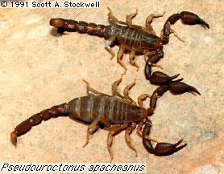

# [[Vaejovidae]] 

 

## #has_/text_of_/abstract 

> **Vaejovidae** is a family of scorpions, currently comprising 25 genera and over 230 species, 
> found in North America. 
> 
> The species of the family are found from western Guatemala, throughout Mexico, 
> and in the United States, mostly west of the 100° meridian 
> and one species in the Appalachian Mountains. 
> 
> Small, montane species of the genus Vaejovis 
> have been found in pine and spruce forests at elevations over 9,500 feet (2900 m) 
> in New Mexico and Arizona. 
> 
> The northern scorpion, Paruroctonus boreus, is found from northern Arizona 
> to the southern plains of Saskatchewan, Alberta, and British Columbia in Canada 
> and is the northernmost known species of scorpion in the world.
>
> [Wikipedia](https://en.wikipedia.org/wiki/Vaejovidae) 

### Information on the Internet

-   The [Scorpion     Emporium](http://wrbu.si.edu/www/stockwell/emporium/emporium.html)

## Phylogeny 

-   « Ancestral Groups  
    -   [Vaejovoidea](../Vaejovoidea.md)
    -   [Scorpion](../../Scorpion.md)
    -   [Scorpionida](Scorpionida)
    -   [Arachnida](Arachnida)
    -   [Arthropoda](Arthropoda)
    -   [Bilateria](Bilateria)
    -   [Animals](Animals)
    -   [Eukaryotes](Eukaryotes)
    -   [Tree of Life](../../../../../../../../../Tree_of_Life.md)

-   ◊ Sibling Groups of  Vaejovoidea
    -   Vaejovidae
    -   [Iuridae](Iuridae.md)
    -   [Superstitionidae](Superstitionidae.md)

-   » Sub-Groups 

## Title Illustrations

----------
Pseudouroctonus apacheanus.
Copyright © 1988, Scott A. Stockwell.

Copyright ::   © 1988 Scott A. Stockwell

