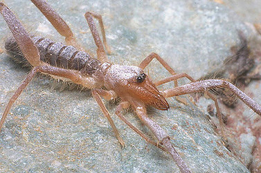

# [[Ammotrechinae]] 

 

## Phylogeny 

-   « Ancestral Groups  
    -   [Ammotrechidae](Ammotrechidae)
    -   [Solifugae](Solifugae)
    -   [Arachnida](Arachnida)
    -   [Arthropoda](Arthropoda)
    -   [Bilateria](Bilateria)
    -   [Animals](Animals)
    -   [Eukaryotes](Eukaryotes)
    -   [Tree of Life](../../../../../../../../Tree_of_Life.md)

-   ◊ Sibling Groups of  Ammotrechidae
    -   Ammotrechinae

-   » Sub-Groups 
	-   *Ammotrecha*
	-   *Ammotrechella*
	-   *Ammotrechesta*
	-   *Ammotrechinus*
	-   *Ammotrechona*
	-   *Ammotrechula*
	-   *Antillotrecha*
	-   *Campostrecha*
	-   *Dasycleobis*
	-   *Neocleobis*
	-   *Pseudocleobis*

## Title Illustrations

------------

Scientific Name ::     Ammotrechula pilosa Muma
Specimen Condition   Live Specimen
Sex ::                Male
Life Cycle Stage ::     Adult
Copyright ::            © 2003 Warren E. Savary

