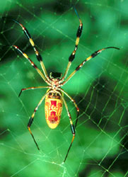

# [[Araneomorphae]] 

 
 

## #has_/text_of_/abstract 

> The **Araneomorphae** (also called the Labidognatha or "true spiders") are an infraorder of spiders. 
> They are distinguishable by chelicerae (fangs) that point diagonally forward 
> and cross in a pinching action, in contrast to the Mygalomorphae (tarantulas and their close kin), 
> where they point straight down. 
> Araneomorphs comprise the vast majority (about 93%) of living spiders.
>
> [Wikipedia](https://en.wikipedia.org/wiki/Araneomorphae) 

## Phylogeny 

-   « Ancestral Groups  
    -   [Spider](../Spider.md)
    -   [Arachnida](Arachnida)
    -   [Arthropoda](Arthropoda)
    -   [Bilateria](Bilateria)
    -   [Animals](Animals)
    -   [Eukaryotes](Eukaryotes)
    -   [Tree of Life](../../../../../../../Tree_of_Life.md)

-   ◊ Sibling Groups of  Spider
    -   [Mygalomorphae](Mygalomorphae)
    -   Araneomorphae

-   » Sub-Groups
    -   [Haplogynae](Haplogynae.md)
    -   [Hypochilidae](Hypochilidae.md)
    -   [Entelegynae](Entelegynae.md)

## Title Illustrations

-   Woodlouse hunter, Dysdera crocata (Haplogynae, Dysderidae).\
Photograph copyright © Jim Kalisch, [Department of Entomology,     University of Nebraska-Lincoln](http://entomology.unl.edu/).

-   Golden-silk spider, Nephila clavipes (Entelegynae, Orbicularia,
Araneidae).\
Photograph courtesy [InsectImages.org](http://www.insectimages.org/)
(image 0001045), copyright © Ray Simons, Centers for Disease Control
and Prevention.

-   Wolf spider male, Lycosa (Hogna) helluo (Entelegynae, Lycosoidea,
Lycosidae).\
Photograph copyright © Jim Kalisch, [Department of Entomology,     University of Nebraska-Lincoln](http://entomology.unl.edu/).

