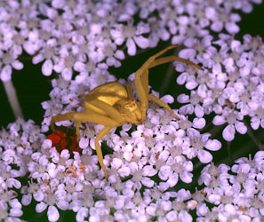
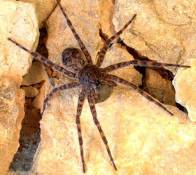

---
title: Entelegynae
---

# [[Entelegynae]] 

 
 

## #has_/text_of_/abstract 

> The **Entelegynae** or entelegynes are a subgroup of araneomorph spiders, 
> the largest of the two main groups into which the araneomorphs were traditionally divided. 
> 
> Females have a genital plate (epigynum) and a "flow through" fertilization system; 
> males have complex palpal bulbs. 
> 
> Molecular phylogenetic studies have supported the monophyly of Entelegynae 
> (whereas the other traditional subgroup, the Haplogynae, has been shown __not__ to be monophyletic).
>
> The clade contains both cribellate and ecribellate spiders.
>
> [Wikipedia](https://en.wikipedia.org/wiki/Entelegynae) 

## Phylogeny 

-   « Ancestral Groups  
    -   [Araneomorphae](Araneomorphae)
    -   [Spider](../../Spider.md)
    -   [Arachnida](Arachnida)
    -   [Arthropoda](Arthropoda)
    -   [Bilateria](Bilateria)
    -   [Animals](Animals)
    -   [Eukaryotes](Eukaryotes)
    -   [Tree of Life](../../../../../../../../Tree_of_Life.md) 

-   ◊ Sibling Groups of  Araneomorphae
    -   [Haplogynae](Haplogynae)
    -   [Hypochilidae](Hypochilidae)
    -   Entelegynae

-   » Sub-Groups
    -   [Amaurobiidae](Amaurobiidae.md)
    -   [Eresoidea](Eresoidea.md)
    -   [other entelegynes](other_entelegynes)
    -   [Palpimanoidea](Palpimanoidea.md)
    -   [Dictynoidea](Dictynoidea.md)
    -   [Orbiculariae](Orbiculariae.md)
    -   [Dionycha](Dionycha)
    -   [other amaurobioids](other_amaurobioids)
    -   [Lycosoidea](Lycosoidea.md)

## Title Illustrations

-------------------------------------------------------------------------

Scientific Name ::     Misumena vatia
Location ::           Bodega Bay (Marin County, California, US)
Comments             Yellow crab spider (goldenrod spider) on wild carrot, Daucus carota.
Specimen Condition   Live Specimen
Source Collection    [CalPhotos](http://calphotos.berkeley.edu/)
Copyright ::            © 2000 [Joseph Dougherty](http://www.ecology.org/) 

-----------------------------------------------------------------------

Scientific Name ::     Dolomedes tenebrosus
Comments             Fishing spider with egg case.
Specimen Condition   Live Specimen
Sex ::                Female
Life Cycle Stage ::     adult, egg sac
Copyright ::            © [Jim Kalisch](http://entomology.unl.edu/) 

## Confidential Links & Embeds: 

### #is_/same_as :: [Entelegynae](/_Standards/bio/bio~Domain/Eukaryotes/Animals/Bilateria/Arthropoda/Chelicerata/Arachnida/Spider/Araneomorphae/Entelegynae.md) 

### #is_/same_as :: [Entelegynae.public](/_public/bio/bio~Domain/Eukaryotes/Animals/Bilateria/Arthropoda/Chelicerata/Arachnida/Spider/Araneomorphae/Entelegynae.public.md) 

### #is_/same_as :: [Entelegynae.internal](/_internal/bio/bio~Domain/Eukaryotes/Animals/Bilateria/Arthropoda/Chelicerata/Arachnida/Spider/Araneomorphae/Entelegynae.internal.md) 

### #is_/same_as :: [Entelegynae.protect](/_protect/bio/bio~Domain/Eukaryotes/Animals/Bilateria/Arthropoda/Chelicerata/Arachnida/Spider/Araneomorphae/Entelegynae.protect.md) 

### #is_/same_as :: [Entelegynae.private](/_private/bio/bio~Domain/Eukaryotes/Animals/Bilateria/Arthropoda/Chelicerata/Arachnida/Spider/Araneomorphae/Entelegynae.private.md) 

### #is_/same_as :: [Entelegynae.personal](/_personal/bio/bio~Domain/Eukaryotes/Animals/Bilateria/Arthropoda/Chelicerata/Arachnida/Spider/Araneomorphae/Entelegynae.personal.md) 

### #is_/same_as :: [Entelegynae.secret](/_secret/bio/bio~Domain/Eukaryotes/Animals/Bilateria/Arthropoda/Chelicerata/Arachnida/Spider/Araneomorphae/Entelegynae.secret.md)

