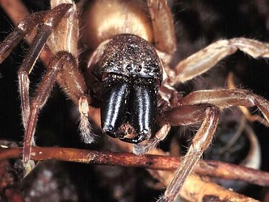

# [[Clubionidae]] 

 

## #has_/text_of_/abstract 

> The sac spiders of the family **Clubionidae** are nocturnal, sac-building hunting spiders with a near-worldwide distribution. Their sacs, silken retreats in which they hide during the day, may be made in a variety of places, including between folded leaves or grass blades, under bark and below rocks or other ground litter.
>
> Although formerly a much larger catch-all taxon, in its current definition the family contains less than 700 described species across 18 genera, of which Clubiona is by far most species-rich, with 528 accepted species as of November 2024.
>
> [Wikipedia](https://en.wikipedia.org/wiki/Sac%20spider) 

## Phylogeny 

-   « Ancestral Groups  
    -   [Dionycha](Dionycha)
    -   [Entelegynae](Entelegynae)
    -   [Araneomorphae](Araneomorphae)
    -   [Spider](../../../../../Spider.md)
    -   [Arachnida](Arachnida)
    -   [Arthropoda](Arthropoda)
    -   [Bilateria](Bilateria)
    -   [Animals](Animals)
    -   [Eukaryotes](Eukaryotes)
    -   [Tree of Life](../../../../../../../../../../../Tree_of_Life.md)

-   ◊ Sibling Groups of  Dionycha
    -   [Jumping_Spider](Jumping_Spider.md)
    -   [Crab_Spider](Crab_Spider.md)
    -   Clubionidae

-   » Sub-Groups 

	-   *Alloclubionoides*
	-   *Carteroniella*
	-   *Carteronius*
	-   *Clubiona*
	-   *Clubionina*
	-   *Dorymetaecus*
	-   *Elaver*
	-   *Malamatidia*
	-   *Matidia*
	-   *Nusatidia*
	-   *Pristidia*
	-   *Pteroneta*
	-   *Scopalio*
	-   *Simalio*
	-   *Tixcocoba*

Containing group: [Dionycha](Dionycha.md)

## Title Illustrations

----------------------------------------------------------------------------

Scientific Name ::     Arachnida:Spider:Clubionidae: Chiracanthium sp (face)
Location ::           Midland Meanders, Kwazulu-Natal, South Africa
Specimen Condition   Live Specimen
Body Part            face
Image Use ::    [Attribution-NonCommercial 2.0 Creative Commons License](http://creativecommons.org/licenses/by-nc/2.0/).
Copyright ::            © 2005 [Cesare Brizio](http://xoomer.virgilio.it/cebrizio/) 

## Confidential Links & Embeds: 

### #is_/same_as :: [Clubionidae](/_Standards/bio/bio~Domain/Eukaryotes/Animals/Bilateria/Arthropoda/Chelicerata/Arachnida/Spider/Araneomorphae/Entelegynae/Dictynoidea/Dionycha/Clubionidae.md) 

### #is_/same_as :: [Clubionidae.public](/_public/bio/bio~Domain/Eukaryotes/Animals/Bilateria/Arthropoda/Chelicerata/Arachnida/Spider/Araneomorphae/Entelegynae/Dictynoidea/Dionycha/Clubionidae.public.md) 

### #is_/same_as :: [Clubionidae.internal](/_internal/bio/bio~Domain/Eukaryotes/Animals/Bilateria/Arthropoda/Chelicerata/Arachnida/Spider/Araneomorphae/Entelegynae/Dictynoidea/Dionycha/Clubionidae.internal.md) 

### #is_/same_as :: [Clubionidae.protect](/_protect/bio/bio~Domain/Eukaryotes/Animals/Bilateria/Arthropoda/Chelicerata/Arachnida/Spider/Araneomorphae/Entelegynae/Dictynoidea/Dionycha/Clubionidae.protect.md) 

### #is_/same_as :: [Clubionidae.private](/_private/bio/bio~Domain/Eukaryotes/Animals/Bilateria/Arthropoda/Chelicerata/Arachnida/Spider/Araneomorphae/Entelegynae/Dictynoidea/Dionycha/Clubionidae.private.md) 

### #is_/same_as :: [Clubionidae.personal](/_personal/bio/bio~Domain/Eukaryotes/Animals/Bilateria/Arthropoda/Chelicerata/Arachnida/Spider/Araneomorphae/Entelegynae/Dictynoidea/Dionycha/Clubionidae.personal.md) 

### #is_/same_as :: [Clubionidae.secret](/_secret/bio/bio~Domain/Eukaryotes/Animals/Bilateria/Arthropoda/Chelicerata/Arachnida/Spider/Araneomorphae/Entelegynae/Dictynoidea/Dionycha/Clubionidae.secret.md)

