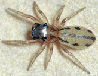

# [[Hyetussinae]] 

## Phylogeny 

-   « Ancestral Groups  
    -   [Jumping_Spider](../Jumping_Spider.md)
    -   [Dionycha](Dionycha)
    -   [Entelegynae](Entelegynae)
    -   [Araneomorphae](Araneomorphae)
    -   [Spider](../../../../../../Spider.md)
    -   [Arachnida](Arachnida)
    -   [Arthropoda](Arthropoda)
    -   [Bilateria](Bilateria)
    -   [Animals](Animals)
    -   [Eukaryotes](Eukaryotes)
    -   [Tree of Life](../../../../../../../../../../../../Tree_of_Life.md)

-   ◊ Sibling Groups of  Salticidae
    -   [Lyssomaninae](Lyssomaninae.md)
    -   [Spartaeinae](Spartaeinae.md)
    -   [Amycinae](Amycinae.md)
    -   [Thiodininae](Thiodininae.md)
    -   [Hisponinae](Hisponinae.md)
    -   [Synemosyninae](Synemosyninae.md)
    -   Hyetussinae
    -   [Sitticinae](Sitticinae.md)
    -   [Plexippinae](Plexippinae.md)
    -   [Pelleninae](Pelleninae.md)
    -   [Heliophaninae](Heliophaninae.md)
    -   [Salticus](Salticus)
    -   [Miscellaneous salticids with a fixed         embolus](Miscellaneous_salticids_with_a_fixed_embolus)
    -   [Dendryphantinae](Dendryphantinae.md)
    -   [Euophryinae](Euophryinae.md)
    -   [Synagelinae](Synagelinae.md)
    -   [Ballinae](Ballinae.md)
    -   [Miscellaneous salticids with a free         embolus](Miscellaneous_salticids_with_a_free_embolus)

-   » Sub-Groups
    -   [Bredana](Bredana)
    -   [Cyllodania](Cyllodania)
    -   [Hyetussa](Hyetussinae/Hyetussa.md)
    -   [Scopocira](Hyetussinae/Scopocira.md)
    -   [Titanattus](Hyetussinae/Titanattus.md)
    -   [Unidentified         Hyetussinae](Unidentified_Hyetussinae)

	-   *Agelista*
	-   *Arachnomura*
	-   *Atomosphyrus*
	-   *[Bredana](Bredana)*
	-   *[Cyllodania](Cyllodania)*
	-   *[Hyetussa](Hyetussinae/Hyetussa.md "go to ToL page")*
	-   *[Scopocira](Hyetussinae/Scopocira.md "go to ToL page")*
	-   *[Titanattus](Hyetussinae/Titanattus.md "go to ToL page")*
	-   *[Unidentified     Hyetussinae](Unidentified_Hyetussinae)*

## Introduction

[Wayne Maddison]() 

A tentative grouping of neotropical salticids. One feature they share
with the synemosynines is the curling of the embolus around the top of
the cymbium when the embolus is long enough. Like the synemosynines,
they also often wave the first pair of legs prominently, but they are
otherwise not so ant-like as the synemosynines. It would not be
surprising should it turn out that the synemosynines are derived from
hyetussines.

## Title Illustrations

  ---------------------------------------------------------------------------
  Copyright ::   © 1994-1995 [Wayne Maddison](http://salticidae.org/wpm/home.html) 
  ---------------------------------------------------------------------------
