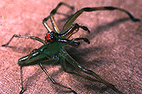

# [[Lyssomaninae]] 

Copyright ::   © 1994-1995 [Wayne Maddison](http://salticidae.org/wpm/home.html) 

The lyssomanines are peculiar salticids that may well be the sister
group to the remaining salticids. Along with the spartaeines they lack
many of the derived features that mark the bulk of the family (the
Salticine Division).

## #has_/text_of_/abstract 

> **Lyssomaninae** is a subfamily of jumping spiders. 
> It includes four genera, three from the New World.
>
> [Wikipedia](https://en.wikipedia.org/wiki/Lyssomaninae)

## Phylogeny 

-   « Ancestral Groups  
    -   [Jumping_Spider](../Jumping_Spider.md)
    -   [Dionycha](Dionycha)
    -   [Entelegynae](Entelegynae)
    -   [Araneomorphae](Araneomorphae)
    -   [Spider](../../../../../../Spider.md)
    -   [Arachnida](Arachnida)
    -   [Arthropoda](Arthropoda)
    -   [Bilateria](Bilateria)
    -   [Animals](Animals)
    -   [Eukaryotes](Eukaryotes)
    -   [Tree of Life](../../../../../../../../../../../../Tree_of_Life.md)

-   ◊ Sibling Groups of  Salticidae
    -   Lyssomaninae
    -   [Spartaeinae](Spartaeinae.md)
    -   [Amycinae](Amycinae.md)
    -   [Thiodininae](Thiodininae.md)
    -   [Hisponinae](Hisponinae.md)
    -   [Synemosyninae](Synemosyninae.md)
    -   [Hyetussinae](Hyetussinae.md)
    -   [Sitticinae](Sitticinae.md)
    -   [Plexippinae](Plexippinae.md)
    -   [Pelleninae](Pelleninae.md)
    -   [Heliophaninae](Heliophaninae.md)
    -   [Salticus](Salticus)
    -   [Miscellaneous salticids with a fixed         embolus](Miscellaneous_salticids_with_a_fixed_embolus)
    -   [Dendryphantinae](Dendryphantinae.md)
    -   [Euophryinae](Euophryinae.md)
    -   [Synagelinae](Synagelinae.md)
    -   [Ballinae](Ballinae.md)
    -   [Miscellaneous salticids with a free         embolus](Miscellaneous_salticids_with_a_free_embolus)

-   » Sub-Groups
    -   [Lyssomanes](Lyssomanes)

	-   *New World*
	    -   *[Lyssomanes](Lyssomanes)*
	    -   *Chinoscopus*
	-   *Old World*
	    -   *Asemonea*
	    -   *Goleba*
	    -   *Pandisus*
	    -   *Onomastus*

