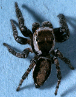
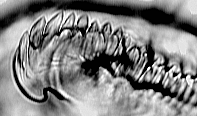
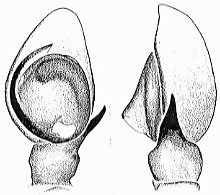

# [[Plexippinae]] 

## #has_/text_of_/abstract 

> The Plexippini are a tribe of jumping spiders (Salticidae). 
> They have also been treated as the subfamily **Plexippinae**.
>
> [Wikipedia](https://en.wikipedia.org/wiki/Plexippini) 

## Phylogeny 

-   « Ancestral Groups  
    -   [Jumping_Spider](../Jumping_Spider.md)
    -   [Dionycha](Dionycha)
    -   [Entelegynae](Entelegynae)
    -   [Araneomorphae](Araneomorphae)
    -   [Spider](../../../../../../Spider.md)
    -   [Arachnida](Arachnida)
    -   [Arthropoda](Arthropoda)
    -   [Bilateria](Bilateria)
    -   [Animals](Animals)
    -   [Eukaryotes](Eukaryotes)
    -   [Tree of Life](../../../../../../../../../../../../Tree_of_Life.md)

-   ◊ Sibling Groups of  Salticidae
    -   [Lyssomaninae](Lyssomaninae.md)
    -   [Spartaeinae](Spartaeinae.md)
    -   [Amycinae](Amycinae.md)
    -   [Thiodininae](Thiodininae.md)
    -   [Hisponinae](Hisponinae.md)
    -   [Synemosyninae](Synemosyninae.md)
    -   [Hyetussinae](Hyetussinae.md)
    -   [Sitticinae](Sitticinae.md)
    -   Plexippinae
    -   [Pelleninae](Pelleninae.md)
    -   [Heliophaninae](Heliophaninae.md)
    -   [Salticus](Salticus)
    -   [Miscellaneous salticids with a fixed         embolus](Miscellaneous_salticids_with_a_fixed_embolus)
    -   [Dendryphantinae](Dendryphantinae.md)
    -   [Euophryinae](Euophryinae.md)
    -   [Synagelinae](Synagelinae.md)
    -   [Ballinae](Ballinae.md)
    -   [Miscellaneous salticids with a free         embolus](Miscellaneous_salticids_with_a_free_embolus)

-   » Sub-Groups
    -   [Bianor](Bianor)
    -   [Evarcha](Evarcha)
    -   [Plexippus](Plexippus)

	-   *[Bianor](Bianor)*
	-   *Brancus*
	-   *Dexippus*
	-   *[Evarcha](Evarcha)*
	-   *Harmochirus*
	-   *Hyllus*
	-   *Mogrus*
	-   *Paramodunda*
	-   *Plexippoides*
	-   *[Plexippus](Plexippus)*
	-   *Telamonia*
	-   *Thyene*
	-   *Yaginumella*

## Introduction

[Wayne Maddison]()

The plexippines are among those salticids with the embolus immovably
fixed to the tegulum. They occur primarily in the Old World, and include
some of the more familiar genera (Plexippus, Evarcha, Hyllus, Thyene).
The genus Bianor probably does not belong technically within the group,
since the type species is apparently not a plexippine. However, some of
the more familiar species (e.g. B. aenescens and aemulus) are
plexippines and may very well deserve a transfer to Harmochirus.

### Characteristics

Characters delimiting the Plexippinae are (Maddison, 1996):

1.  Male endite serrula with the most lateral few teeth curled and
    projecting:

    

    Ventral view of lateral edge of endite serrula of male Evarcha.

2.  Males with a bump on the tegulum near the base of the embolus. The
    bump is just counterclockwise to the embolus and points clockwise on
    a left palp. Heliophanines also have bump on the tegulum but it is
    in a different place.

    

    Left palpus of Bianor aemulus

3.  Tufts of setae occur near eyes, reminiscent of those of Phidippus.
    Those of plexippines occur below the small eyes and between the PME
    and ALE, while those of Phidippus occur below the PME and between
    the PME and PLE. This tuft character may help support the grouping
    of plexippines, but it does so only weakly, for a number of species
    in the group lack distinct tufts, including Bianor aemulus and some
    species of Evarcha.

### References

Maddison, W.P. 1996. Pelegrina Franganillo and other jumping spiders
formerly placed in the genus Metaphidippus (Spider: Salticidae).
Bulletin of the Museum of Comparative Zoology. l54(4): 215-368.

## Title Illustrations

  ---------------------------------------------------------------------------
  Copyright ::   © 1994-1995 [Wayne Maddison](http://salticidae.org/wpm/home.html) 
  ---------------------------------------------------------------------------
