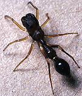

# [[Synemosyninae]] 

## #has_/text_of_/abstract 

> Simonellini is a tribe of spiders belonging to the Amycoida clade 
> of the subfamily Salticinae of the family Salticidae. 
> 
> The group has been treated at a variety of formal and informal ranks, 
> with different circumscriptions, including as the subfamilies **Synemosyninae** and Simonellinae. 
> 
> Its species mimic ants and beetles.
>
> [Wikipedia](https://en.wikipedia.org/wiki/Simonellini) 

## Phylogeny 

-   « Ancestral Groups  
    -   [Jumping_Spider](../Jumping_Spider.md)
    -   [Dionycha](Dionycha)
    -   [Entelegynae](Entelegynae)
    -   [Araneomorphae](Araneomorphae)
    -   [Spider](../../../../../../Spider.md)
    -   [Arachnida](Arachnida)
    -   [Arthropoda](Arthropoda)
    -   [Bilateria](Bilateria)
    -   [Animals](Animals)
    -   [Eukaryotes](Eukaryotes)
    -   [Tree of Life](../../../../../../../../../../../../Tree_of_Life.md)

-   ◊ Sibling Groups of  Salticidae
    -   [Lyssomaninae](Lyssomaninae.md)
    -   [Spartaeinae](Spartaeinae.md)
    -   [Amycinae](Amycinae.md)
    -   [Thiodininae](Thiodininae.md)
    -   [Hisponinae](Hisponinae.md)
    -   Synemosyninae
    -   [Hyetussinae](Hyetussinae.md)
    -   [Sitticinae](Sitticinae.md)
    -   [Plexippinae](Plexippinae.md)
    -   [Pelleninae](Pelleninae.md)
    -   [Heliophaninae](Heliophaninae.md)
    -   [Salticus](Salticus)
    -   [Miscellaneous salticids with a fixed         embolus](Miscellaneous_salticids_with_a_fixed_embolus)
    -   [Dendryphantinae](Dendryphantinae.md)
    -   [Euophryinae](Euophryinae.md)
    -   [Synagelinae](Synagelinae.md)
    -   [Ballinae](Ballinae.md)
    -   [Miscellaneous salticids with a free         embolus](Miscellaneous_salticids_with_a_free_embolus)

-   » Sub-Groups
    -   [Fluda](Fluda)
    -   [Myrmarachne](Myrmarachne)
    -   [Sarinda](Sarinda)
    -   [Simprulla](Simprulla)
    -   [Synemosyna](Synemosyna)

-   *Bocus*
-   *Corcovetella*
-   *[Fluda](Fluda)*
-   *Martella*
-   *[Myrmarachne](Myrmarachne)*
-   *[Sarinda](Sarinda)*
-   *[Simprulla](Simprulla)*
-   *[Synemosyna](Synemosyna)*
-   *Zuniga*

Containing group: [Jumping_Spider](../Jumping_Spider.md)

## Introduction

The synemosynines are strikingly ant-like salticids common in the
tropics. The first legs are waved like antennae and have the embolus
fixed to the tegulum (in comparison with the synagelines, which use the
second legs and have a free embolus). In many cases where the embolus is
long, it curls around the top of the cymbium (like the hyetussines).
Tentatively included are Myrmarachne and Bocus.

