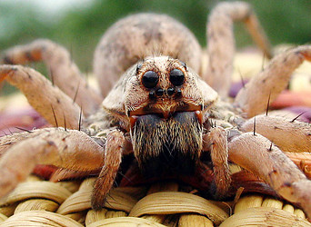

## Phylogeny 

-   « Ancestral Groups  
    -   [Lycosoidea](Lycosoidea)
    -   [Entelegynae](Entelegynae)
    -   [Araneomorphae](Araneomorphae)
    -   [Spider](../../../../Spider.md)
    -   [Arachnida](Arachnida)
    -   [Arthropoda](Arthropoda)
    -   [Bilateria](Bilateria)
    -   [Animals](Animals)
    -   [Eukaryotes](Eukaryotes)
    -   [Tree of Life](../../../../../../../../../../Tree_of_Life.md)

-   ◊ Sibling Groups of  Lycosoidea
    -   Lycosidae
    -   [Oxyopidae](Oxyopidae)

-   » Sub-Groups 

# Lycosidae

## wolf spiders 

-   *Acantholycosa*
-   *Adelocosa*
-   *Agalenocosa*
-   *Aglaoctenus*
-   *Algidus*
-   *Allocosa*
-   *Allotrochosina*
-   *Alopecosa*
-   *Alopecosella*
-   *Amblyothele*
-   *Anomalomma*
-   *Anomalosa*
-   *Anoteropsis*
-   *Arctosa*
-   *Arctosippa*
-   *Arctosomma*
-   *Artoria*
-   *Artoriellula*
-   *Aulonia*
-   *Auloniella*
-   *Brevilabus*
-   *Bristowiella*
-   *Camptocosa*
-   *Caporiaccosa*
-   *Crocodilosa*
-   *Cynosa*
-   *Dejerosa*
-   *Diapontia*
-   *Dingosa*
-   *Dolocosa*
-   *Donacosa*
-   *Dorjulopirata*
-   *Edenticosa*
-   *Evippa*
-   *Evippomma*
-   *Geolycosa*
-   *Gladicosa*
-   *Gnatholycosa*
-   *Hesperocosa*
-   *Hippasa*
-   *Hippasella*
-   *Hippasosa*
-   *Hogna*
-   *Hognoides*
-   *Hyaenosa*
-   *Hygrolycosa*
-   *Loculla*
-   *Lycosa*[ (non-monophyletic) ]
-   *Lycosella*
-   *Lycosula*
-   *Lysania*
-   *Malimbosa*
-   *Margonia*
-   *Megarctosa*
-   *Melloicosa*
-   *Melocosa*
-   *Molitorosa*
-   *Mongolicosa*
-   *Mustelicosa*
-   *Notocosa*
-   *Oculicosa*
-   *Ocyale*
-   *Orinocosa*
-   *Orthocosa*
-   *Paratrochosina*
-   *Pardosa*
-   *Pardosella*
-   *Passiena*
-   *Pavocosa*
-   *Phonophilus*
-   *Pirata*
-   *Piratosa*
-   *Proevippa*
-   *Prolycosides*
-   *Pseudevippa*
-   *Pterartoria*
-   *Pterartoriola*
-   *Pyrenecosa*
-   *Rabidosa*
-   *Satta*
-   *Schizocosa*
-   *Shapna*
-   *Sibirocosa*
-   *Sosippus*
-   *Syroloma*
-   *Tasmanicosa*
-   *Trabea*
-   *Trabeops*
-   *Trebacosa*
-   *Tricassa*
-   *Trochosa*
-   *Trochosippa*
-   *Trochosula*
-   *Varacosa*
-   *Venator*
-   *Venatrix*
-   *Venonia*
-   *Vesubia*
-   *Wadicosa*
-   *Xerolycosa*
-   *Zantheres*
-   *Zenonina*
-   *Zoica*

Containing group: [Lycosoidea](Lycosoidea.md)

### References

Dondale, C. D. 1986. The subfamilies of wolf spiders (Spider:
Lycosidae). Act. X Congr. Intern. Aracnol. Jaca, España 1:327--332.

Griswold, C. E. 1993. Investigations into the phylogeny of the lycosoid
spiders and their kin (Arachnida: Spider: Lycosoidea). Smiths. Contr.
Zool. 539:1--39.

Murphy, N. P., V. W. Framenau, S. C. Donnellan, M. S. Harvey, Y.-C. Park
and A. D. Austin. 2006. Phylogenetic reconstruction of the wolf spiders
(Spider: Lycosidae) using sequences from the 12S rRNA , 28S rRNA , and
NADH1 genes: Implications for classification, biogeography, and the
evolution of web building behavior. Mol. Phylogent. Evol. 38(3):583-602.

Zehethofer, K. and C. Sturmbauer. 1998. Phylogenetic relationships of
Central European wolf spiders (Spider: Lycosidae) inferred from 12S
Ribosomal DNA sequences. Mol. Phylogent. Evol. 10:391--398.

Vink, C. J. 2002. Lycosidae (Arachnida: Spider). Fauna New Zeal.
44:1--94.

Vink, C. J., A. D. Mitchell and A. M. Paterson. 2002. A preliminary
molecular analysis of phylogenetic relationships of Australasian wolf
spider genera (Spider, Lycosidae). J. Arachnol. 30:227--237.

## Title Illustrations



  -------------------------------------------------------------------------
  Scientific Name ::     Lycosa
  Location ::           Tucson, AZ, USA
  Comments             Found in house, Sonoran desert habitat
  Specimen Condition   Live Specimen
  Sex ::                Female
  Life Cycle Stage ::     Adult
  Body Part            Cephalothorax
  View                 Frontal
  Size                 ca. 15mm
  Copyright ::            © 2005 [David Bygott](mailto:davidbygott@yahoo.com) 
  -------------------------------------------------------------------------
