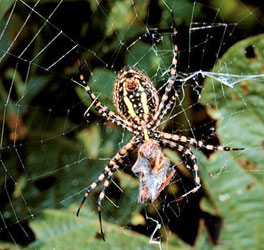

## Phylogeny 

-   « Ancestral Groups  
    -   [Orbiculariae](Orbiculariae)
    -   [Entelegynae](Entelegynae)
    -   [Araneomorphae](Araneomorphae)
    -   [Spider](../../../../Spider.md)
    -   [Arachnida](Arachnida)
    -   [Arthropoda](Arthropoda)
    -   [Bilateria](Bilateria)
    -   [Animals](Animals)
    -   [Eukaryotes](Eukaryotes)
    -   [Tree of Life](../../../../../../../../../../Tree_of_Life.md)

-   ◊ Sibling Groups of  Orbiculariae
    -   [Anapidae](Anapidae)
    -   [Mysmenidae](Mysmenidae)
    -   [Deinopidae](Deinopidae)
    -   [Uloboridae](Uloboridae)
    -   Araneidae
    -   [Theridiosomatidae](Theridiosomatidae)
    -   [Symphytognathidae](Symphytognathidae)
    -   [Linyphiidae](Linyphiidae)
    -   [Pimoidae](Pimoidae)
    -   [Synotaxidae](Synotaxidae)
    -   [Cyatholipidae](Cyatholipidae)
    -   [Nesticidae](Nesticidae)
    -   [Theridiidae](Theridiidae)

-   » Sub-Groups 

# Araneidae 

[Jonathan Coddington]()

Containing group: [Orbiculariae](Orbiculariae.md)

## Title Illustrations



  -------------------------------------
  Scientific Name ::     Argiope trifasciata
  Comments             Banded Argiope
  Specimen Condition   Live Specimen
  Copyright ::            © [Leon Higley, Department of Entomology, University of Nebraska-Lincoln](http://entomology.unl.edu/)
  -------------------------------------


  ----------------------------------------------------------------------------
  Scientific Name ::     Arachnida:Spider:Araneidae: Araneus diadematus
  Location ::           "Corno alle Scale" Park, Bologna Province, Emilia Romagna, Italy
  Specimen Condition   Live Specimen
  Image Use ::    [Attribution-NonCommercial 2.0 Creative Commons License](http://creativecommons.org/licenses/by-nc/2.0/).
  Copyright ::            © 2005 [Cesare Brizio](http://xoomer.virgilio.it/cebrizio/) 
  ----------------------------------------------------------------------------


  ---------------------------------------------------------------------------------
  Scientific Name ::     Micrathena gracilis
  Location ::           Virginia, USA
  Specimen Condition   Live Specimen
  Identified By        Jonathan Coddington
  Sex ::                Female
  Life Cycle Stage ::     adult
  Copyright ::            © [Jonathan Coddington](http://entomology.si.edu/StaffPages/coddington.html) 
  ---------------------------------------------------------------------------------

## Confidential Links & Embeds: 

### #is_/same_as :: [Araneidae](/_Standards/bio/bio~Domain/Eukaryotes/Animals/Bilateria/Arthropoda/Chelicerata/Arachnida/Spider/Araneomorphae/Entelegynae/Orbiculariae/Araneidae.md) 

### #is_/same_as :: [Araneidae.public](/_public/bio/bio~Domain/Eukaryotes/Animals/Bilateria/Arthropoda/Chelicerata/Arachnida/Spider/Araneomorphae/Entelegynae/Orbiculariae/Araneidae.public.md) 

### #is_/same_as :: [Araneidae.internal](/_internal/bio/bio~Domain/Eukaryotes/Animals/Bilateria/Arthropoda/Chelicerata/Arachnida/Spider/Araneomorphae/Entelegynae/Orbiculariae/Araneidae.internal.md) 

### #is_/same_as :: [Araneidae.protect](/_protect/bio/bio~Domain/Eukaryotes/Animals/Bilateria/Arthropoda/Chelicerata/Arachnida/Spider/Araneomorphae/Entelegynae/Orbiculariae/Araneidae.protect.md) 

### #is_/same_as :: [Araneidae.private](/_private/bio/bio~Domain/Eukaryotes/Animals/Bilateria/Arthropoda/Chelicerata/Arachnida/Spider/Araneomorphae/Entelegynae/Orbiculariae/Araneidae.private.md) 

### #is_/same_as :: [Araneidae.personal](/_personal/bio/bio~Domain/Eukaryotes/Animals/Bilateria/Arthropoda/Chelicerata/Arachnida/Spider/Araneomorphae/Entelegynae/Orbiculariae/Araneidae.personal.md) 

### #is_/same_as :: [Araneidae.secret](/_secret/bio/bio~Domain/Eukaryotes/Animals/Bilateria/Arthropoda/Chelicerata/Arachnida/Spider/Araneomorphae/Entelegynae/Orbiculariae/Araneidae.secret.md)

