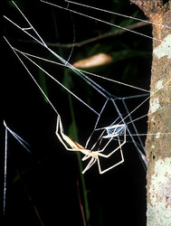

## Phylogeny 

-   « Ancestral Groups  
    -   [Orbiculariae](Orbiculariae)
    -   [Entelegynae](Entelegynae)
    -   [Araneomorphae](Araneomorphae)
    -   [Spider](../../../../Spider.md)
    -   [Arachnida](Arachnida)
    -   [Arthropoda](Arthropoda)
    -   [Bilateria](Bilateria)
    -   [Animals](Animals)
    -   [Eukaryotes](Eukaryotes)
    -   [Tree of Life](../../../../../../../../../../Tree_of_Life.md)

-   ◊ Sibling Groups of  Orbiculariae
    -   [Anapidae](Anapidae)
    -   [Mysmenidae](Mysmenidae)
    -   Deinopidae
    -   [Uloboridae](Uloboridae)
    -   [Araneidae](Araneidae)
    -   [Theridiosomatidae](Theridiosomatidae)
    -   [Symphytognathidae](Symphytognathidae)
    -   [Linyphiidae](Linyphiidae)
    -   [Pimoidae](Pimoidae)
    -   [Synotaxidae](Synotaxidae)
    -   [Cyatholipidae](Cyatholipidae)
    -   [Nesticidae](Nesticidae)
    -   [Theridiidae](Theridiidae)

-   » Sub-Groups 

# Deinopidae 

[Jonathan Coddington]()

Containing group: [Orbiculariae](Orbiculariae.md)

### References

Blest, A.D. & M.F. Land. 1977. The physiological optics of Dinopis
subrufus L. Koch: A fish lens in a spider. Proc. R. Soc. London (B)
196:197-222.

Blest, A.D. & D.G. Price. 1981. A new mechanism for transitory, local
endocytosis in photoreceptors of a spider, Dinopis. Cell Tissue Res.
217:267-282.

Clyne, D. 1967. Notes on the construction of the nest and sperm-web of a
cribellate spider Dinopis subrufus (Koch) (Araneida: Dinopidae). Aust.
Zool. 14:189-198.

Coddington, J.A. 1986. Orb webs in \'non orb weaving\' ogre faced
spiders (Spider: Dinopidae): a question of genealogy. Cladistics
2:53-67.

Coddington, J. & C. Sobrevila. 1987. Web manipulation and two
stereotyped attack behaviors in the ogre-faced spider Deinopis spinosus
Marx (Spider, Deinopidae). J. Arachnology 15:213-225

Eberhard, W. & F. Pereira. 1993. Ultrastructure of cribellate silk of
nine species in eight families and possible taxonomic implications
(Spider: Amaurobiidae, Deinopidae, Desidae, Dictynidae, Filistatidae,
Hypochilidae, Stiphidiidae, Tengellidae). J. Arachnology 21:161-174.

Griswold, C.E., J.A. Coddington, G. Hormiga & N. Scharff. 1998.
Phylogeny of the orb-web building spiders (Spider, Orbiculariae:
Deinopoidea, Araneoidea). Zoological Journal of the Linnean Society. May
123:1-99.

Peters, H.M. 1992. On the spinning apparatus and the structure of the
capture threads of Deinopis subrufus (Spider, Deinopidae).
Zoomorphology 112:27-37.

Robinson, M.H. & B. Robinson. 1971. The predatory behavior of the
ogre-faced spider, Dinopis longipes F. Cambridge (Spider: Dinopidae).
Amer. Midland Nat. 85:85-96.

## Title Illustrations



  ---------------------------------------------------------------------------------
  Scientific Name ::     Deinopis spinosus
  Location ::           Gainesville, Florida
  Specimen Condition   Live Specimen
  Identified By        Jonathan Coddington
  Sex ::                Female
  Life Cycle Stage ::     adult
  Copyright ::            © [Jonathan Coddington](http://entomology.si.edu/StaffPages/coddington.html) 
  ---------------------------------------------------------------------------------


  ---------------------------------------------------------------------------------
  Scientific Name ::     Deinopidae
  Location ::           Gainesville, Florida
  Specimen Condition   Live Specimen
  Sex ::                Female
  Life Cycle Stage ::     adult
  Copyright ::            © [Jonathan Coddington](http://entomology.si.edu/StaffPages/coddington.html) 
  ---------------------------------------------------------------------------------

## Confidential Links & Embeds: 

### #is_/same_as :: [Deinopidae](/_Standards/bio/bio~Domain/Eukaryotes/Animals/Bilateria/Arthropoda/Chelicerata/Arachnida/Spider/Araneomorphae/Entelegynae/Orbiculariae/Deinopidae.md) 

### #is_/same_as :: [Deinopidae.public](/_public/bio/bio~Domain/Eukaryotes/Animals/Bilateria/Arthropoda/Chelicerata/Arachnida/Spider/Araneomorphae/Entelegynae/Orbiculariae/Deinopidae.public.md) 

### #is_/same_as :: [Deinopidae.internal](/_internal/bio/bio~Domain/Eukaryotes/Animals/Bilateria/Arthropoda/Chelicerata/Arachnida/Spider/Araneomorphae/Entelegynae/Orbiculariae/Deinopidae.internal.md) 

### #is_/same_as :: [Deinopidae.protect](/_protect/bio/bio~Domain/Eukaryotes/Animals/Bilateria/Arthropoda/Chelicerata/Arachnida/Spider/Araneomorphae/Entelegynae/Orbiculariae/Deinopidae.protect.md) 

### #is_/same_as :: [Deinopidae.private](/_private/bio/bio~Domain/Eukaryotes/Animals/Bilateria/Arthropoda/Chelicerata/Arachnida/Spider/Araneomorphae/Entelegynae/Orbiculariae/Deinopidae.private.md) 

### #is_/same_as :: [Deinopidae.personal](/_personal/bio/bio~Domain/Eukaryotes/Animals/Bilateria/Arthropoda/Chelicerata/Arachnida/Spider/Araneomorphae/Entelegynae/Orbiculariae/Deinopidae.personal.md) 

### #is_/same_as :: [Deinopidae.secret](/_secret/bio/bio~Domain/Eukaryotes/Animals/Bilateria/Arthropoda/Chelicerata/Arachnida/Spider/Araneomorphae/Entelegynae/Orbiculariae/Deinopidae.secret.md)

