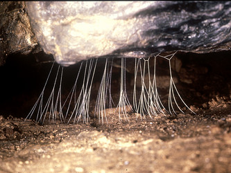

## Phylogeny 

-   « Ancestral Groups  
    -   [Orbiculariae](Orbiculariae)
    -   [Entelegynae](Entelegynae)
    -   [Araneomorphae](Araneomorphae)
    -   [Spider](../../../../Spider.md)
    -   [Arachnida](Arachnida)
    -   [Arthropoda](Arthropoda)
    -   [Bilateria](Bilateria)
    -   [Animals](Animals)
    -   [Eukaryotes](Eukaryotes)
    -   [Tree of Life](../../../../../../../../../../Tree_of_Life.md)

-   ◊ Sibling Groups of  Orbiculariae
    -   [Anapidae](Anapidae)
    -   [Mysmenidae](Mysmenidae)
    -   [Deinopidae](Deinopidae)
    -   [Uloboridae](Uloboridae)
    -   [Araneidae](Araneidae)
    -   [Theridiosomatidae](Theridiosomatidae)
    -   [Symphytognathidae](Symphytognathidae)
    -   [Linyphiidae](Linyphiidae)
    -   [Pimoidae](Pimoidae)
    -   [Synotaxidae](Synotaxidae)
    -   [Cyatholipidae](Cyatholipidae)
    -   Nesticidae
    -   [Theridiidae](Theridiidae)

-   » Sub-Groups 

# Nesticidae 

Containing group: [Orbiculariae](Orbiculariae.md)

## Title Illustrations



  ---------------------------------------------------------------------------------
  Scientific Name ::     Eidmanella pallida
  Location ::           Tennessee, USA
  Specimen Condition   Live Specimen
  Identified By        Jonathan Coddington
  Behavior             Nesticids, as far as known, all make branched gum foot lines.
  Sex ::                Female
  Life Cycle Stage ::     adult
  Size                 ca, 10 cm. across
  Copyright ::            © [Jonathan Coddington](http://entomology.si.edu/StaffPages/coddington.html) 
  ---------------------------------------------------------------------------------
