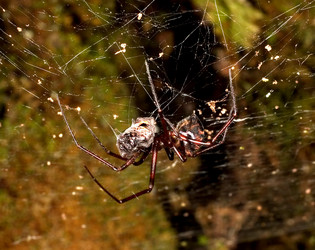

## Phylogeny 

-   « Ancestral Groups  
    -   [Orbiculariae](Orbiculariae)
    -   [Entelegynae](Entelegynae)
    -   [Araneomorphae](Araneomorphae)
    -   [Spider](../../../../Spider.md)
    -   [Arachnida](Arachnida)
    -   [Arthropoda](Arthropoda)
    -   [Bilateria](Bilateria)
    -   [Animals](Animals)
    -   [Eukaryotes](Eukaryotes)
    -   [Tree of Life](../../../../../../../../../../Tree_of_Life.md)

-   ◊ Sibling Groups of  Orbiculariae
    -   [Anapidae](Anapidae)
    -   [Mysmenidae](Mysmenidae)
    -   [Deinopidae](Deinopidae)
    -   [Uloboridae](Uloboridae)
    -   [Araneidae](Araneidae)
    -   [Theridiosomatidae](Theridiosomatidae)
    -   [Symphytognathidae](Symphytognathidae)
    -   [Linyphiidae](Linyphiidae)
    -   Pimoidae
    -   [Synotaxidae](Synotaxidae)
    -   [Cyatholipidae](Cyatholipidae)
    -   [Nesticidae](Nesticidae)
    -   [Theridiidae](Theridiidae)

-   » Sub-Groups 

# Pimoidae 

Containing group: [Orbiculariae](Orbiculariae.md)

### References

Agnarsson, I. 2004. Morphological phylogeny of cobweb spiders and their
relatives (Spider, Araneoidea, Theridiidae). Zoological Journal Of The
Linnean Society 141:447-626.

Griswold, C.E., J.A. Coddington, G. Hormiga & N. Scharff. 1998.
Phylogeny of the orb-web building spiders (Spider, Orbiculariae:
Deinopoidea, Araneoidea). Zoological Journal of the Linnean Society. May
123:1-99.

Hormiga, G. 1993. Implication of the phylogeny of Pimoidae for the
systematics of linyphiid spiders (Spider, Araneoidea, Linyphiidae).
Memoirs Of The Queensland Museum 33:533-542.

Hormiga, G. 1994. A revision and cladistic analysis of the spider family
Pimoidae (Araneoidea: Spider). Smithsonian Contributions to Zoology,
549:1-104.

Hormiga, G. 1994. Cladistics and the comparative morphology of linyphiid
spiders and their relatives (Spider, Araneoidea, Linyphiidae).
Zoological Journal Of The Linnean Society 111:1-71.

Hormiga, G. 2003. Weintrauboa, a new genus of pimoid spiders from Japan
and adjacent islands, with comments on the monophyly and diagnosis of
the family Pimoidae and the genus Pimoa (Araneoidea, Spider).
Zoological Journal Of The Linnean Society 139:261-281.

Jocqué, R. & A.S. Dippenaar-Schoeman. 2006. Spider Families of the
World. Musée Royal de l\'Afrique Centrale, Tevuren. 336pp.

## Title Illustrations



  ---------------------------------------------------------------------------------
  Scientific Name ::   Pimoa sp.
  Location ::         Bhutan
  Identified By      Jonathan Coddington
  Behavior           Pimoids spin large, linyphiid-like sheet webs with a tubular retreat at the margin. They hang from t
  Sex ::              Female
  Life Cycle Stage ::   adult
  Size               ca. 60 cm. across
  Copyright ::          © [Jonathan Coddington](http://entomology.si.edu/StaffPages/coddington.html) 
  ---------------------------------------------------------------------------------


  ---------------------------------------------------------------------------------
  Scientific Name ::     Pimoa sp.
  Location ::           Bhutan
  Specimen Condition   Live Specimen
  Identified By        Jonathan Coddington
  Behavior             Feeding on a wrapped prey item
  Sex ::                Female
  Life Cycle Stage ::     adult
  Size                 Spider body length ca. 13 mm.
  Copyright ::            © [Jonathan Coddington](http://entomology.si.edu/StaffPages/coddington.html) 
  ---------------------------------------------------------------------------------

## Confidential Links & Embeds: 

### [Pimoidae](/_Standards/bio/bio~Domain/Eukaryotes/Animals/Bilateria/Arthropoda/Chelicerata/Arachnida/Spider/Araneomorphae/Entelegynae/Orbiculariae/Pimoidae.md) 

### [Pimoidae.public](/_public/bio/bio~Domain/Eukaryotes/Animals/Bilateria/Arthropoda/Chelicerata/Arachnida/Spider/Araneomorphae/Entelegynae/Orbiculariae/Pimoidae.public.md) 

### [Pimoidae.internal](/_internal/bio/bio~Domain/Eukaryotes/Animals/Bilateria/Arthropoda/Chelicerata/Arachnida/Spider/Araneomorphae/Entelegynae/Orbiculariae/Pimoidae.internal.md) 

### [Pimoidae.protect](/_protect/bio/bio~Domain/Eukaryotes/Animals/Bilateria/Arthropoda/Chelicerata/Arachnida/Spider/Araneomorphae/Entelegynae/Orbiculariae/Pimoidae.protect.md) 

### [Pimoidae.private](/_private/bio/bio~Domain/Eukaryotes/Animals/Bilateria/Arthropoda/Chelicerata/Arachnida/Spider/Araneomorphae/Entelegynae/Orbiculariae/Pimoidae.private.md) 

### [Pimoidae.personal](/_personal/bio/bio~Domain/Eukaryotes/Animals/Bilateria/Arthropoda/Chelicerata/Arachnida/Spider/Araneomorphae/Entelegynae/Orbiculariae/Pimoidae.personal.md) 

### [Pimoidae.secret](/_secret/bio/bio~Domain/Eukaryotes/Animals/Bilateria/Arthropoda/Chelicerata/Arachnida/Spider/Araneomorphae/Entelegynae/Orbiculariae/Pimoidae.secret.md)

