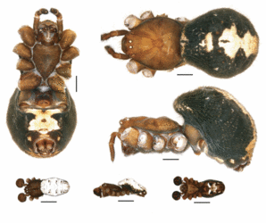
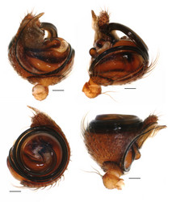
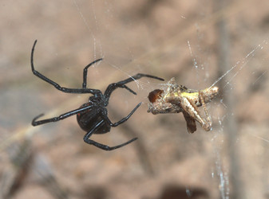

## Phylogeny 

-   « Ancestral Groups  
    -   [Latrodectus](Latrodectus)
    -   [Theridiidae](Theridiidae)
    -   [Orbiculariae](Orbiculariae)
    -   [Entelegynae](Entelegynae)
    -   [Araneomorphae](Araneomorphae)
    -   [Spider](../../../../../../Spider.md)
    -   [Arachnida](Arachnida)
    -   [Arthropoda](Arthropoda)
    -   [Bilateria](Bilateria)
    -   [Animals](Animals)
    -   [Eukaryotes](Eukaryotes)
    -   [Tree of Life](../../../../../../../../../../../../Tree_of_Life.md)

-   ◊ Sibling Groups of  Latrodectus
    -   [Latrodectus geometricus](Latrodectus_geometricus)
    -   Latrodectus diaguita
    -   [Latrodectus antheratus](Latrodectus_antheratus)
    -   [Latrodectus mirabilis](Latrodectus_mirabilis)
    -   [Latrodectus         renivulvatus](Latrodectus_renivulvatus)
    -   [Latrodectus         indistinctus](Latrodectus_indistinctus)
    -   [Latrodectus quartus](Latrodectus_quartus)

-   » Sub-Groups 

# *Latrodectus diaguita* 

[Jeremy Miller]()

Containing group: *[Latrodectus](Latrodectus.md)*

## Title Illustrations



  ---------------------------------------------------------------------------------------
  Scientific Name ::     Latrodectus diaguita
  Location ::           Ruta 4, Km 9, Catamarca Prov., Argentina
  Comments             Photograph of specimen in alcohol. Note that red coloration fades in alcohol. See live photographs for true color. Scale bar = 1.0 mm.
  Specimen Condition   Dead Specimen
  Identified By        Jeremy Miller
  Life Cycle Stage ::     Adult
  Copyright ::            © [Jeremy Miller](http://www.calacademy.org/research/entomology/personnel/jmiller/index.htm) 
  ---------------------------------------------------------------------------------------


  ---------------------------------------------------------------------------------------
  Scientific Name ::     Latrodectus diaguita
  Location ::           Ruta 4, Km 9, Catamarca Prov., Argentina
  Comments             Scale bar = 0.1 mm.
  Specimen Condition   Dead Specimen
  Identified By        Jeremy Miller
  Sex ::                Male
  Life Cycle Stage ::     Adult
  Body Part            Male palp
  Copyright ::            © [Jeremy Miller](http://www.calacademy.org/research/entomology/personnel/jmiller/index.htm) 
  ---------------------------------------------------------------------------------------


  ---------------------------------------------------------------------------------------
  Scientific Name ::     Latrodectus diaguita
  Location ::           Ruta 4, Km 9, Catamarca Prov., Argentina
  Specimen Condition   Live Specimen
  Identified By        Jeremy Miller
  Behavior             Wrapping prey
  Sex ::                Female
  Life Cycle Stage ::     Adult
  Copyright ::            © [Jeremy Miller](http://www.calacademy.org/research/entomology/personnel/jmiller/index.htm) 
  ---------------------------------------------------------------------------------------


  ---------------------------------------------------------------------------------------
  Scientific Name ::     Latrodectus diaguita
  Location ::           Ruta 4, Km 9, Catamarca Prov., Argentina
  Specimen Condition   Live Specimen
  Identified By        Jeremy Miller
  Sex ::                Female
  Life Cycle Stage ::     Adult
  Copyright ::            © [Jeremy Miller](http://www.calacademy.org/research/entomology/personnel/jmiller/index.htm) 
  ---------------------------------------------------------------------------------------

## Confidential Links & Embeds: 

### [diaguita](/_Standards/bio/bio~Domain/Eukaryotes/Animals/Bilateria/Arthropoda/Chelicerata/Arachnida/Spider/Araneomorphae/Entelegynae/Orbiculariae/Theridiidae/Latrodectus/diaguita.md) 

### [diaguita.public](/_public/bio/bio~Domain/Eukaryotes/Animals/Bilateria/Arthropoda/Chelicerata/Arachnida/Spider/Araneomorphae/Entelegynae/Orbiculariae/Theridiidae/Latrodectus/diaguita.public.md) 

### [diaguita.internal](/_internal/bio/bio~Domain/Eukaryotes/Animals/Bilateria/Arthropoda/Chelicerata/Arachnida/Spider/Araneomorphae/Entelegynae/Orbiculariae/Theridiidae/Latrodectus/diaguita.internal.md) 

### [diaguita.protect](/_protect/bio/bio~Domain/Eukaryotes/Animals/Bilateria/Arthropoda/Chelicerata/Arachnida/Spider/Araneomorphae/Entelegynae/Orbiculariae/Theridiidae/Latrodectus/diaguita.protect.md) 

### [diaguita.private](/_private/bio/bio~Domain/Eukaryotes/Animals/Bilateria/Arthropoda/Chelicerata/Arachnida/Spider/Araneomorphae/Entelegynae/Orbiculariae/Theridiidae/Latrodectus/diaguita.private.md) 

### [diaguita.personal](/_personal/bio/bio~Domain/Eukaryotes/Animals/Bilateria/Arthropoda/Chelicerata/Arachnida/Spider/Araneomorphae/Entelegynae/Orbiculariae/Theridiidae/Latrodectus/diaguita.personal.md) 

### [diaguita.secret](/_secret/bio/bio~Domain/Eukaryotes/Animals/Bilateria/Arthropoda/Chelicerata/Arachnida/Spider/Araneomorphae/Entelegynae/Orbiculariae/Theridiidae/Latrodectus/diaguita.secret.md)

